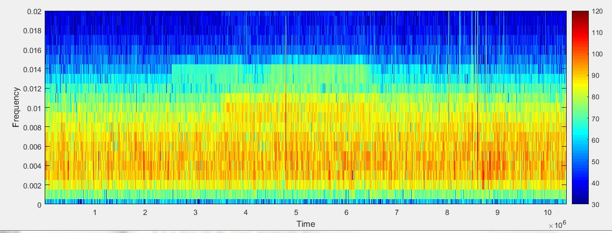

#　非負値行列因子分解（NMF; Nonnegative Matrix Factorization)についてまとめてみた  

今回は非負値行列因子分解(NMF)についてまとめていく。  
非負値行列因子分解は、音声の音源分離や、多次元のデータの次元削減のために使われる手法である。  
音声の音源分離について調べてたときにちょうど出てきたのでまとめてみたいと思う。  

以下の書籍の内容を自分なりにまとめていく。  
[Source Separation and Machine Learning 1st Edition](https://www.elsevier.com/books/source-separation-and-machine-learning/chien/978-0-12-804566-4)  

## 0.概要  

NMFは非負の行列 $X\in \mathbb{R}^{M\times N}$があるとして、非負基底行列(もしくは初めから決めていた行列)の $B\in \mathbb{R}^{M\times K}$ と非負の重み行列 $W\in \mathbb{R}^{K\times N}$ の2つの内積に分解する手法である。  

$$
X \approx \hat{X} = BW \tag{1}
$$

これは様々な学習システムに応用されてきた。(文書分類、computer vision、信号処理、レコメンドシステムなど)  

分解の対象となる値は **非負である必要がある**。非負としたのは、自然界に存在する様々な信号の性質を反映するため。  
実際、画像の画素値や音声スペクトログラムの値などは非負となっている。  

### 0.1 音源分離の文脈で  

今回は、音源分離の文脈でまとめていきたいと思う。  

音源分離だと、 NMFは単音源の音源分離によく使われる。  
(複数音源だとICAなどがよく使われる）  

$X$ はスペクトログラム値とすると$M$個の周波数分の値が $N$フレーム分格納されていることになる。  

  
###### https://dsp.stackovernet.com/ja/q/10887 より  

横軸が $M$個分あり、縦軸が$N$個分存在する。  

基底行列 $B\in \mathbb{R}^{M\times K}$ は$K$ 個の基底ベクトルが並んでいると解釈できる。   
そのため、これらの基底ベクトルに対して重みをつけて足し合わせると、元の信号に再現できることで $W$　を用意する。  

$W$ を違った見方をすると、$W$の1行1行が分解された信号に対応する重みになる。  

$$
W = A^T = [a_1, \cdots, a_K]^T \in \mathbb{R}^{K\times N} \tag{2}
$$

このように $W$　を1つ1つの行の重みベクトルで構成されていると考えると$X$ は以下のように書き換えることができる。  

$$
X \approx BW = BA^T = \sum_k b_k \circ a_k  \tag{3}
$$

($\circ$ は直積を意味し、前半部分が行、後半部分が列に相当し、それぞれの行、列の位置を変えながら総当たり的に積を求めていく操作である)  

  

## 1.学習過程 

### 1.1 教師あり

欲しい音源 $X^S$ と、その背景音に当たる $X^B$ がそれぞれ強度スペクトログラムで得られるとする。  
この時、**各々のスペクトログラムの和が実際に得られる信号** で、あらかじめ分離されたものが教師データとして持っている場合を考えてみる。  

この時、 $X^S \approx B^S W^S$、$X^B \approx B^B W^B$ と分解ができ、分解する次元数 $K^S,K^B$ が、$K=K^S+K^B$ を満たす時、新たに与えられた信号 $X_{new}$ は以下のように表現することができる。  

$$ 
X_{new} \approx [B^S B^B]W \tag{4}
$$ 

ここで、 $X_{new}$ に含まれる音源と背景音のスペクトログラムの推定値を推定重み行列 $\hat{W}$ で表すと、   

$$
\hat{X}^S = B^S \hat{W}^S \tag{5}
$$
$$
\hat{X}^B = B^B \hat{W}^B \tag{6}
$$

これに加えて、Wienerゲインに基づくsoft mask functionにより、分離スペクトログラムの精度がより高まるらしい。  

$$
\tilde{X}^S = X_{new} \odot \frac{\hat{X}^S}{\hat{X}^S + \hat{X}^B} \tag{7}  
$$
$$
\tilde{X}^B = X_{new} \odot \frac{\hat{X}^B}{\hat{X}^S + \hat{X}^B} \tag{8}
$$
ここで、 $\odot$ は要素ごとの積を表している。  
(時間によって変化しない畳み込みフィルタによって得られる周波数領域でのゲインのこと)  
Wienerゲインについては、以下のスライドの13ページ目に該当すると思われる。  
[音声音響信号処理 第10回（WienerフィルタとKalmanフィルタ)](http://hil.t.u-tokyo.ac.jp/~kameoka/SAP/Kameoka2011__Speech_and_Audio_Processing__10.pdf)  

そして、これらによって得られた $\tilde{X}^S,\tilde{X}^B$ をオーバーラップさせながら足し合わせていく逆短時間フーリエ変換を行えば分離された音声を再構成することができる。  

### 1.2 教師なし  

今度は分離された教師信号が存在しない場合を考えてみる。　　
これがかなり現実で多い問題設定になるだろう。  

分離したい音源の基底行列 $B_1$、背景音の基底行列 $B_2$ とすると、これらを直接得られないため、推定値 $\hat{B_1}, \hat{B_2}$ を計算する必要がある。  
ここで、元信号 $X$ を分解して得られた基底行列 $B$ をk-meansなどのクラスタリングアルゴリズムを用いて任意のクラスに分離することができる。  
この分離方法にはいくつか存在しており、ベイズ推定によって得る手法も提案されている。（Yang εt al. 2014)  

## 2. 学習手順(Learning Objective)  

## 2.1 概要

$X \in \mathbb{R}^{M\times N}$ の非負行列が与えられているとする。NMFで、2つの非負行列 $B \in \mathbb{R}^{M \times K}, W \in \mathbb{R}^{K \times N}$ に分解するのが目的。  
この時、各要素は以下のような対応関係となっている。  

$$
X_{mn} \approx [BW]_{mn} = \sum_k B_{mk}W_{kn} \tag{9}
$$

$X$ の位置$(m,n)$の要素の値は$B$の第$m$行の$K$次元ベクトルと第$n$列の$K$次元ベクトルとの内積の値に該当する。  

この時、学習対象となるパラメータ集合 $\Theta= \{ B, W\}$ は以下の条件を満たすように調整されていく。  

$$
(\hat{B}, \hat{W}) = arg \min_{B,W \geq 0} \mathcal{D}(X || BW)  \tag{10}
$$

$\mathcal{D}$は2つの値 $X$、$BW$との間にある情報量(Divergence)もしくは距離(Distance)を示しており、この値が最小となるような $\Theta$ の値を求めていくのが目標となる。  
要は、 $X$ をよりよく近似できる $B,W$ の組を何らかの指標を使いながら求めていこうということになる。  

得られた勾配などから値を更新していく。  
勾配の正のパートと負のパートとに分けて考えると、  

$$
\frac{\partial \mathcal{D}}{\partial \Theta} =  [\frac{\partial \mathcal{D}}{\partial \Theta}]^{+} - [\frac{\partial \mathcal{D}}{\partial \Theta}]^{-} \tag{11}
$$
$$
([\frac{\partial \mathcal{D}}{\partial \Theta}]^{+} > 0, [\frac{\partial \mathcal{D}}{\partial \Theta}]^{-})  \tag{12}
$$

これらを使ったパラメータ更新式は以下のようになる。  

$$
\Theta \larr \Theta \odot [\frac{\partial \mathcal{D}}{\partial \Theta}]^{-} \oslash [\frac{\partial \mathcal{D}}{\partial \Theta}]^{+} \tag{13}
$$

$\odot$ は要素積で、 $\oslash$ は要素ごとの商を示す。  

以下では、 $\mathcal{D}$ の種類によってどのように更新式が変化するかを具体的に見ていく。  

## 2.2 二乗ユークリッド距離(Squared Euclidean Distance)  

直接的に距離を求めた指標。  

$$
\mathcal{D}_{EU}(X||BW) = \sum_{m,n}(X_{mn} - [BW]_{mn})^2  \tag{14}  
$$

それぞれの要素間の距離の二乗を単純に足し合わせたものとなる。  
上記の損失関数 $\mathcal{D}_{EU}$ を最小化するために以下の更新式にしたがってパラメータを更新していく。  

$$
B_{mk} \larr  B_{mk} \frac{[XW^T]_{mk}}{[BWW^T]_{mk}} \tag{15}
$$
$$ 
W_{kn} \larr W_{kn} \frac{[B^TX]_{kn}}{[B^TBW]_{kn}} \tag{16}
$$

更新前の $B_{mk},W_{kn}$ が非負であれば更新後の値も正になる。  
和ベースでの更新式に変えると、 $W_{kn}$ の更新式は以下のように書くこともできる。  

$$
W_{kn} \larr W_{kn} + \eta_{kn}([B^TX]_{kn} - [B^TBW]_{kn}) \tag{17}
$$

ここで、 $\eta_{nk} = \frac{W_{kn}}{[B^TBW]_{kn}}$ とおくと分数の更新式と同じ形を得ることができる。  

更新式は以下のように変形することで結果を得ることができる。  

$$
\begin{array}{lcl}
\frac{\partial \mathcal D_{EU}}{\partial W_{kn}}& = & \frac{\partial}{\partial W_{kn}}\sum_{m,n}(X_{mn} - [BW]_{mn}) \\
 & = & \frac{\partial}{\partial W_{kn}}\sum_{m,n}(X_{mn} - \sum_{k}B_{mk}W_{kn}) \\  
 & = & \sum_m(-2 B_{mk}(X_{mn} - B_{mk}W_{kn})) \\
 & = & -2(\sum_m B_{mk}X_{mn}) + 2(\sum_m B^2_{mk} W_{kn}) \\
 & = & -2[B^TX]_{kn} + 2 [B^TBW]_{kn} \\ \tag{18}
\end{array}
$$

前半部分が $[\frac{\partial \mathcal{D}}{\partial W_{kn}}]^{-}$,後半部分が $[\frac{\partial \mathcal{D}}{\partial W_{kn}}]^{+}$ に相当するので、式(13)に当てはめて計算すれば(16)が導き出される。  

### 2.3 Kullback-Leibler Divergence  

今度は2つの行列の間にある情報量を測る手法について見ていく。  
Kullback-Leibler(KL) Divergence は以下のようなエントロピーを求めることで得られる。  

$$
\mathcal{D}_{KL}(X || BW) 
$$

$$
=   \sum_{m,n}(X_{mn}log\frac{X_{mn}}{[BW]_{mn}} + [BW]_{mn} - X_{mn}) \tag{19}
$$

KL Divergenceを最小化していくためのパラメータの更新式は以下のようになる。  

$$
B_{mk} \larr B_{mk}\frac{\sum_n W_{kn}(X_{mn}/[BW]_{mn})}{\sum_n W_{kn}} \tag{20}
$$
$$
W_{kn} \larr W_{kn} \frac{\sum_m B_{mk}(X_{mn}/[BW]_{mn})}{\sum_m B_{mk}} \tag{21}
$$

また、 $\eta_{kn} = \frac{W_{kn}}{\sum_m B_{mk}}$ とすれば、  

$$
W_{kn} \larr W_{kn} + \eta_{kn}(\sum_m B_{mk}\frac{X_{mn}}{[BW]_{mn}} - \sum_mB_{mk}) \tag{22}
$$

### 2.4 板倉・斎藤 Divergence  

板倉・斎藤(IS) Divergence はNMFで使われる損失としてよく使われるものの1つである。  

$$
D_{IS}(X||BW) 
$$
$$
= \sum_{m,n}(\frac{X_{mn}}{[BW]_{mn}} - log\frac{X_{mn}}{[BW]_{mn}}-1)  \tag{23}  
$$

$B_{mk},W_{kn}$の更新式は以下のようになる。  

$$
B_{mk} \larr B_{mk} \frac{\sum_n W_{kn}(X_{mn}/[BW]_{mn}^2)}{\sum_nW_{kn}(1/[BW]_{mn})} \tag{24}
$$

$$
W_{kn} \larr W_{kn}\frac{\sum_mB_{mk}(X_{mn}/[BW]^2_{mn})}{\sum_m B_{mk}(1/[BW]_{mn})} \tag{25}
$$

### 2.5 $\beta$ Divergence  

より一般的に $\beta$ Divergenceが使われることがある。  

$$
\mathcal{D}_{\beta} = 
$$
$$
\sum_{m,n}\frac{1}{\beta(\beta-1)}(X^{\beta}_{mn}+(\beta -1)[BW]^{\beta}_{mn} - \beta X_{mn}[BW]^{\beta-1}_{mn}) \tag{26}  
$$

二乗ユークリッド距離($\beta=2$)、KL Divergence($\beta=1$), IS Divergence($\beta=0$)　にそれぞれ $\beta$ の値が相当する。  

更新式は以下のようになる。  

$$
B \larr B \odot \frac{((BW)^{[\beta-2]}\odot X)W^T}{(BW)^{[\beta-1]}W^T} \tag{27}  
$$
$$
W \larr W \odot \frac{B^T(BW)^{[\beta-2]}\odot X}{B^T(BW)^{[\beta-1]}} \tag{28}  
$$

## 3. スパース性の確保 

基底表現にスパース性を確保することで、実際のノイズ混じりの信号からシンプルな基底だけを確保できるようになる。  

スパース性を確保するために、損失に正則化項が加わる。  

$$
(\hat{B}, \hat{W}) = arg \min_{B,W \geq 0} \mathcal{D}(X||BW) + \lambda \cdot g(W) \tag{29}
$$

$g(\cdot)$はモデル正則化のための罰則関数。  

L1正則化かL2正則化がよく使われる。

L1正則化 $g(W)=|W|$ にすると、KL Divergenceの更新式は以下のように変化する。  

$$
B \larr B \odot \frac{\frac{X}{BW}W^T + B\odot(\boldsymbol{1}(\boldsymbol{1} W^T\odot B))}{\boldsymbol{1}W^T + B\odot (\boldsymbol{1}\frac{X}{BW}W^T\odot B)} \tag{30}
$$

$$
W \larr W \odot \frac{B^T \frac{X}{BW}}{B^T\boldsymbol{1} + \lambda} \tag{31}  
$$

## 4. まとめ  

今回は、NMFについて書籍に書いてある内容を一通りなぞってみた。  
NMFは自然界の信号の性質を加味して非負性を意図的に確保しつつさらにスパース性も加えている基底分解の方法の1つだということがわかった。  
手順そのものもICAなどよりかはかなり直接的に求められるのでわかりやすいものになっている。  
英語ではあるものの、式などが丁寧に乗っているのでとても読みやすいものになっている。  
音源分離について色々知っていきたい。  