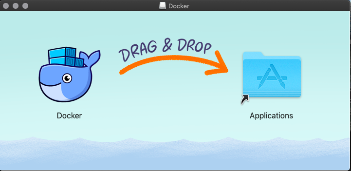
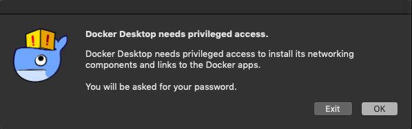
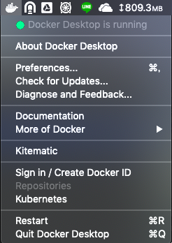

# dockerのインストールメモ(Mac OS)   
初めてDockerを使うことになったのでMacにインストールする手順などをメモ代わりに残す。  

## 手順メモ
### Dockerのダウンロード  
以下のサイトからダウンロードできる。  

参考にしたサイトとかではStable版とBeta版があるようなことが書いてあったが、特にそれを選ぶ画面がなかったので消えたのかもしれない。  

[https://docs.docker.com/docker-for-mac/install/](https://docs.docker.com/docker-for-mac/install/)  

### インストール  
ここからダンロードしたファイルを開いてインストールする。  
とりあえず画面の指示にしたがってドラッグ&ドロップ  
  

### Dockerを起動する  
Dockerを起動すると、以下のような画面が表示されるので、OKをクリックして指示に従ってパスワードを入力する。  

すると、上部のメニューバーにDockerのアイコンが出現するので、そこをクリックすると以下のようなメニューが表示される。  
   
### 動作確認  
Dockerが起動しているのが確認できたらターミナルを開いて動作確認をする。  
```zsh
% docker version
Client: Docker Engine - Community
 Version:           18.09.2
 API version:       1.39
 Go version:        go1.10.8
 Git commit:        6247962
 Built:             Sun Feb 10 04:12:39 2019
 OS/Arch:           darwin/amd64
 Experimental:      false

Server: Docker Engine - Community
 Engine:
  Version:          18.09.2
  API version:      1.39 (minimum version 1.12)
  Go version:       go1.10.6
  Git commit:       6247962
  Built:            Sun Feb 10 04:13:06 2019
  OS/Arch:          linux/amd64
  Experimental:     false
```

とりあえずDockerはインストールされたようだ。  
次にちゃんとイメージ(仮想環境のセットのようなものだと理解している)をダウンロードして動かせるかどうかを確かめる。  

```zsh
% docker run hello-world
Unable to find image 'hello-world:latest' locally
latest: Pulling from library/hello-world
1b930d010525: Pull complete
Digest: sha256:2557e3c07ed1e38f26e389462d03ed943586f744621577a99efb77324b0fe535
Status: Downloaded newer image for hello-world:latest

Hello from Docker!
This message shows that your installation appears to be working correctly.

To generate this message, Docker took the following steps:
 1. The Docker client contacted the Docker daemon.
 2. The Docker daemon pulled the "hello-world" image from the Docker Hub.
    (amd64)
 3. The Docker daemon created a new container from that image which runs the
    executable that produces the output you are currently reading.
 4. The Docker daemon streamed that output to the Docker client, which sent it
    to your terminal.

To try something more ambitious, you can run an Ubuntu container with:
 $ docker run -it ubuntu bash

Share images, automate workflows, and more with a free Docker ID:
 https://hub.docker.com/

For more examples and ideas, visit:
 https://docs.docker.com/get-started/
```
これで動作確認ができた。  
取得しているImageのリストは`docker image ls`で確認できる。  
```zsh
% docker image ls
REPOSITORY          TAG                 IMAGE ID            CREATED             SIZE
hello-world         latest              fce289e99eb9        2 months ago        1.84kB
```

## まとめ  
とりあえず今回はインストールするところまでをざっくりまとめた。  
次回はMySQLをDocker上で動かすところをやってみたいと思う。  
