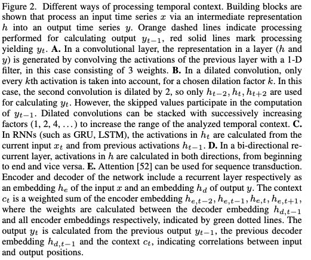

# Deep Learning for Audio Signal Processing  
インターン先の[MICIN](https://micin.jp/)で論文サーベイしたのでそのまとめです。  
DeepLearningを使った音声信号処理について総合的にまとめたもの。  
かなり網羅している感じはあるので最近の傾向とかはこれを読むだけで大体掴める。  

2019/04/30  
[論文リンク](https://arxiv.org/abs/1905.00078)   

## Abstract  
- 音声処理のSOTAのレビュー論文。  
- 前処理から幅広い応用分野に到るまで色々まとめた  

## 1. Introduction  
- 深層学習(DL)は、複合ガウスモデル(GMM)や隠れマルコフモデル(HMM)、non-negative matrix factorizationといった従来の手法を凌駕した。  
### 画像処理とは異なった音声における観点  
- 音声信号は一次元の時系列データ(2次元の画像データとは根本的に異なる)
- 音声信号は通常、2次元の時系列データ(周波数スペクトログラムなど)に変換されて利用される  
- 音声信号は瞬間を捉えた画像とは異なり、時系列に沿って処理する必要がある  

## 2. Methods  
### 2-A. problem Categorization  
どんな出力にしたいかで分類する。  
そこには**2つの独立した軸** が存在している。  
1. ラベルの長さについての種類  
2. ラベルそのものの分類の仕方  
  
#### ラベルの長さ  
- 単一の広域的なラベル(音声の種類とか)(single global label)  
- 各タイムステップにおける局所的なラベル(label per time step)    
- 可変長のラベルのシーケンス(label sequence)    

の3つに分類される。  
#### ラベルの分類の仕方  
- 単一クラス(そのクラスに属するかどうか)(single class)    
- 複数クラスの分類(set of classes)    
- 数値データ(numeric value)    

の3つが各ラベルにおける目標値として分類できる。  
#### 問題ごとの名称づけ  
それぞれやり方によって名前をつけていく。  
|名称|長さの種類|分類の仕方|具体例や備考|
|:--:|----|:--:|-----------|
|sequence classification|single global label|single class|言語や話者推定、音楽のキーなど|
|multi-label sequence classification|single global label|set of classes|いくつかの音響的な現象の推定(weakly-labelled AudioSet datasetなどがある)|  
|sequence regression|single global label|numerica value|目標値を離散化すれば多クラス分類問題に変換が可能|  
|sequence labeling|label per time step|single class, set of classes|和音の検出や歌声の動きの検出など|
|Event detection|label per time step|single class|その時刻でイベントが発生したかどうか。(話者の変更など)|  
|Regression per time step|label per time step|numeric value|変化する音源からの距離や音声のピッチ、音源の分離|  
|sequence transduction|label sequence|区別なし|音声認識、音楽解析、翻訳(特に決まった用語はない)|  

音声以外の入力をするもの。  
音声合成 : sequence transductionやsequence regressionタスクに分類が可能。  
音声の類似判定 : 回帰問題  
### 2-B. Audio Features  
音声の特徴量。  
#### 特徴量抽出とDNN  
しばしば音声の特徴量の抽出の仕方そのものに対して考えられることが多いが、DNNs(Deep neural networks)は最適化の際に一緒に特徴量抽出も行なっていると考えらえれる。  
- 音声認識では、 [10]において、下層(入力に近い方)における活性化された値は話者に適応された特徴量として考えられ、上層(出力に近い方)はクラスベースの分類を行なっていると考えることができる。  

#### MFCC  
メル周波数ケプストラム係数(MFCCs)がここ何十年か音声データの特徴量表現の主なものとして利用されてきた。  
1. FFTで周波数に変換  
2. 得られたスペクトルに強さ(magnitude)を計算
3. メル周波数に沿った周波数フィルタをかける
4. logをとる  
5. 白色化(分散を統一する)  
6. 離散コサイン変換(DCT)(逆フーリエ変換の代用)  

DLモデルにおいては、空間的な関係性を破壊し、情報が失われてしまうためDCTは不要と考えられている。  

6番の工程を取り除いた**ログメルスペクトラム(log-mel spectrum)** が音声分野において主流の特徴量。  
#### フィルターバンク  
- メルフィルターバンクは、周波数のフィルタリングに使用されるが、人の聴覚特性に影響されたものである。  
- 転置(transpotitions)をtranslationとして捉えた表現を用いることの方が好ましいタスクもある。  
共通因子(共通の関数とか)によって倍音や基音をスケーリングすることによってトーンの変換を行う。  
これが対数周波数スケールに変化した。  
- **constant-Q周波数** (抽出する周波数の大きさに合わせてフィルターの大きさも変化させて得られた周波数のこと)は人の聴覚特性に即したフィルターバンクを生成していると言える。  

#### スペクトログラム  
スペクトログラムはスペクトルのシーケンスのこと。  
時刻と周波数における、音声の隣り合うスペクトログラムのビン(bins)は相関があると考えれるが、  
他にも音声生成の際の物理的な性質から他の相関性が存在している。  
倍音などがその例になる。  

このような物理的な性質を考慮するために、CNNなどの空間的に局所的なモデルにおいて3つ目の次元を追加して倍音の強さを出力することも可能。  

各々の周波数帯において、値の分散は異なるので、それぞれの周波数帯において正規化を行うことがある。  

#### 窓の幅  
スペクトルを計算するための窓幅は時間的な解像度と周波数的な解像度とのトレードオフの関係にある。  
- 短い窓幅であれば時間解像度は上がるが、周波数解像度は下がる。逆もまた然り。  

- log-melとconstant-Q周波数はどちらも高周波数に対しては短い窓幅を適用することが可能であるが、不均質にぼやけたスペクトログラムを生成することになってしまい空間的に局所的なモデルには適さない。  

- 複数のチャンネルで異なった窓幅を適用して抽出した特徴量を使うという手がある。  
#### フィルターバンクに頼らない方法  
このように意図的に設計されたフィルターバンクを頼らず特徴量抽出を単純化するために様々な手法が提案されてきた。  
結果的にデータ・ドリブンな統計的なモデル学習になった。  

- 解像度をマックスにした(full-resolution)([18],[19])、magnitudeスペクトルや、
- 生の音声データを直接使用し、フィルタ自体もモデルとして学習させるケースもある([20]-[23])。
- 下層レイヤーでlog-メルスペクトルの計算をデータから学習させるよう設計したモデルもある([24])。  
- フィルターバンクを一切使わず、1次元の音声データから回帰モデルを作成した例もある([25])。  

### 2-C. Models  
複数のフィードフォワード、畳み込み、再帰層が組み合わせてモデルの可能性を広げている。  

#### Convolutional Neural Networks(CNNs)  
CNNsは学習可能なカーネルを使って入力を畳み込みを行うことが基本。  
- 1次元(時間軸)か2次元(時間-周波数軸)の2つが主流。  

- 1次元畳み込みは生の音声データによく使われる。  
- それぞれのカーネルを使用して複数の特徴量マップ(channels)を計算するのが特徴。  

- プーリング層でダウンサンプリングを行う。   
- (畳み込み→プーリング)xN→全結合層(FCN)がよく使われる。  
#### 受容野  
- それぞれのモデルによって固定されている。  
- 大きなカーネルを使ったり、複数のCNN層を重ねると受容野も大きくなる  
- サンプルレートが大きいデータだと、十分な受容野を確保しようとすると膨大な数のパラメタを要し、計算も複雑になる  
##### 代替手段  
- dilated convolution(atrous, convolution with holes)がある。([25],[27]-[29])。  
フィルタ係数の間にゼロの値を差し込むことで、畳み込みのフィルタをカーネルサイズよりも大きい範囲に適用する。    
dilated畳み込みを重ねれば、非常に大きな受容野を確保することが可能。  

#### CNNの構造決定  
- 特定のタスクに対して有効なCNN構造の構築をするための理論は今の所ない([30])。  
- 経験的に選ばれている場合がほとんど。  
- 大雑把なガイドラインは存在している。  
少ないデータには少ないパラメータで([31])や、チャンネルの数は特徴量マップのサイズが小さくなるにしたがって増やしていくべきだといったことなど。  

#### Recurrent Neural Networks (RNNs)  
CNNによる有効な文脈(context)サイズは限られている。  
RNNsはシーケンスのモデルで異なったアプローチをしている([32])。  
- そのステップでの入力と直前の出力を使って出力の計算を行う  

オフラインではbidirectional RNNsは逆方向の再帰も行い、未来方向へも受容野を広げている。  
従来のHMMsとは異なり、RNNの隠れ層のユニット数が線形に増加すると、指数関数的に表現可能な状態数は増加する。  
この時、学習に必要な時間はせいぜい二次関数的に増加するのみである([33])。  

#### 勾配消失  
RNNは勾配消失は勾配発散に見舞われることがある。  
- LSTM([7])はゲートメカニズムとメモリーセルを一般化て情報の流れを緩和し、勾配問題を解決した。  

- 再帰層を重ねる([34])ことや、
- スパースな再帰層を重ねる([35])ことが音声合成で有用なことがわかっている。    
#### LSTMの拡張  
時間軸方向と周波数軸方向にLSTMを拡張する。  
- Frequency LSTMs(F-LSTM)[36]やTime-Frequency LSTMs(TF-LSTM)([37]-[39])が周波数間の相関をモデルするCNNの代替手段として導入された。  

CNNとは異なり、F-LSTMsはローカルフィルタや再帰的なつながりを通してtranslationalな普遍性を取得する。  

TF-LSTMsは時間と周波数方向に拡張しており、ローカルフィルタと再帰的な結合によりスペクトルと一時的な(temporal)もの両方をモデル化することができる。  
- TF-LSTMsはいくつかの課題でCNNsよりも良い成績を出している。([39])  
しかしながら、計算の並列化がCNNに比べてできないため学習速度が遅い。  
#### CNNとLSTMの利用  
RNNはCNNで出力された値を処理することが可能。  
Convolutional Recurrent Neural Network(CRNN)と呼ばれる。  
CNNで局所的な情報を取得し、RNNによってそれらを結合する。  

一時的な文脈を処理する様々な方法が以下の表にまとまっている。  

  

#### Sequence-to-Sequence Models(Seq2Seq)  
Seq2Seqは入力のシーケンスから出力のシーケンスを直接出力するモデル。  

多くの音声処理タスクは本質的にはsequence-to-sequenceの変換タスク。  
これまで細分化されてたタスクをひとまとめに行うことができる。  
例えば、音声認識の分野では、最終的なタスクは入力となる音声信号を単語のシーケンスとして出力すること。  
- しかしながら従来のASR(Automatic Speech Recognition)システムでは音響的、発音、言語モデと分離して各々を独立に学習させていた([40],[41])。  

#### end-to-endでの学習  
DLモデルでのend-to-endによる学習が盛んに行われている([42]-[47])。  
語彙集といった予備的な知識や文章の正規化モジュールといった外部情報を一切使わない。  
全て一色単に学習する。  
モデルは直接目的となるシーケンスを予測するため、デコードの処理も単純化されている。  

#### Connectionist temporal classification (CTC)  
end-to-endで学習するモデルの一例([48]-[51])。  
- ブランクラベル(blank symbol)を導入し、シーケンスの長さ調整を行う  
- ブランクを含めた考えうるパスを全て統合し、まとめて最適化を行う  
ベースとなるCTCモデルはGraves([42])によって拡張され、セパレートな言語モデル(recurrent neural network transducer; RNN-T)を導入した  
入力と出力のシーケンスをまとめて学習する注意機構のモデルがどんどん主流になってきている([43],[52],[53])。  

他のsequence-to-sequenceモデルを改良したlisten, attend and spell (LAS)がある([54])。  

### Generative Adversarial Networks (GANs)  
GANは教師なしの生成モデル([55])。  
GANは2つのネットワークから構成される。  
- 生成器  
- 識別器

生成器(generator)はいくつかの前提知識から潜在ベクトルにマップしサンプルを生成し、識別器(discriminator)は生成されたサンプルが本物か偽物かを判定する。  
画像生成ではGANは成功したが、音声分野での利用は限られる。  
GANは音源分離([56])や楽器変換([57])やノイズ除去([58]-[61])で使われている。  

### Loss Functions  
訓練に勾配降下法を使う場合、損失関数は微分可能である必要がある。  
log-melスペクトルでの最小二乗損失(mean squared error; MSE)は2つの音声間の距離の評価に使うことができる。  
時間方向でMSEを取るのは柔軟性のある評価方法とは言えない。  
(同じ周波数の正弦波でも位相の違いによってかなり異なる)  
非線形に歪んだ信号は似たように聞こえるが、これを評価する手法として
- differentiable dynamic time warping distance([62])や  
- Wasserstein GANs([63])といったearth mover's distanceが存在する。  

損失関数はテイラー展開することもできる。  
複数の損失関数を組み合わせることも可能。  
制御された音声合成をするために、変分オートエンコーダ(VAE)の潜在変数を定めておいた範囲に収まるような損失関数を1つ設定し、もう1つは生成された音声の中で制御空間において変化が反映されるような損失関数を設定した([64])。  
### Phase modeling  
log-melスペクトラムだと位相情報は失われる。  
- 位相はGriffin-Lim Algorithm([65])によって求めたmagnitudeスペクトラムから見積もることができる。  

上質な音声を生成するためには位相の精度をあげるだけでは不十分。  
- WaveNet([25])といったNNはlog-melスペクトルから時系列データを生成するよう学習することができる([66])。  

- また、DLではmagnitudeと位相スペクトルを入力特徴量として含むことで複素数スペクトラムを挿入するように学習させることも可能([67], [68])。  
- またはDNNの各レイヤーでの計算を複素数で行うこともできる([69])。  
#### 異なる位相を持つ同質の音声への対処  
音声解析タスクで入力データとして生の音声データを扱う場合、認知的にも意味的にも全く同じ音声が全く異なった位相の中で現れるといった困難が発生する。  
些細な位相変化に対して不変な表現手法を使うことが肝要になってくる。   

- これに対して、畳み込み層が時間方向に使われる([20],[21],[23])。
- もしくは、十分に多くの隠れユニットを持つDNNレイヤを使う([22])。  

### 2-D. Data  
DLの発展には大規模なデータセットが必要。  
画像分野ではImageNetがある(1400万もの手動でラベリングされた画像)。  
- 音声認識の分野では特に英語において巨大なデータセット([71])が存在する。  
- 音楽の分類や類似度判定にはMillion Song Dataset [72]が使える。  
- 一方で、MusicNet([73])は音階ごとのシーケンスがラベリングされている。  
- 他の音楽情報(コードとかビートとか)を含んだラベリングが施されたデータセットは非常に小規模([74])。  
- 環境音分類にはAudioSet[9]がある(200万もの音声)。  
#### transfer learning
画像分野においては転移学習が可能。  
音声認識において、モデルは事前学習が可能。  
言語間での転移学習([75])や異なるタスクでの転移学習([76])もできる。  
#### データセットが少ない時の対処  
転移学習もあるが、そもそもデータセットを増やしたり生成することでデータセットのサイズを大きくすることもできる。  
既知の合成パラメータとラベルがあれば現実のデータを模倣したデータを生成することができるタスクもある。  
生成する画像データを徐々に複雑にしていくことが機械学習の手法を理解し、デバッグし、改善する助けになる。  

生成された画像のみを使って学習をすると、実際のデータに対してはうまく機能しない可能性がある。  
#### DataAugmentation
Data augmentationはより広い範囲での可能な入力を網羅するためにすでにあるサンプルをいじることで新たなる訓練データを生成する。  
- ASRの場合、vocal perturbationと呼ばれるピッチを変化させたり時間を伸ばすことでデータを増やす手法がある([77],[78])。  
- 遠くにある音源の音声認識(far-field ASR)をする際には、音源データを部屋の反響モデルに通すことで複数チャネルのノイズや反響のあるデータを生成することができる([79])。  
- ピッチ変更はコード識別において有用である([80])。これと時間方向の引き伸ばしやスペクトルでのフィルタリングは歌声の識別や楽器識別に有用である([81],[82])。  
- 環境音では、訓練データ同士を線形に足し合わせると汎用化に有用である([83])  
- 音源分離では、別々のトラックの音声を混ぜたデータセットを使うことで学習ができる  
### 2-E. Evaluation  
評価基準はタスクによって変化する。  
#### WER(音声認識)  
例えば、音声認識の分野ではword error rate (WER)が使われる。  
WERは予測した単語列と参照する単語列とを並べてみて単語の間違う割合をカウントし、挿入、削除、置き換えの割合によって構成される(分母は答えとなる単語列の長さ)。  
#### 音楽や音響シーンのクラス分類問題  
accuracyがよく使われる。  
#### 二値分類問題(閾値なし)  
AUCROC(the area under the receiver operating characteristic curve)が使われる。  

これらの評価手法の設計では、クラス間の意味的な関係性が考慮される。  
(コードの推測問題ではハーモニーが近いもの同士はエラーの値を小さくするなど)   

イベント検知では、Fスコアかequal error rateが使われる([84],[85])。  
音源分離などにはsignal-to-distorion ratio, signal-to-interference ratio そして signal-to-artifacts ratio([86])のような手法を使って評価される。  
Mean opinion score (MOS)は主観的なスコア。合成された音源(特にスピーチ)を主観的に評価する。  

## 3. Applications  
具体的な応用例について見ていく。  
### 3-A. Analysis  
#### 3-A-1) Speech:
音声認識は音声ベースのinteractionの前提条件となる。  
音声認識の歴史は半世紀ほどまでに遡る([87])。  
##### 遍歴  
triphone-state ガウス混合モデル(GMM)/隠れマルコフモデル(HMM)がここ数十年の主流モデルだった。  
が、
- 2012年にDNNを使ったモデルが何千時間ものデータを使った学習したところ驚異的なWERスコアを出した([3])。  
- deep feedforward and convolutional networks([91])の他にも、LSTMやGRUは他のフィードフォワードのDNNよりも良いスコアを出した([92])。  
- CLDNN(the convolutional, long short-term memory deep neural network)モデルがLSTMのみのモデルよりも良い成績を残した([93])。  

CLDNNsでは、入力に使われる窓を2次元畳み込みとMAXプーリングで処理する。これにより、信号における周波数の分散を抑えることができ、LSTMへ渡す特徴量の低次元化もすることができる。LSTMで処理された情報はいくつかのフィードフォワード層で計算され、ソフトマックス関数で出力される。  
##### HMMなしのsequence-to-sequenceに  
RNNを使ったモデルによって、HMMなどによる音素状態量を入れる必要がなくなった。  
CTCベースのモデルを単語の出力ターゲットに合わせて訓練したものは、YouTubeの動画のキャプションタスクでSOTAデアルCD-phoneme baselineを超えた([45])。  
LASはエンコーダを含む NNモデルで、エンコーダ部分は従来の音響モデルと類似している。   
CTCとLASはモデル構造はシンプルではあるが、性能自体は従来のモデルよりもよくなっている([94])。  
##### 具体的な適用例  
無人アシスタント。
- Google Home
- Amazon Alexa
- Microsoft Cortana  
これらのインターフェースは音声となっている。  

また、YouTubeの自動字幕にも使われている。  

音声ベースのアプリケーションが増えていくと、より多くの話者と言語に対してカバーしていくことが寛容となっていく。  

転移学習はマイナーな言語に対して活用されている([75])。  
自動音声認識分野でDLが大きな成功を納めているため、他の分野でもDLよりの流れができている。  
(音声区間検出(voice activity detection)([95]), 話者識別(speaker recognition)[96]), 言語識別([97]), 音声翻訳(speech translation)[98])  
#### 3-A-2) Music:  
言語音声に比べると、音楽データは非常に多岐にわたり、豊富。  
同一の種類の音楽に対しては、時間や周波数軸方向で同様の規則性が働いているが、それにより複雑な依存関係を構築している。  

##### 課題  
- 低レベル分析(周波数解析など)  
- リズム分析(ビート追跡)
- ハーモニー分析(キーの検出、メロディーの抽出)  
- 高レベル分析(ジャンル分けとか楽器検出)  
- 高レベル比較(繰り返し部分の検出、カバーソングの同定など)  

これらの課題は人力で設計されたアルゴリズムや特徴量を使って取り組まれていた。  
現在ではDLによって取り組まれている。  
より詳細なリストは[99]に記載されている。  
##### binary event detection  
いくつかのタスクはイベント検知(binary event detection)に分類される。  

最も単純なもので onset detectionがある。これは、録音のどの部分が小節や展開のスタート地点なのかを検出する。  
- Lacoste and Eck [84]は、constant-Q log-magnitudeスペクトログラムの200msごとの切り抜きデータを使って小節(や展開)の始まりかその最中なのかを予測する小規模なMLPを学習させた(フーリエ変換を使った特徴量を使用しない方が良い結果が残ったらしい)。   
↑人力で設計されたアルゴリズムよりも良い結果を残した。  

- Eyben et al. [100] は上記の手法を改良させ、bidirectional LSTMを微分フィルタを通したスペクトログラムに対して適用した。  
- Schluter et al. [16]は 15フレーム分のlog-mel スペクトログラムをCNNで処理した結果をさらに改善させた。  

- onset detection(小節の始まり部分の特定)はビートやダウンビート(小説の1拍目)の追跡に使われている[101]  
- ダウンビート検出に、スペクトログラムに対してDurand et al. [102]はCNNを利用し、Bock et al.[103]はRNNを使用して検出しようとした。  
- 上記の2つの研究ではHMM[104]やDynamic Bayesian Network(DBN)[104]をネットワークの出力に噛ませている。  

- Fuentes et al. [104] はCRNN(CNN+RNN)を提案し、HMMやDBNを使った後処理の必要性をなくしたが、ビート追跡器を使用している。  

- 高レベルな分析として展開の区切りを予測するものをUllrich はCNNで解決した([105])。  
受容野は60秒にまで大きくして、強力なダウンサンプリングを行なっている。  

CNNとRNNを使ったアプローチはevent detectionでは成功を収めている。  
時間軸方向で訓練のターゲットがぼやかされると致命的になる([16],[84],[105])。  
##### 他クラス分類問題  
コード識別問題がある。  
(各タイムステップごとの基音とコードのクラスを予測する課題)  

- 従来の手法では12音階を元にオクターブを考慮して検出していた([13])。  

- Humphrey and Bello [80]はCNNでの処理の類似性を指摘し、CNNと入力にconstant-Q, 線形マグニチュード スペクトログラムを使用したモデルで良い成績を残した。  
(ピッチの変更とかで学習データのカサ増しをした)  

- McFee and Bello [106]はCRNN(2dConv→1dConv→GRU)を使って170種類もの詳細なコードセットを予測した。  
- Korzeniowski et al. [107]はlog周波数スペクトログラムを入力に使ったCNNを学習させ、コードだけでなくchromagramを表現する手法を改善させた。  

##### シーケンス分類問題  
テンポ検出が低レベルな問題としてある。  
- ビートとダウンビートの検出を元にするのが自然なやり方([102],[103])。  
- onset detectionなしにビート追跡を行うように、Schreiber and Muller [108]はCNNが12秒のスペクトログラムの切り抜きを入力に与えるだけでテンポの検出ができることを示した。  

より広い課題として、人が音楽の切り抜きを聞いて、どのタグ付けを行うのかという問題がある。  
タグの種類としてテンポ、ジャンルなどがあるが、曲全体に対して付けられることが常。  

この曲の切り抜きから曲全体のタグを予想する問題に対してのアプローチがいくつかある。  
- Dieleman et al. [109]は3秒ほどのlog-メルスペクトログラムを入力として小さな1dConvを適用し、それぞれの切り抜きにおける予測値を平均することで曲全体のタグを予測させた。比較として、生データを入力に使用したが結果はよくなかった。

- Choi et al. [110]はスペクトログラムを画像に見立てて、3x3のCNNの後にFCNを適用して分類問題をといた。  
画像分類に比べると、プーリング層がより後の段階で出てくる。局所的な歌声検知が全体の予測性能の向上をさせる目的でmax-poolingを入れた。  
- Lee et al. [111]は音楽の生データに対してCNNを学習させた(kernelサイズは2から4ほどでmax-poolingを使用))  

##### 音楽分野まとめ  
まとめると、音楽分野においてDLは様々な音楽処理タスクにおいて成功を納めた。その結果として、自動化された産業用のアプリケーションで多岐にわたって使われるようになった。  
音楽のレコメンド機能や、説明付与など。  

研究的な側面ではどんな特徴量を入力として使うかや、ネットワーク構造としてCNNやRNNを使うかについては総意が取られていない。  
この辺りについてはさらなる研究が必要となるだろう。  

#### 3-A-3) Environmental Sounds:
スピーチや音楽以外にも、他の音もまた我々の環境に関する豊富な情報を与えてくれる。  

環境音分析はいくつかの応用先がある。例えば、状況を検出するデバイスや、音による監視装置、複数の媒体によるラベル漬けや情報収集などである。  

これらは主に3つの基本的な取り組みによってなされている。  
1. 音響的なシーン分類  
2. 音響的なイベント検知  
3. タグ付け  

##### 音響的なシーン分類(acoustic scene classification)  
録音データ全体からその録音に対して場面ラベルを付与するのが目的(どんな場面かを予測する)。   
ラベルの例としてあるのは "家","道路","車中","レストラン"など。  

##### 音響的なイベント検知(acoustic event detection)  
- 様々なイベントの音が検知されている区間(始まりと終わり)を検知するのが目的。  
イベントとしては足音や信号機の音、犬のほえ声など。  

- 単純でかつ効果的な手法として、各時刻ごとのイベントのクラス分類問題を教師あり学習として解くのがある。  

- イベント検知に使われている分類器は文脈的な情報(contextual information)を使用する。(分類の対象から出てくる音声を処理した特徴量など)  
目的となるフレーム周辺の音響的特徴量を結合して使用するのが2016年に開催されたDCASE(Detection and Classification of Acoustic Events and Scenes)[112]での基本的な手法となった。  
- RNNが2クラスのフレームごとのイベント検知問題に使われた([113])ように、一時的な情報をモデルした分類器構造が使うこともできる。  
- CNNもまた有効。だが、時間的な解像度を高くするためにはmaxプーリングやストライドのサイズはあまり大きくしすぎてはいけない。  
- CNNで解像度を高く保ちながら大きな受容野を確保するためにはdilated convolutionやdilated poolingが使用できる([114])。  

##### タグ付け  
タグ付けの目的は、局所情報(temporal information)なしに音声データを複数のラベル付けをすることである。  

タグ付けやイベント検知において、同時に起こりうる複数のイベントを予測対象とすることがありうる。  
イベント検知の分野では polyphonicなイベント検知と呼ぶ。  
この中では、それぞれのクラスはバイナリーなベクトルによって表現される。それぞれのベクトルがそれぞれのイベントに対応している仕組みだ(1: active, 0: nonactive)。  
重複したラベル付けが可能となると、マルチラベルなクラス分類問題になる。  
##### マルチラベルなクラス分類問題  
同時に起こる複数のクラスを予測するマルチラベルなクラス分類器は各々のクラスに対して単クラス分類器を使うよりも良い結果を残す。  

これはクラス間の相関関係もモデル化していることによるのではないかと考えられる。  

##### データセットの制限  
音楽やスピーチに比べると研究が盛んでないこともあり、データセットも限られたものとなっている。  
ほとんどのデータセットはDCASEchallengeの中で出されたもの。  
データセットが限られているので、data augmentationが共通して使われており、効果も実証されている。  

#### 3-A-4) Localization and Tracking:  
複数チャンネルの音声データは音源の位置推定と追跡のために利用できる。  
これを活用すると、音源分離やスピーチの補強(enhancement)、話者分離などに利用することが可能となる。  

##### 音源方位、場所検知  
複数のマイクからの入力からなる音源配列は音源の方位や高度推定に使うことができる。  
複数のマイクからの情報を結合することで、方位情報を結合して場所情報を得ることが可能となる。  
複数のマイクからの情報を与えられた上での方位推定は2つに大きく分類できる。  
1. 方位を離散クラス化してクラス分類問題に変える([115])    
2. 回帰問題として方位を推定する([116])か空間座標を推定する([117])  

DL構造の違いによって入力される特徴量の違いによってDL構造も異なり、単一なのか複数の音源の位置推定を行うかでも異なってくる。  

##### 入力に使われる特徴量  
位置推定としてよく使われる特徴量は以下のようなものがある  
- 位相スペクトル[115]  
- 強度(magnitude)スペクトル[118]  
- 一般化されたチャンネル間の相互相関係数(generalized cross-correlation)[117]  

一般的に、音源の位置推定には複数チャンネルの情報が必要になっている。  
これらの情報をDLを使って学習することも可能で、チャンネル内での(within-channel)適切な位相情報が必要になってくる。  
- CNNでこれを行うことができる[118]。カーネルは複数チャンネルにまたがっている。  

### 3-B. Synthesis and Transformation  
#### 3-B-1) Source Separation:  
音源分離は単一音源からの音情報のみを抽出する処理のことをさす。

現実世界では複数音源の混ざった音声データが取得されるため、これらを分離することは信号処理タスクで良い成績を出すために重要である。  

音源分離が応用されている分野はロバストなクラス分類のための前処理、スピーチの明瞭化のための前処理、音楽編集やリミックスなどが含まれる。  

##### 音源分離の定式化  
音源分離は以下のように定式化することが可能。  
ある単一音源からの信号を $s_{m,i}(n)$ とすると、

$$
x_m(n) = \sum_{i=1}^I S_{m,i}(n) \tag{1} \\\\
$$   

$i$ が音源のインデックスで、 $I$ が音源の個数。 $n$ がサンプルのインデックスとなる。
複数のマイク入力からの合成結果が $x(n)$ だとすると、 $s_{m,i}(n)$ が $m$ 番目のマイクからの $i$ 番目の情報だということになる。  

##### 音源分離手法のSOTA  
音源分離手法におけるSOTAは時間-周波数軸方向でマスキング処理を施しているのが特徴的(音声の生データからDNNを使って直接推定する研究もあるにはある[119])。  

時間ー周波数軸方向で処理をする理由は主に3つある。  
1. 生の音声データは時間ー周波数軸方向でより構造が顕著になる。  
2. 畳み込みにより、複数周波数の合成が可能となり、処理手法の単純化ができる  
3. 生の音源は時間ー周波数軸方向だとスパースなデータとなり、分離が容易になる  

##### 時間ー周波数軸方向のマスキング  
混合された音源のスペクトル $X_m(f,t)$ の時刻 $t$ 、 周波数 $f$　における分離マスク $M_{m,i}(f,t)$ を使うことでスペクトルの分離を行う。  

$$
\hat{S}_{m,i}(f,t) = M_{m,i}(f,t)X_m(f,t) \tag{2} \\\\
$$

は $m$ 番目のマイクチャンネルの $i$ 番目のソースを示している。  

$X_m(f,t)$ は短時間フーリエ変換(STFT)を使って計算される。  
他にはconstant-Q や mel スペクトログラムを使うこともできる。  

しかしながら、これら2つの特徴量を使うことは情報の損失などを理由にあまり一般的ではなくなっている。  

##### 単一音源へのDL的なアプローチ  
2つのカテゴリに分類可能。  
1. 混合入力 $X(f,t)$ から分離マスク $M_i(f,t)$ を予測するのが目的  
2. 音源スペクトル $S_i(f,t)$ を直接予測する([120])    

これらの場合のDLは教師あり学習を基礎としている。  
目標値となるマスクはバイナリーな値をとるか、連続値([0,1])をとる。  
手法として
- 畳み込みの使用[121]  
- 再帰層の使用[122]  
がある。  

- 従来の平均二乗損失(MSE)を使うのではなく、設計された損失関数が開発されている[123]  

##### クラスタリング  
- deep clustering は教師ありのDLを使って各々の時間ー周波数地点におけるembeddingベクトルを計算することを目的としており、これを教師なし的な手法でクラスタリングする[124]  

上記のアプローチは訓練データに出現しない音源の分離を行うことを可能としている。  
- この手法を発展させて、それぞれの音源に対するattractorベクトルを予測し、単一チャンネルからの音源分離においてSOTAの結果を得るのに使われているattractor networkというのがある[125]  

##### 複数チャンネルの音データによる音源分離   
複数チャネルを使うと、音源の位置情報も加味することができるので音源分離の精度向上を行うことができる。  

DLを使ったアプローチはいくつか存在する。  
最も多いのは単一チャネルと同様のアプローチでDLを使う方法  
- 目標となるスペクトラムや分離マスクをモデル化[126]。このような場合、目的となるのはスペクトル的な特徴、特質をDLヲを使ってモデル化することにある。  
- 位置情報も情報として加えることができる[127]  

- DNNを使って複数チャンネルに対するマスクの重みを推定することも可能[128]  

##### 環境音  
環境音はそれぞれの音源同士が独立で、情報そのものがスパースなのが特徴。  
音楽データはそれぞれの音源同士が高い相関を持っている。  

#### 3-B-2) Audio Enhancement:  
スピーチ強化の技術はノイズを抑えることでスピーチの質を上げることが目的。  
- ノイズ除去は、明確な手法[129]であれ、暗示的な手法[130],[131]であれノイズに強いASRシステムの構成には非常に重要である。  
- 従来の技術[129]  
- 直接クリアなスピーチをDNNを使って再構築する[132],[133]  
- ノイズの混じった信号からそれを取り除くマスクを推定する[134]-[136]  

DL的なアプローチでは従来手法ではできなかった時間依存のノイズをモデル化することが可能となっている。  
その他の種類のネットワークがスピーチ強化のために開発されている  
- ノイズ除去オートエンコーダ(denoising autoencoder)[137]  
- CNN[138]  
- RNN[139]  

##### GAN  
- GANがノイズありのスピーチに対する強化に有用であることが示されている[58] (ノイズありの信号からノイズのないクリーンな信号に変換するタスク)。  
- log-melスペクトルで表現されているスピーチに対してGANが適用された[59]  

GANによって補強されたスピーチがASRシステムに使われても、あまり効果はなかった。  

#### 3-B-3) Generative Models:  
音声データから学習した特徴量を元に、リアルな音声データを合成する。  
生成される音声データは訓練データとして投入されたものに近いものでなければならない。  

スピーチ生成での必要な条件  
- 訓練に使う抽出された音源が判別可能である
- 生成されるデータは独自のもの
- 生成されるデータに多様性  
- 訓練時間が短い  
- 生成時間が短い(理想はリアルタイム)  

入力として使うデータとしてはスペクトログラム的な表現か生のデータ表現がある。  
スペクトログラム的な表現は音声合成の段階でGriffin-Limアルゴリズム[65]を逆フーリエ変換[140]と共に位相を再構築する必要があるが、良質な音声データを合成するには至らない  
これに対してEnd-to-endの方が良い。  
- VAEやGAN[141]を使用する場合、音声データは低次元の隠れ状態から合成されることが多い  
- ランダムな位相を持った異なった解像度を持つレイヤーを通すことで性能をよくすることもできる[141]  
- RNNを用いて系sなんコストの高い損失を計算することで粗い解像度で次のレイヤーの活性化された値に左右されるRNNを結合する[34]  
- 長いシーケンスを短いものに分割するスパースなRNNをベースとして音声生成モデルもある[35]  
- dilated covolutionをWaveNetで結合した[25]ものは、扱いやすいサイズに文脈窓のサイズを導いてくれる  
- WaveNetを使うと自己回帰推定はクラス分類問題として捉えることができる。  
- 文脈情報を使うことで入力をより拡張することが可能となる[25]。  
この文脈情報は全体に渡るglobalなものか、時間に沿って変化するものになる。  
- 導入されたtext-to-speechシステムが2つのモジュールを構築する[66]。  
1つはNNは入力となるテキストからメルスペクトルを予測する。  
もう1つはWaveNetが予測されたメルスペクトルから合成されたスピーチを生成する。[66]  

WaveNetを用いたモデルはこれまでの性能から大差をつけた結果を残しているが、学習コストが高い。  
- 並列化されたWaveNetの使用によって学習時間の短縮や様々な応用先において合成そのものにかかる時間の短縮に繋がる([66],[143],[144])  
- 合成をオートエンコーダ内にある隠れ状態におけるパラメータを使って制御することができる[145]。  
- より深いレベルでの音楽生成をDLで行った研究もある[146]  

##### 生成されたデータの評価方法  
生成モデルは主観的もしくは客観的に評価することができる。  
音声の判別のしやすさは分類器を通せば客観的に評価することができる。([141])    

もしくは人出で主観的に評価を行う。  
多様性は客観的に評価をすることが可能。  
- 音声はlog-melスペクトルを使って正規化することが可能で、2つの音声の多様性は平均ユークリッド距離で評価することが可能。  
- 独自性(originality)は最も近い訓練データからのユークリッド距離で評価ができる[141]  
本物か合成されたデータかを人に判別してもらうTurning Testは非常に難易度が高い。  
例えばWaveNetは従来のSOTAであった結合的もしくはパラメトリックな手法よりもより高いMOSスコアを出している。[25]  

## 4. Discussion And Conclusion  
### 4-A. Features  
従来の手法ではMFCCが最も一般的な特徴量のであったが、log-melスペクトログラムが一番で、生の波形データもしくは複素数のスペクトログラムがDLでは一般的な特徴量として使われている。  

- 生の波形データは人手で設計された特徴量を避ける(より良い特徴量をモデルそのものから抽出させるため)  
計算コストが高く、より多くのデータが必要  
log-melスペクトログラムを使うと上記のデメリットを克服できる  
生の波形データを生成するタスクにおいては、スペクトログラムを使用すると大抵の場合、位相情報を再構築する必要がある。  

- 一方で、生の波形データを使った方が解析タスクにおいて性能が向上した落ちう結果もある([25],[147],[148])  
- もしくは従来の特徴量を出力するように最初のレイヤーを学習させる研究もある[18],[19],[23],[24]  

そのため、未だにメルスペクトログラムが最も適切な特徴量かどうかははっきりとしていない。  
### 4-B. Models  
DLがSVMやGMM-HMMsに取って代わった。  
非負行列分解(non-negative matrix factorization)やWiener methodsによって取り組まれていた音声の補強やノイズ除去はDLによって解決されている。  

複数分野にまたがって、CNNsやRNNs、CRNNsが使われている。  
3つのタイプはどれも一時的なシーケンスをモデルすることができ、シーケンスのクラス分類問題や、ラベリング、変換タスクを解くことができる。  
CNNは一定の受容野をもち、これにより考慮できる文脈情報に制限がかかっている。しかし、それと同時に文脈情報をどれぐらいの幅で取得するかを簡単に変更ができる。  

RNNは理論上では文脈情報を無限の範囲で考慮することができるが、まずはそのよう学習させる必要があ理、モデル構造そのものの調整が困難で有り文脈の考慮する範囲の指定が容易にできない。  

#### 課題  
どの状況でどのようなモデルが優れているかは未だにはっきりとしていない。  
### 4-C. Data Requirements  
音声認識用のデータセットを除くと、ほとんどの領域においてデータセットは小規模のものしか存在しない。  
これが原因で、DLのモデルのサイズを大きくすることも難しい。    

#### 他分野との対比(転移学習の限界)    
画像分野ではImageNet[70]で事前学習させることができるので、特定のタスクにおけるデータ数が少なくても対応ができる。  
同様に、自然言語処理の分野においても巨大なテキストコーパスを利用して学習させた単語予測モデルは他の言語においても良い初期化となっていることがわかっている[149],[150]。  
画像、自然言語処理の分野のような大きなデータセットが音声の世界では存在しない。  

また、音声領域で一般的となるようなデータセットを作成することが難しく、転移学習を適用することができない。  
(特定のタスクに特化したものであれば可能だが、他分野への応用がきかない)  

#### 転移学習以外の解決策  
上記の問題を解決するためにも、限られたデータを有効に活用する方法として、転移学習以外の解決策を模索するべきである。  

### 4-D. Computational Complexity  
計算量の増大の利点がDNNの成功によって示された。  
DL用に一般的に使われているのはCPUではなくgeneral-purpose garaphics processing units(GPGPUs)と呼ばれるもの([151])やTPUのような([8])特定タスク用に設計された回路群もある。  

限られた計算資源しか使えない場面(スマホのみで計算したいなど)もあるので、そのためにもコンパクトなモデルを開発していくのも価値のあることだ。  
### 4-E. Interpretability and Adaptability  
DL内のモデルにおいて、特定の箇所がどのようなタスクを解いているのか(どのような情報を抽出しているのか)を解釈することは困難。  
それぞれのニューロンが目標となるタスクに対してどのような値の変化を示すかを研究した例もある([16],[152])。  
もしくは、どの入力によって予測値がされているのかを調査した例もある([153],[154])。  

## References  
文章中の[]で囲まれた数字が以下の文献に対応しています。  
[1] F. Rosenblatt, “The perceptron: A probabilistic model for information
storage and organization in the brain,” Psychological Review, vol. 65,
no. 6, p. 386, 1958.  
[2] D. E. Rumelhart, G. E. Hinton, and R. J. Williams, “Learning representations by back-propagating errors,” Nature, vol. 323, no. 6088, p.
533, 1986.  
[3] G. Hinton, L. Deng et al., “Deep neural networks for acoustic modeling
in speech recognition: The shared views of four research groups,” IEEE
Signal Processing Magazine, vol. 29, no. 6, pp. 82–97, 2012.  
[4] A. Krizhevsky, I. Sutskever, and G. E. Hinton, “Imagenet classification
with deep convolutional neural networks,” in NIPS, 2012.  
[5] A.-R. Mohamed, G. Dahl, and G. Hinton, “Deep belief networks for
phone recognition,” in NIPS workshop on deep learning for speech
recognition and related applications, vol. 1, no. 9, 2009, pp. 39–47.  
[6] Y. LeCun, B. Boser et al., “Backpropagation applied to handwritten
zip code recognition,” Neural Computation, vol. 1, no. 4, pp. 541–551,1989.    
[7] S. Hochreiter and J. Schmidhuber, “Long Short-Term Memory,” Neural
Computation, vol. 9, no. 8, pp. 1735–1780, 1997.  
[8] N. P. Jouppi, C. Young et al., “In-datacenter performance analysis of
a tensor processing unit,” in ISCA. IEEE, 2017, pp. 1–12.  
[9] “AudioSet: A large-scale dataset of manually annotated audio events,”
https://research.google.com/audioset/, accessed: 2019-01-15.  
[10] A. Mohamed, G. Hinton, and G. Penn, “Understanding how Deep
Belief Networks Perform Acoustic Modelling,” in ICASSP, 2012.  
[11] S. Furui, “Speaker-independent isolated word recognition based on
emphasized spectral dynamics,” in ICASSP, 1986.  
[12] S. Davis and P. Mermelstein, “Comparison of Parametric Representations for Monosyllabic Word Recognition in Continuously Spoken
Sentences,” IEEE Transactions on ASSP, vol. 28, no. 4, pp. 357 – 366,1980.  
[13] H. Purwins, B. Blankertz, and K. Obermayer, “A new method for
tracking modulations in tonal music in audio data format,” in IJCNN,2000.  
[14] V. Lostanlen and C.-E. Cella, “Deep Convolutional Networks on the
Pitch Spiral For Music Instrument Recognition,” in ISMIR, 2016.  
[15] R. M. Bittner, B. McFee et al., “Deep salience representations for f0
estimation in polyphonic music,” in ISMIR, 2017.  
[16] J. Schlüter and S. Böck, “Improved Musical Onset Detection with
Convolutional Neural Networks,” in ICASSP, 2014.  
[17] J. Chen, Y. Wang, and D. Wang, “A feature study for classificationbased speech separation at low signal-to-noise ratios,” IEEE/ACM TASLP, vol. 22, no. 12, pp. 1993–2002, 2014.  
[18] T. N. Sainath, B. Kingsbury et al., “Learning filter banks within a deep
neural network framework,” in ASRU, 2013.  
[19] E. Cakir, E. C. Ozan, and T. Virtanen, “Filterbank Learning for Deep
Neural Network Based Polyphonic Sound Event Detection,” in IJCNN, 2016.   
[20] N. Jaitly and G. Hinton, “Learning a Better Representation of Speech
Soundwaves using Restricted Boltzmann Machines,” in ICASSP, 2011.  
[21] D. Palaz, R. Collobert, and M. Doss, “Estimating Phoneme Class
Conditional Probabilities From Raw Speech Signal using Convolutional
Neural Networks,” in Interspeech, 2014.  
[22] Z. Tüske, P. Golik, R. Schlüter, and H. Ney, “Acoustic Modeling
with Deep Neural Networks using Raw Time Signal for LVCSR,” in
Interspeech, 2014.  
[23] Y. Hoshen, R. Weiss, and K. Wilson, “Speech Acoustic Modeling from
Raw Multichannel Waveforms,” in ICASSP, 2015.  
[24] T. N. Sainath, R. J. Weiss, K. W. Wilson, A. Senior, and O. Vinyals,
“Learning the Speech Front-end with Raw Waveform CLDNNs,” in
Interspeech, 2015.  
[25] A. Oord, S. Dieleman, H. Zen, K. Simonyan, O. Vinyals, A. Graves,
N. Kalchbrenner, A. Senior, and K. Kavukcuoglu, “Wavenet: A generative model for raw audio,” in SSW, vol. 125, 2016.  
[26] I. J. Goodfellow, Y. Bengio, and A. Courville, Deep learning. MIT
Press, 2016.  
[27] M. Holschneider, R. Kronland-Martinet, J. Morlet, and
P. Tchamitchian, “Wavelets, time-frequency methods and phase
space,” Springer, pp. 289–297, 1989.  
[28] L. Chen, G. Papandreou, I. Kokkinos, K. Murphy, and A. Yuille,
“Deeplab: Semantic image segmentation with deep convolutional nets,
atrous convolution, and fully connected crfs,” arXiv:1606.00915, 2016.  
[29] F. Yu and V. Koltun, “Multi-scale context aggregation by dilated
convolutions,” arXiv:1511.07122, 2015.  
[30] S. Watanabe, Algebraic geometry and statistical learning theory. Cambridge University Press, 2009, vol. 25.  
[31] O. Ronneberger, P. Fischer, and T. Brox, “U-net: Convolutional networks for biomedical image segmentation,” in MICCAI, 2015, pp. 234–
241.  
[32] J. L. Elman, “Finding structure in time,” Cognitive science, vol. 14,
no. 2, pp. 179–211, 1990.  
[33] Z. C. Lipton, J. Berkowitz, and C. Elkan, “A critical review of recurrent
neural networks for sequence learning,” arXiv:1506.00019, 2015.  
[34] S. Mehri, K. Kumar, I. Gulrajani, R. Kumar, S. Jain, J. Sotelo,
A. Courville, and Y. Bengio, “SampleRNN: An unconditional endto-end neural audio generation model,” arXiv:1612.07837, 2016.
[35] N. Kalchbrenner, E. Elsen, K. Simonyan, S. Noury, N. Casagrande,
E. Lockhart, F. Stimberg, A. van den Oord, S. Dieleman, and
K. Kavukcuoglu, “Efficient Neural Audio Synthesis,” in PMLR, vol. 80,
2018, pp. 2410–2419.  
[36] J. Li, A. Mohamed, G. Zweig, and Y. Gong, “LSTM Time and
Frequency Recurrence for Automatic Speech Recognition,” in ASRU,
2015.  
[37] A. Graves, S. Fernandez, and J. Schmidhuber, “Multi-Dimensional
Recurrent Neural Networks,” in ICANN, 2007.  
[38] J. Li, A. Mohamed, G. Zweig, and Y. Gong, “Exploring Multidimensional LSTMs for Large Vocabulary ASR,” in ICASSP, 2016.
JOURNAL OF SELECTED TOPICS OF SIGNAL PROCESSING, VOL. 14, NO. 8, MAY 2019 12  
[39] T. N. Sainath and B. Li, “Modeling Time-Frequency Patterns with
LSTM vs. Convolutional Architectures for LVCSR Tasks,” in Interspeech, 2016, pp. 813–817.  
[40] H. Sak, A. Senior, and F. Beaufays, “Long Short-Term Memory
Recurrent Neural Network Architectures for L
JOURNAL OF SELECTED TOPICS OF SIGNAL PROCESSING, VOL. 14, NO. 8, MAY 2019 13  
[98] S. Bansal, H. Kamper, A. Lopez, and S. Goldwater, “Towards speechto-text translation without speech recognition,” arXiv:1702.03856,
2017.  
[99] Y. Bayle, “Deep learning for music,” 2018. [Online]. Available:
https://github.com/ybayle/awesome-deep-learning-music   
[100] F. Eyben, S. Böck, B. Schuller, and A. Graves, “Universal Onset Detection with Bidirectional Long Short-Term Memory Neural Networks,”
in ISMIR, 2010.  
[101] B. McFee and D. P. W. Ellis, “Better beat tracking through robust onset
aggregation,” in ICASSP, 2014.  
[102] S. Durand, J. P. Bello, B. David, and G. Richard, “Tracking using
an ensemble of convolutional networks,” IEEE/ACM Transactions on
ASLP, vol. 25, no. 1, pp. 76–89, Jan. 2017.  
[103] S. Böck, F. Krebs, and G. Widmer, “Joint Beat and Downbeat Tracking
with Recurrent Neural Networks,” in ISMIR, 2016.  
[104] M. Fuentes, B. McFee, H. C. Crayencour, S. Essid, and J. P. Bello,
“Analysis of common design choices in deep learning systems for
downbeat tracking,” in ISMIR, 2018.  
[105] K. Ullrich, J. Schlüter, and T. Grill, “Boundary Detection in Music
Structure Analysis using Convolutional Neural Networks,” in ISMIR,
2014.  
[106] B. McFee and J. P. Bello, “Structured Training for Large-Vocabulary
Chord Recognition,” in ISMIR, 2017, pp. 188–194.  
[107] F. Korzeniowski and G. Widmer, “Feature Learning for Chord Recognition: The Deep Chroma Extractor,” in ISMIR, 2016.  
[108] H. Schreiber and M. Müller, “A Single-Step Approach to Musical
Tempo Estimation using a Convolutional Neural Network,” in ISMIR,
2018.  
[109] S. Dieleman and B. Schrauwen, “End-to-end learning for music audio,”
in ICASSP, 2014.  
[110] K. Choi, G. Fazekas, and M. B. Sandler, “Automatic Tagging Using
Deep Convolutional Neural Networks,” in ISMIR, 2016.  
[111] J. Lee, J. Park, K. L. Kim, and J. Nam, “Sample-level deep convolutional neural networks for music auto-tagging using raw waveforms,”
in Proc. Sound Music Comput. Conf., 2017, pp. 220–226.  
[112] A. Mesaros, T. Heittola et al., “Detection and classification of acoustic scenes and events: Outcome of the DCASE 2016 challenge,”
IEEE/ACM Transactions on ASLP, vol. 26, no. 2, pp. 379–393, 2018.  
[113] G. Parascandolo, H. Huttunen, and T. Virtanen, “Recurrent Neural Networks for Polyphonic Sound Event Detection in Real Life Recordings,”
in ICASSP, 2016.  
[114] T. Sercu and V. Goel, “Dense prediction on sequences with time-dilated
convolutions for speech recognition,” in NIPS Workshop on End-to-end
Learning for Speech and Audio Processing, Nov. 2016.  
[115] S. Chakrabarty and E. A. P. Habets, “Multi-speaker localization using
convolutional neural network trained with noise,” in NIPS Workshop
on Machine Learning for Audio Processing, 2017.  
[116] E. L. Ferguson, S. B. Williams, and C. T. Jin, “Sound Source
Localization in a Multipath Environment Using Convolutional Neural
Networks,” in ICASSP, 2018.  
[117] F. Vesperini, P. Vecchiotti, E. Principi, S. Squartini, and F. Piazza, “A
neural network based algorithm for speaker localization in a multi-room
environment,” in proc. in IEEE International Workshop on Machine
Learning for Signal Processing, 2016.  
[118] S. Adavanne, A. Politis, and T. Virtanen, “Direction of arrival estimation for multiple sound sources using convolutional recurrent neural
network,” in ESPC, 2018.  
[119] A. Pandey and D. Wang, “A New Framework for Supervised Speech
Enhancement in the Time Domain,” in Interspeech, 2018.  
[120] Y. Wang, A. Narayanan, and D. Wang, “On Training Targets for
Supervised Speech Separation,” IEEE/ACM Transactions on ASLP,
vol. 22, no. 12, pp. 1849–1858, 2014.  
[121] S.-W. Fu, Y. Tsao, and X. Lu, “SNR-Aware Convolutional Neural
Network Modeling for Speech Enhancement,” in Interspeech, 2016.  
[122] P. Huang, M. Kim, M. Hasegawa-Johnson, and P. Smaragdis, “Joint
optimization of masks and deep recurrent neural networks for monaural
source separation,” IEEE/ACM Transactions on ASLP, vol. 23, no. 12,
pp. 2136 – 2147, 2015.  
[123] M. Kolbæk, Z.-H. Tan, and J. Jensen, “Monaural speech enhancement
using deep neural networks by maximizing a short-time objective
intelligibility measure,” in ICASSP, 2018.  
[124] Y. Isik, J. Le Roux, Z. Chen, S. Watanabe, and J. R. Hershey, “SingleChannel Multi-Speaker Separation using Deep Clustering,” in Proc.
Interspeech, 2016, pp. 545–549.  
[125] Z. Chen, Y. Luo, and N. Mesgarani, “Deep attractor network for singlemicrophone speaker separation,” in ICASSP, 2017.  
[126] A.A.Nugraha, A.Liutkus, and E.Vincent, “Multichannel audio source
separation with deep neural networks,” IEEE/ACM Transactions on
ASLP, vol. 24, no. 9, pp. 1652–1664, 2016.  
[127] Q. Liu, Y. Xu, P. J. Jackson, W. Wang, and P. Coleman, “Iterative
Deep Neural Networks for Speaker-Independent Binaural Blind Speech
Separation,” in ICASSP, 2018.  
[128] X. Xiao, S. Watanabe et al., “Deep beamforming networks for multichannel speech recognition,” in ICASSP, 2016.  
[129] J. Chen, J. Benesty, Y. A. Huang, and E. J. Diethorn, “Fundamentals
of noise reduction,” in Springer Handbook of Speech Processing.
Springer, 2008, pp. 843–872.  
[130] Y. Xu, J. Du, L.-R. Dai, and C.-H. Lee, “An experimental study on
speech enhancement based on deep neural networks,” IEEE Signal
Processing Letters, vol. 21, no. 1, pp. 65–68, 2014.   
[131] B. Li, T. N. Sainath, R. J. Weiss, K. W. Wilson, and M. Bacchiani,
“Neural Network Adaptive Beamforming for Robust Multichannel
Speech Recognition,” in Interspeech, 2016.  
[132] X. Feng, Y. Zhang, and J. Glass, “Speech feature denoising and
dereverberation via deep autoencoders for noisy reverberant speech
recognition,” in ICASSP, 2014.  
[133] Y. Xu, J. Du, L.-R. Dai, and C.-H. Lee, “A regression approach
to speech enhancement based on deep neural networks,” IEEE/ACM
Transactions on ASLP, vol. 23, no. 1, pp. 7–19, 2015.  
[134] D. Wang and J. Chen, “Supervised speech separation based on deep
learning: an overview,” arXiv:1708.07524, 2017.  
[135] B. Li and K. C. Sim, “A spectral masking approach to noise-robust
speech recognition using deep neural networks,” IEEE/ACM Transactions on ASLP, vol. 22, no. 8, pp. 1296–1305, 2014.  
[136] A. Narayanan and D. Wang, “Ideal ratio mask estimation using deep
neural networks for robust speech recognition,” in ICASSP, 2013.  
[137] X. Lu, Y. Tsao, S. Matsuda, and C. Hori, “Speech enhancement based
on deep denoising autoencoder.” in Interspeech, 2013.  
[138] S.-W. Fu, Y. Tsao, and X. Lu, “SNR-Aware Convolutional Neural
Network Modeling for Speech Enhancement,” in Interspeech, 2016.  
[139] F. Weninger, H. Erdogan, and et al., “Speech enhancement with LSTM
recurrent neural networks and its application to noise-robust ASR,” in
ICLVASS, 2015.  
[140] Y. Wang, R. Skerry-Ryan, D. Stanton, Y. Wu, R. J. Weiss, N. Jaitly,
Z. Yang, Y. Xiao, Z. Chen, S. Bengio, and others, “Tacotron: Towards
end-to-end speech synthesis,” in In Proc. Interspeech, 2017, pp. 4006–
4010.  
[141] C. Donahue, J. McAuley, and M. Puckette, “Synthesizing Audio with
Generative Adversarial Networks,” arXiv:1802.04208, 2018.  
[142] A. van den Oord, Y. Li, I. Babuschkin, K. Simonyan, O. Vinyals,
K. Kavukcuoglu, G. v. d. Driessche, E. Lockhart, L. C. Cobo, F. Stimberg et al., “Parallel WaveNet: Fast high-fidelity speech synthesis,”
PMLR, vol. 80, pp. 3918–3926, 2018.  
[143] K. Chen, B. Chen, J. Lai, and K. Yu, “High-quality voice conversion
using spectrogram-based wavenet vocoder,” Interspeech, 2018.  
[144] S.-Y. Chang, B. Li, G. Simko, T. N. Sainath, A. Tripathi, A. van den
Oord, and O. Vinyals, “Temporal modeling using dilated convolution
and gating for voice-activity-detection,” in ICASSP, 2018.  
[145] J. Engel, C. Resnick, A. Roberts, S. Dieleman, D. Eck, K. Simonyan,
and M. Norouzi, “Neural Audio Synthesis of Musical Notes with
WaveNet Autoencoders,” Proc. Int. Conf. Mach. Learn., vol. 70, pp.
1068–1077, 2017.  
[146] J.-P. Briot, G. Hadjeres, and F. Pachet, “Deep Learning Techniques for
Music Generation - A Survey,” arXiv:1709.01620, 2017.  
[147] P. Ghahremani, V. Manohar, D. Povey, and S. Khudanpur, “Acoustic
modelling from the signal domain using CNNs,” in Interspeech, 2016.  
[148] H. B. Sailor and H. A. Patil, “Novel unsupervised auditory filterbank
learning using convolutional RBM for speech recognition,” IEEE/ACM
Transactions on ASLP, vol. 24, no. 12, pp. 2341–2353, 2016.  
[149] M. E. Peters, M. Neumann, M. Iyyer, M. Gardner, C. Clark, K. Lee,
and L. Zettlemoyer, “Deep contextualized word representations,” in
NAACL, 2018.  
[150] J. Devlin, M. Chang, K. Lee, and K. Toutanova, “BERT: pretraining of deep bidirectional transformers for language understanding,”
arXiv:1810.04805, 2018.   
[151] S. Che, M. Boyer, J. Meng, D. Tarjan, J. W. Sheaffer, and K. Skadron,
“A performance study of general-purpose applications on graphics
processors using cuda,” Journal of parallel and distributed computing,
vol. 68, no. 10, pp. 1370–1380, 2008.  
[152] S. Tan, K. C. Sim, and M. Gales, “Improving the interpretability of
deep neural networks with stimulated learning,” in ASRU, 2015.  
[153] J. Schlüter, “Learning to pinpoint singing voice from weakly labeled
examples,” in ISMIR, 2016.
JOURNAL OF SELECTED TOPICS OF SIGNAL PROCESSING, VOL. 14, NO. 8, MAY 2019 14  
[154] S. Mishra, B. L. Sturm, and S. Dixon, “Local interpretable modelagnostic explanations for music content analysis,” in ISMIR, 2017.  
