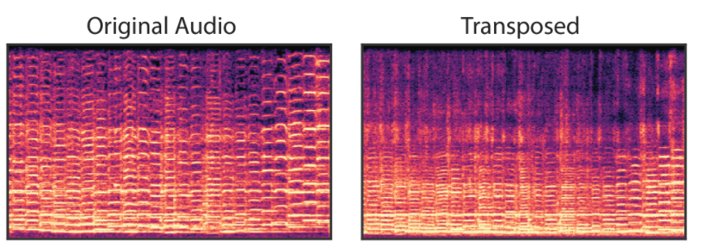

# DDSPのチュートリアルをのぞいてみた(Differentiable Digital Signal Processing)

今回は音声変換のモデルの１つであるDDSPについて公式ページを参照しながら遊んでみようと思う。  

[論文リンク](https://g.co/magenta/ddsp-paper)  
[実装リンク](https://github.com/magenta/ddsp)  

## 1. DDSPとは  

論文のまとめとして今度詳しく書こうと思うがやらない可能性もあるのでここでも分かる限りのことは書いておく。  

[デモページ](https://storage.googleapis.com/ddsp/index.html)の音声をまずは聞いてみて欲しい。  
デモページで掲載されている音声をここで掲載するのはさすがに気が引けるので是非元のサイトで音声を聞いてみてほしい。  
書かれている英語の雰囲気の訳をここに流していく。  
図はデモページのものを流用した。  

従来の音声生成モデルであるWaveNetやGANSSynthはいわゆるブラックボックスで、どのようにして音声を生成しているのかよくわからない部分も多かった。  
その影響もあり、パラメータを変更することで思うような音声を簡単に出す、といった制御は難しいものとなっている。  

今回のDDSPでディープ以前のデジタル信号処理(DSP; Digital Signal Processing)で使われていた要素を盛り込んだモデルをend-to-endで学習できるようにした音声生成モデルとなっている。  
基本周波数、反響、ノイズ、音の大きさ、ハーモニー、それらを全て明示的なパラメータとして扱っているため生成する音をコントロールすることが容易なのが魅力。  

  

図の中身はこんなところだろう。(結構勝手に解釈しているので要注意)  
- Encoder: 音声から基本パラメータを抽出する機構
- F0: 基本周波数  
- Z: 潜在表現  
- Loudness: 音声の大きさ  
- Decoder: 分解された成分から音声を再合成する機構  
- Harmonic Audio: ハーモニー構造を持った音声(F0からハーモニー情報を受け取っている)  
- Filtered Noise: ノイズ
- Reverb: リバーブ成分

例えば以下のようなことをコントロールすることができる。  

- 基本周波数の変化  
- 音声変換(例えば人の声からヴァイオリンの音)  
- 残響成分の付与および除去  
- ノイズ成分の付与および除去  

### 1.1 微分可能加算合成器(Differentiable Additive Synthesizer)  

見出しの良い日本語が思い浮かばなかった。。  

音声合成の過程としては、 

1. 基本周波数の推移(サイン波)  
2. 音声の強度の推移の付与  
3. ハーモニー成分の付与  

これらをニューラルネットワークが付与していく。  

  

### 1.2 モジュールによる音声の分解(Modular Decomposition of Audio)  

DDSPのデコーダ部分はバイオリンのデータセットを学習させた。  
音声を再合成するとき、元の音声から抽出された各要素(音の大きさの推移、基本周波数)の値を使用する。  

このようにデコーダによって再合成された音は、追加のフィルタや合成器を通すことでリバーブなどのエフェクトが加えられる。  

そのため、要素１つ１つを分離して中身を見ることが可能になる。  

  

上記音声は以下のようなパラメータによって構成されている。  

  

### 1.3 音質変換(Timbre Transfer)  

F0とloudness成分を該当の音声のものに差し替えて再合成するだけで歌声からヴァイオリンの演奏音に変換することができる  

すごい。。。  
工夫として、人の声の基本周波数部分は２オクターブ分あげてやりやすいようにしたとのこと。  

音声ボタンは[元サイト](https://storage.googleapis.com/ddsp/index.html)で押してほしい。 

  

### 1.4 外挿(Extrapolation)  

基本周波数をいじるだけで違う音声が出力することができる。  
例えば、ヴァイオリンの音声であれば基本周波数部分を下にシフトさせれば見事なセロの音になる。  

うん。これは普通の音声のピッチを下げるだけでもできそうなことだな。  
ピッチを下げて訓練データにはない周波数領域にしても自然な音声が作られるってところが売りポイント。  

  

### 1.5 リバーブ成分の除去と変換(Dereverberation and Acoustic Transfer)

リバーブ成分を除去して他のリバーブ成分を付与することもできる。  

学習済みのリバーブ成分を他の音声に対して適用することも可能。  

  

(左側)元の音声からリバーブ成分を取り除いたもの  
(右側)リバーブ成分を付与したもの  

リバーブ成分を取り除いた音声は不自然に聞こえるので、他のリバーブ成分を付与した音声を聞いてみることで、元のリバーブ成分がきちんと除去されていることを確認することができる。  

### 1.6 Independent Control of Loudness, Pitch, and Timbre  

- ２つのLoudness(音の大きさ)
- 2つの基本周波数  
- 2つのスペクトラル中央値(モデル図の中のZに相当)  

これら２つの間を徐々に遷移させていくことが可能。  

  

### 1.7 Phase Invariance  

自己回帰型の波形モデルにおける最尤損失は，波形の形状が知覚に完全に対応していないため，不完全になってしまう。  

例えば、以下の3つの波形は同じように聞こえますが（ハーモニーの相対的な位相オフセット）、自己回帰モデルでは異なる損失を示す  

  

### 1.8 モデルの軽量化(Tiny Model)  

モデルサイズを小さくすることができる。  
オリジナルのモデルはモデルサイズを小さくするための最適化が行われていないようだが、初期段階で行われていた軽量化実験では256ユニットの単レイヤーGRUでも音質変換を行える程度の音声を生成することが出来たようだ。  

ベースライン: 600万パラメータ  
軽量化(Tiny): 24万パラメータ  

### 1.9 再現性の比較(Reconstruction Comparisons)  

DDSPオートエンコーダはCREPEモデルを基本周波数を抽出するために使用した。  
このとき2つのパターンにわけて学習を進めた。  

- Supervised: CREPEモデルでの重みを利用し、重みを固定して学習を進めた
- Unsupervised: CREPEモデルでの重みは利用せず、学習を通じて重みを取得した  

この結果、Unsupervisedモデルでは正しい周波数を生成することはできたが、音質についてはタスクの難易度が上がったためかうまく抽出できなかった。  

## 2. チュートリアルを触ってみる  

自分が試しに撮ってみたボイパの音を遊びで変換させてみた。  
  
  

さすがにヴァイオリンだと苦しい。   
自分の歌の変換もやってみた。  
さすがに下手くそなので変換後の音声だけあげておく。  
  

## 3. まとめ

今回は音声変換モデルであるDDSPについて調べてみた。  
ニューラルネットを使って従来使われていたデジタル信号処理でのパラメータに落とし込むところが新しかった。  
デモを試してみたが、人の声の変換は比較的難易度が高そう。  
今度は中身のところの理解に入れたら良いな。  
