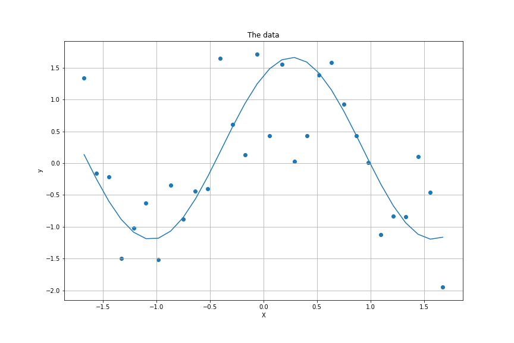
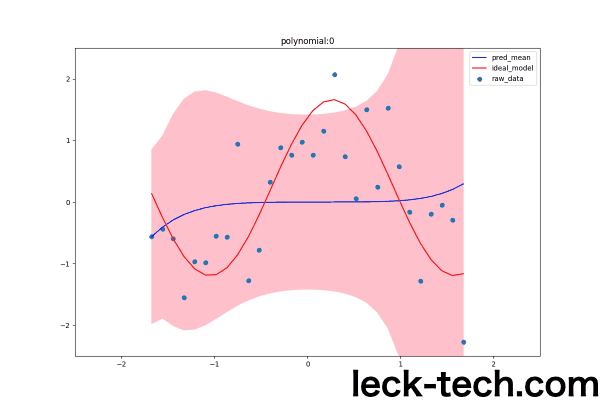
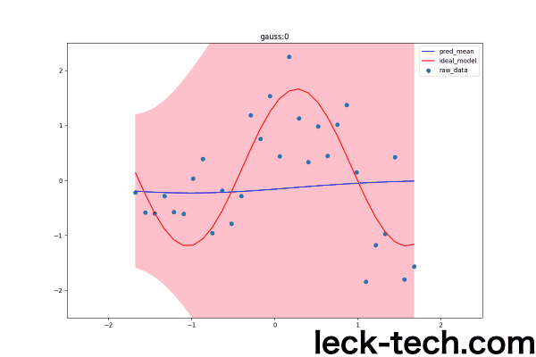

# ベイズ線形回帰をまとめてみる(Python)    
これまでリッジ(Ridge)回帰やラッソ(Lasso)回帰、ElasticNetなどの線形回帰についてまとめてきた。  
[最小2乗法(OLS)をscikit-learnで使ってみる](https://leck-tech.com/machine-learning/ols-sklearn)  
[ラッソ(Lasso)回帰とリッジ(Ridge)回帰をscikit-learnで使ってみる](https://leck-tech.com/machine-learning/ridge-lasso-sklearn)  
[Elastic Netを自分なりにまとめてみた(Python, sklearn)](https://leck-tech.com/machine-learning/elastic-net)  
これらは以下の線形モデル  
$$
\hat{y} = X\omega \\\\
$$
を構築する重み $\omega$ の値そのものを求めるというものだった。  

今回はこの重みのばらつき具合(確率分布)も合わせて出してくれるベイズ回帰についてまとめる。  

## 定式化  
### 扱うモデル  
今回は基底関数の線型結合したモデルを使うことにする。  
この基底関数 $\phi (\boldsymbol{x})$ は多項式基底やガウス基底が使われる。  

#### 多項式基底  
多項式基底は $1, x, x^2, \cdots, x^M$  といった $x$ のべき乗項を線型結合したもの。  
1変数の場合だと  
$$
\phi_i (x) = x^i \\\\
\hat{y} = \omega_0 + \omega_1 x + \omega_2 x^2 + \cdots + \omega_M x^M \\\\
= \sum_{i=0}^{M}\omega_i x^i  \\\\
= \sum_{i=0}^{M}\omega_i \phi_i (x) \\\\
$$

#### ガウス基底  
ガウス基底は  
$$
\boldsymbol{\phi}(x) = ( - \frac{(x-\mu_0)^2}{2\sigma^2}, - \frac{(x-\mu_1)^2}{2\sigma^2}, \cdots, - \frac{(x - \mu_M)^2)}{2\sigma^2})  \\\\
$$
となっている。  

#### 一般化  
これらの基底関数の線型結合なので、  
$n$ 番目の説明変数 $\boldsymbol{x}_n \in \mathbb{R}^d$   に対する予測値 $\hat{y}_n$ は以下のように表せる。  
$$
\hat{y}_n = \sum_{i=0}^{M} \omega_0 \phi_i (\boldsymbol{x}_n) \\\\
$$

### ガウス分布の導入  
ここで、モデルにガウスノイズ $\epsilon$ を加える。  
$$
\hat{y}_n = \sum_{i=0}^{M-1} \omega_0 \phi_i (\boldsymbol{x}_n) + \epsilon \\\\
= g(\boldsymbol{x_n}, \boldsymbol{\omega}) + \epsilon \\\\
(\boldsymbol{\omega} = (\omega_0, \omega_1, \cdots, \omega_M)^T) \\\\
(g(\boldsymbol{x}_n, \boldsymbol{\omega}) = \sum_{i=0}^{M-1} \omega_0 \phi_i (\boldsymbol{x}_n)) \\\\
$$
このガウスノイズ  
$\epsilon$ : 期待値が $0$、分散が $\beta^{-1}$ のガウス分布をもつ値。  
この $\beta$ は精度と呼ばれるパラメータ。  
したがって、 $\hat{y}_n$ は期待値が $g(\boldsymbol{x}_n, \boldsymbol{\omega})$ で分散が $\beta^{-1}$ のガウス分布となる。  

### $\hat{y}_n$ の確率分布  
以上を踏まえると、 $\hat{y}_n$ の確率分布は以下のように表せる。  
$$
p(\hat{y}_n | \boldsymbol{x}_n, \boldsymbol{w}, \beta) = \mathcal{N} (\hat{y}_n | g(\boldsymbol{x}_n, \boldsymbol{\omega}), \beta^{-1}) \\\\
$$
$\mathcal{N}(a | \mu, \sigma^2)$ は $a$ がとる分布が、期待値が $\mu$で分散が $\sigma^2$ となるガウス分布のことを示している。  
ここで  
$\hat{\boldsymbol{y}} = (\hat{y}_1, \hat{y}_2, \cdots, \hat{y}_N)^T$　とし、
$\boldsymbol{X} = (\boldsymbol{x}_1, \boldsymbol{x}_2, \cdots, \boldsymbol{x}_N)^T$  とすると、  

$$
p(\hat{\boldsymbol{y}} | \boldsymbol{X}, \boldsymbol{\omega}, \beta) = \prod_{n=1}^{N}\mathcal{N}(\hat{y}_n | g(\boldsymbol{x}_n, \boldsymbol{\omega}), \beta^{-1}) \\\\
$$
と変形できる。  

### ベイズの定理  
若干天下り式になってしまったが、先ほど導出した値が今回の尤度関数となるのは以下のベイズの定理を適用した式からわかる。  
$$
p(\boldsymbol{\omega} | \hat{\boldsymbol{y}},\boldsymbol{X}, \beta) \propto p(\hat{\boldsymbol{y}} | \boldsymbol{X}, \boldsymbol{\omega}, \beta)p(\boldsymbol{\omega}|\boldsymbol{X}, \beta) \\\\
$$

今回の最尤推定の目標は条件付き確率 $p(\boldsymbol{\omega} | \hat{\boldsymbol{y}},\boldsymbol{X}, \beta)$ の値を最大にすることになるので、  
上式の関係から$p(\hat{\boldsymbol{y}} | \boldsymbol{X}, \boldsymbol{\omega}, \beta)$ を最大化すれば良いことがわかる($p(\boldsymbol{\omega}|\boldsymbol{X}, \beta)$ の値は一定と仮定している)。  

#### 確率分布の式変形  
先ほど求めた尤度 $p(\hat{\boldsymbol{y}} | \boldsymbol{X}, \boldsymbol{\omega}, \beta)$ の対数をとって変形してみる。  
$$
ln(p(\hat{\boldsymbol{y}} | \boldsymbol{X}, \boldsymbol{\omega}, \beta)) = ln(\prod_{n=1}^{N}\mathcal{N}(\hat{y}_n | g(\boldsymbol{x}_n, \boldsymbol{\omega}), \beta^{-1})) \\\\
= \sum_{n=1}^{N} ln(\mathcal{N}(\hat{y}_n | g(\boldsymbol{x}_n, \boldsymbol{\omega}), \beta^{-1})) \\\\
= \sum_{n=1}^{N}ln \bigl[ \sqrt{\frac{\beta}{2\pi}}exp\{ -\frac{\beta}{2}(\hat{y}_n - \boldsymbol{\omega}^T \boldsymbol{\phi}(\boldsymbol{x}_n))^2)\} \bigr] \\\\
= \frac{N}{2}ln\beta - \frac{N}{2}ln(2\pi) - \frac{\beta}{2}\sum_{n=1}^{N}(\hat{y}_n - \boldsymbol{\omega}^T \boldsymbol{\phi}(\boldsymbol{x}_n))^2 \\\\
= - \frac{\beta}{2}\sum_{n=1}^{N}(\hat{y}_n - \boldsymbol{\omega}^T \boldsymbol{\phi}(\boldsymbol{x}_n))^2 + const. \\\\
(\boldsymbol{\phi} = (\phi_0, \phi_1, \cdots, \phi_{M-1})^T) \\\\
$$
$N$ 、 $\beta$ の値は定数とすることができるので  
$\sum_{n=1}^{N}(\hat{y}_n - \boldsymbol{\omega}^T \boldsymbol{\phi}(\boldsymbol{x}_n))^2$ の値が変化する部分ということがわかる。    

### ベイズ線形回帰  
ベイズ推定では先ほど求めた対数尤度を使用する。    
$$
\sum_{n=1}^{N}(\hat{y}_n - \boldsymbol{\omega}^T \boldsymbol{\phi}(\boldsymbol{x}_n))^2 \\\\
$$  
したがって、  
$$
ln(p(\boldsymbol{\hat{y}} | \boldsymbol{X}, \boldsymbol{\omega}, \beta)) \propto - \sum_{n=1}^{N}(\hat{y}_n - \boldsymbol{\omega}^T \boldsymbol{\phi}(\boldsymbol{x}_n))^2 \\\\
= - (\hat{\boldsymbol{y}} - \Phi(\boldsymbol{X}))^T(\hat{\boldsymbol{y}} - \Phi(\boldsymbol{X})) \\\\
\Phi(\boldsymbol{X}) =
        \begin{pmatrix}
            \phi_0 (\boldsymbol{x}_1) & \cdots & \phi_{M-1} (\boldsymbol{x}_1)\\\\
             \vdots & \ddots & \vdots \\\\
            \phi_0 (\boldsymbol{x}_N) & \cdots & \phi_{M-1} (\boldsymbol{x}_N) \\\\
        \end{pmatrix} \in \mathbb{R}^{N \times M}
$$
ここで、 $\Phi(\boldsymbol{X})$ は計画行列と呼ばれている。  
名前の由来は今一つピンと来ないが、結構仰々しい形になっている。  
ただ、こうやって表せると上式のようにシンプルな形で値を表すことができるのが利点。  

#### 事前分布  
このとき、事前分布$p(\boldsymbol{\omega} | \boldsymbol{X}, \beta)$ を以下のようにする。  
$$
p(\boldsymbol{\omega} | \boldsymbol{X}, \beta) = \mathcal{N} (\boldsymbol{\omega} | \mathbb{m}_0, \mathbb{S}_0) \\\\  
\propto exp(-\frac{1}{2}(\boldsymbol{\omega}-\mathbb{m}_0)^T\mathbb{S}_0^{-1}(\boldsymbol{\omega}-\mathbb{m}_0))
$$
この $\mathbb{m}_0$ と $\mathbb{S}_0$ は初期値となる期待値と分散の値。  

#### 最尤推定    
これらより、  
$$
p(\boldsymbol{\omega} | \boldsymbol{X}, \beta) \propto p(\hat{\boldsymbol{y}} | \boldsymbol{X}, \boldsymbol{\omega}, \beta)p(\boldsymbol{\omega}|\boldsymbol{X}, \beta) \\\\
\propto exp\{-\frac{\beta}{2}(\hat{\boldsymbol{y}} - \Phi(\boldsymbol{X})\boldsymbol{\omega})^T(\hat{\boldsymbol{y}} - \Phi(\boldsymbol{X})\boldsymbol{\omega})\} exp\{-\frac{1}{2}(\boldsymbol{\omega}-\mathbb{m}_0)^T \mathbb{S}_0^{-1}(\boldsymbol{\omega}-\mathbb{m}_0)\} \\\\
= \exp \left( - \cfrac{1}{2} \Bigl( \boldsymbol w^{T} \bigl( \boldsymbol S_{0}^{-1} + \beta \boldsymbol \Phi^{T} \boldsymbol \Phi \bigr) \boldsymbol w - \bigl( \boldsymbol S_{0}^{-1} \boldsymbol m_{0} + \beta \boldsymbol \Phi^{T} \boldsymbol t \bigr)^{T} \boldsymbol w - \boldsymbol w^{T} \bigl( \boldsymbol S_{0}^{-1} \boldsymbol m_{0} + \beta \boldsymbol \Phi^{T} \boldsymbol t \bigr) + \beta \boldsymbol t^{T} \boldsymbol t + \boldsymbol m_{0}^{T} \boldsymbol S_{0}^{-1} \boldsymbol m_{0} \Bigr) \right) \\\\
$$  
これより、重みベクトルの分布 $p(\boldsymbol{\omega}| \hat{\boldsymbol{y}}, \boldsymbol{X}, \beta)$ の平均ベクトルと分散行列の値は以下のように更新される。  

$$
\boldsymbol{m}_N = \boldsymbol{S}_N(\boldsymbol{S}_0^{-1} \boldsymbol{m}_0 + \beta \Phi^T \hat{\boldsymbol{y}}) \\\\
\boldsymbol{S}_N = \boldsymbol{S}_0^{-1} + \beta \Phi^T \Phi \\\\
$$
重みベクトルの分布は以下のようになる。  
$$
p(\boldsymbol{\omega} | \hat{\boldsymbol{y}}, \boldsymbol{X}, \beta) = \mathcal{N} (\boldsymbol{\omega} | \boldsymbol{m}_N, \boldsymbol{S}_N) \\\\
$$
この辺りの導出がどうなっているのかがよくわかっていない(微分した値が0になるようなものをとってきているのか、そのまま式変形すると自然と導出される形なのか)。  

### 新たなデータが追加された時は  
新たなデータが追加された時は先ほど更新した $\boldsymbol{m}_N,\boldsymbol{S}_N$の値を $\boldsymbol{m}_0, \boldsymbol{S}_0$ にして同様にパラメータの更新を行えば良い。  

### 予測分布の出し方  
これで重みベクトルの分布を出すことができることがわかった。  
ただ、データを扱う上でわかりやすいのはやはり予測値の分布である。  
ここは結論だけ書いてしまうが、以下のような分布になる。  
$$
p(\hat{y}_{N+1}| \hat{\boldsymbol{y}}, \boldsymbol{X}, \boldsymbol{x}_{N+1}) = \mathcal{N}(\hat{y}_{N+1} | \boldsymbol{m}_N \boldsymbol{\phi}(\boldsymbol{x}_{N+1}), \beta^{-1}+\boldsymbol{\phi}(\boldsymbol{x}_{N+1})^T \boldsymbol{S}_N \boldsymbol{\phi}(\boldsymbol{x}_{N+1}))) \\\\
$$

## 実装  
sklearnに純粋なベイズ回帰実装はされておらず、リッジ回帰をベイズ推定してみたバージョン(重みの分布の初期値がゼロベクトルで、分散の初期値が全て同じ値)となっていた。  
[Bayesian Ridge Regression - sklearn](https://scikit-learn.org/stable/modules/linear_model.html#bayesian-ridge-regression)   

ということなので、実装してみようと思う。  
実装にはNumPyを基本的に使う。  
この実装は以下のレポジトリにアップロードしてある。  
https://github.com/wildgeece96/bayesian_regression  
扱うデータは平均が $0$ で分散が $1$ に正規化されたデータとする。  
### 基底関数  
まずは多項式基底関数と、ガウス基底関数とを使った計画行列を返すコードを作成する。  

```python
def base_polynomial(x, M=5):
    """
    多項式基底を元にした計画行列の作成
    inputs:
        x : 2d-array. Nxd  = (サンプル数)x(特徴量数)
    return:
        Phi : 2d-array. Nx(Mxd). (1つの特徴量に対してM個の基底関数を適用)
                計画行列を返す
    """
    N = x.shape[0] # サンプル数
    d = x.shape[1] # 特徴量数
    Phi = np.zeros(shape=(N, int(M*d)), dtype='float')
    for m in range(M):
        Phi[:,m::M] = x**m
    return Phi  
```
次にガウス基底関数部分。  
```python
def base_gauss(x, M=5, seed=42, mu=None):
    """
    ガウス基底を元にした計画行列の作成
    inputs:
        x : 2d-array. Nxd  = (サンプル数)x(特徴量数)
    return:
        Phi : 2d-array. Nx(Mxd). (1つの特徴量に対してM個の基底関数を適用)
                計画行列を返す
    今回は簡略化のため、σの値は1で統一する(これは入力が正規化されてるのも理由の1つ)
    """
    np.random.seed(seed)  
    N = x.shape[0]
    d = x.shape[1]
    if type(mu) != np.ndarray:
        mu = np.random.randn(M*d) # 基底関数の数だけ平均値をランダム生成
    else:
        M = mu.shape[0]//d
    x_tile = np.tile(x, (1,M))
    Phi = -(x_tile-mu)**2/2
    return Phi, mu
```
### ベイズ線形回帰  
続いて、線形回帰部分の実装。  
まずは全体像を乗っけてしまう。  
```python
def bayesian_regression(X, y, base_mode='polynomial',M=5, w_S=None, w_m=None, mu=None,beta=1e0):
    """
    ベイズ推定を行う。
    inputs:
        X : 2d-array(Nxd). 説明変数
        y : 1d-array(N,). 教師データ
        base_mode: {'polynomial', 'gauss'}. 基底関数の種類
        M : 各説明変数に対して何個ずつ基底関数を生成するか.
        mu : ガウス分布を基底関数として使うときの各々の分布の平均値
    return:
        wm_list : 2d-array.((Mxd), 1)のlist. 重みベクトルの期待値のリスト
        wS_list : 2d-array.((Mxd), (Mxd))のlist. 重みベクトルの分散のリスト
        m_list : 2d-array. (N, 1)のlist. 予測値の期待値のリスト
        S_list : 2d-array. (N,N)のlist. 予測値の分散のリスト
    """
    # 前準備  
    d = X.shape[1]
    N = X.shape[0]
    if not w_S:
        w_S = np.eye(M*d)
    if not w_m:
        w_m = np.zeros(M*d).reshape(-1,1)
    # 実行結果を保存する入れ物を用意しておく  
    wS_list = []
    wm_list = []
    S_list = []
    m_list = []

    lam = 1e-3 # 逆行列を求める時にエラーを防ぐ
    # 計画行列の作成
    if base_mode == 'polynomial':
        Phi_all = base_polynomial(X, M)
    elif base_mode == 'gauss':
        Phi_all, mu = base_gauss(X, M, mu=mu)  
    else:
        raise ValueError("Please valid base mode , {'gauss', 'polynomial'}")  

    # ここからはデータ1つ1つを追加していく形で分布を予測していく  
    for i in range(N):
        w_S_0 = w_S +  lam*np.eye(M*d)
        w_m_0 = w_m +  lam*np.ones(M*d).reshape(-1,1)
        if base_mode=='polynomial':
            Phi = base_polynomial(X[i,:].reshape(1,-1),M)
        elif base_mode == 'gauss':
            Phi, mu = base_gauss(X[i,:].reshape(1,-1), M=M, mu=mu)
        w_S = np.linalg.inv(np.linalg.inv(w_S_0) + beta * np.dot(Phi.T,Phi))
        m_partial_1 = np.dot(np.linalg.inv(w_S_0), w_m_0)
        m_partial_2 = beta * np.dot(Phi.T, y[i].reshape(1,1))
        w_m = w_S.dot(m_partial_1+m_partial_2)
        m = np.dot(Phi_all, w_m)  
        S = beta**(-1) + np.dot(Phi_all, np.dot(w_S, Phi_all.T))  
        wS_list.append(w_S)
        wm_list.append(w_m)
        S_list.append(S)
        m_list.append(m)  
    return wS_list,wm_list,S_list,m_list  
```
とりあえずこれを適当に分けて解説する。  
#### 前準備  
まずは前準備部分。  
$d$ は特徴量の個数で $N$ は今回使うデータの数(サンプル数)に相当する。  
また、`wS`と`wm`が重みベクトル $\boldsymbol{\omega}$ の分散と期待値に相当し、  
`S`と`m` が予測値の分散と期待値に相当する。  
```python
# 前準備  
d = X.shape[1]
N = X.shape[0]
if not w_S:
    w_S = np.eye(M*d)
if not w_m:
    w_m = np.zeros(M*d).reshape(-1,1)
# 実行結果を保存する入れ物を用意しておく  
wS_list = []
wm_list = []
S_list = []
m_list = []
```
次に、計画行列を作成する。  
`base_model`変数でどの基底関数を使うかを指定できるのでそれにしたがって計画行列を作成。  
```python
lam = 1e-3 # 逆行列を求める時にエラーを防ぐ
# 計画行列の作成
if base_mode == 'polynomial':
    Phi_all = base_polynomial(X, M)
elif base_mode == 'gauss':
    Phi_all, mu = base_gauss(X, M, mu=mu)  
else:
    raise ValueError("Please valid base mode , {'gauss', 'polynomial'}")  
```
#### 回帰本体部分  
続いて回帰本体部分。  
forループでデータ1つずつを逐次的に追加していく形で分布を予測していく。  
以下の4つの値を順番に計算していっている。  
$$
\boldsymbol{m}_i = \boldsymbol{S}_i(\boldsymbol{S}_{i-1}^{-1} \boldsymbol{m}_i + \beta \phi(\boldsymbol{x}_i)^T \hat{\boldsymbol{y}}) \\\\
\boldsymbol{S}_i = \boldsymbol{S}_{i-1}^{-1} + \beta \phi(\boldsymbol{x}_i)^T \phi(\boldsymbol{x}_i) \\\\
\mathbb{E}[\hat{\boldsymbol{y}}] = \boldsymbol{m}_i \boldsymbol{\Phi} \\\\
Var[\hat{\boldsymbol{y}}] = \beta^{-1}+\boldsymbol{\Phi}^T \boldsymbol{S}_i \boldsymbol{\Phi}
$$
```python  
for i in range(N):
    w_S_0 = w_S +  lam*np.eye(M*d)
    w_m_0 = w_m +  lam*np.ones(M*d).reshape(-1,1)
    if base_mode=='polynomial':
        Phi = base_polynomial(X[i,:].reshape(1,-1),M)
    elif base_mode == 'gauss':
        Phi, mu = base_gauss(X[i,:].reshape(1,-1), M=M, mu=mu)
    w_S = np.linalg.inv(np.linalg.inv(w_S_0) + beta * np.dot(Phi.T,Phi))
    m_partial_1 = np.dot(np.linalg.inv(w_S_0), w_m_0)
    m_partial_2 = beta * np.dot(Phi.T, y[i].reshape(1,1))
    w_m = w_S.dot(m_partial_1+m_partial_2)
    m = np.dot(Phi_all, w_m)  
    S = beta**(-1) + np.dot(Phi_all, np.dot(w_S, Phi_all.T))  
    wS_list.append(w_S)
    wm_list.append(w_m)
    S_list.append(S)
    m_list.append(m)  
```
### 学習データの作成  
今回はシンプルに合成サイン波を使っていく。  
```python
N = 30
X = np.linspace(-4, 4, N).reshape(-1,1)  
y_true = 0.3*np.sin(X)+ 0.4*np.cos(X)
y = y_true +np.random.randn(N,1)/3.0
X = (X - X.mean(axis=0))/X.std(axis=0)  
y = (y - y.mean())/y.std()
y_true = (y_true - y_true.mean())/y_true.std()
```  
このデータをプロットしてみる。  
```python
import matplotlib.pyplot as plt
plt.figure(figsize=(12,8))
plt.plot(X.flatten(), y_true.flatten(), label='true_model')
plt.scatter(X.flatten(), y.flatten(), label='raw_data')
plt.title('The data')
plt.xlabel('X')
plt.ylabel('y')
plt.grid()
plt.show()
```

  

### 学習結果のプロット  
重みのベクトルの分布をプロットされても正直よく分からないので予測値の分布をプロットする。  
```python  
# base_modeの指定
mode = 'polynomial'
wS_list,wm_list, S_list, m_list = bayesian_regression(X, y,M=5,beta=1.0,
                                                      base_mode=mode)
for i in range(X.shape[0]):
    plt.figure(figsize=(12,8))
    plt.ylim(-2.5,2.5)
    plt.xlim(-2.5,2.5)
    SD = np.sqrt(np.diag(S_list[i]))
    upper = m_list[i].flatten() + SD.flatten()
    lower = m_list[i].flatten() - SD.flatten()
    # 分布のプロット
    plt.fill_between(X.flatten(), upper.flatten(), lower.flatten(), color='pink')
    # 今回使ったデータのプロット
    plt.scatter(X.flatten(),y.flatten(), label='raw_data')
    # 予測値の平均(期待値)のプロット
    plt.plot(X.flatten(), m_list[i].flatten(), label='pred_mean',color='b')
    # 元々のモデルのプロット  
    plt.plot(X.flatten(), y_true, label='ideal_model', color='r')
    plt.legend()
    plt.title(f'{mode} : {i}')
    plt.savefig(f'fig/bayesian_{mode}_{i}.png')
```
これらのプロット結果は以下のような推移になる。  
  
左側のデータから順に追加しているので、分散の範囲が左側から徐々に狭まっていることがわかる。　　
基底関数にガウス関数を使う場合は平均値となる`mu`を等間隔に配置した方が結果の見栄えがよくなる。  
```python
mode = 'gauss'
M = 30
mu = np.linspace(-2,2,M)
wS_list,wm_list, S_list, m_list = bayesian_regression(X, y,M=M,beta=1.0,
                                                     base_mode=mode,
                                                     mu=mu)
for i in range(X.shape[0]):
    plt.figure(figsize=(12,8))
    plt.ylim(-2.5,2.5)
    plt.xlim(-2.5,2.5)
    SD = np.sqrt(np.diag(S_list[i]))
    upper = m_list[i].flatten() + SD.flatten()
    lower = m_list[i].flatten() - SD.flatten()
    plt.fill_between(X.flatten(), upper.flatten(), lower.flatten(), color='pink')
    plt.scatter(X.flatten(),y, label='raw_data')
    plt.plot(X.flatten(), m_list[i].flatten(), label='pred_mean',color='b')
    plt.plot(X.flatten(), y_true, label='ideal_model', color='r')
    plt.legend()
    plt.title(f'{mode} : {i}')
    plt.savefig(f'fig/bayesian_{mode}_{i}.png')
```

これらのプロット結果は以下のような推移になる。  
  
残念ながら、こちらはうまくサイン波を再現仕切れなかったようだ。  


## 参考  
[pythonでベイズ線形回帰実装 - Qiita](https://qiita.com/ta-ka/items/8ee3cb7ecb17e58f4f78)  
[ガウス過程の基礎と教師なし学習 - 統計数理研究所](https://www.ism.ac.jp/~daichi/lectures/H26-GaussianProcess/gp-lecture2-daichi.pdf)  
