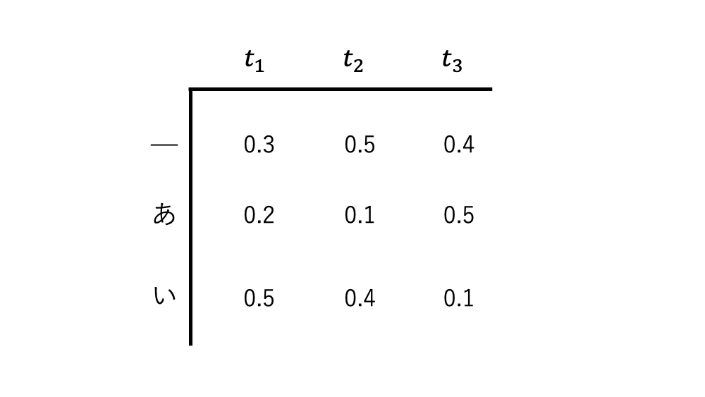

# CTCを用いたビームサーチCTC Beam Search Decoderのまとめ  

今、インターン先の業務で音声認識のモデルを組んでいる。調べてみると、発話内容を予測する時にCTCを使ったBeam search decoderというものがよく使われるらしい。  
TensorFlowでは`tf.nn.ctc_beam_search_decoder`という関数まで公式で実装されている。(Pytorchは公式実装なし)  

調べたついでに簡単にまとめてみる。   

以下のサイトが大変参考になった。  
- [Beam Search Decoding in CTC-trained Neural Networks](https://towardsdatascience.com/beam-search-decoding-in-ctc-trained-neural-networks-5a889a3d85a7)  

## CTCとは  
まず、CTCはconnectionist temporal classificationの略で、パス探索の際に使われる手法の1つ。  

通常CTCはニューラルネットワークモデルの最終層に付け加えられるもので、直前の各タイムステップごとに出力される、語彙の確率分布を元にデコードする方法となる。  

  

`＿`は`blank`トークンとして設置したもの。出力される文字列には出現してこない。    
ここでは詳細な説明はしないが、以下のサイトの解説がわかりやすいので、そちらを参照してほしい。  
- [Connectionist Temporal Classificationの理論と実装について](http://musyoku.github.io/2017/06/16/Connectionist-Temporal-Classification/)  

CTCは各タイムステップを遷移していくパスの中から等価な出力をするものの確率を足し合わせていく。  
等価な出力というのは、例えば `ああ＿` といったパスがあったとすると、この出力結果は `あ` となる。  
また、 `あ＿＿`も同様に `あ` という出力結果になる。  

そのためこの2つのパスは等価な出力をするため、同じ出力候補としてそれぞれのパスに割り当てられた確率の和がこの`あ`という出力候補に割り当てられる確率となる。  

他のパスと出力結果の対応としては、以下のようになる。    
- `あああ＿い＿いいいい` → `あいい`  
- `＿＿＿＿い＿い＿あああいああ` → `いいあいあ`  

そして、最終的に出力が等価となるようなパスに割り当てられた確率の和が、その出力の確率となる。  
確率が最大となるような出力がCTCのデコード結果となる。  
これが簡単なCTCの原理。  

パスの確率は、先程上げたような確率分布であれば、`＿あい`は    
- `＿あい`　→ $0.3 \times 0.1 \times 0.1 = 0.003$ となる  

### CTCの問題点  
今見たように、CTCは考えられるパスを **全て** 検索し、出力が等価なものを足し合わせるというのが理想形である。  

だが、例えばタイムステップが $10$　あり、候補となる語彙が $10$ あるとすると、検索対象のパスは  
$$
10^{10} = 10000000000
$$

と、膨大な数となる。  
アルファベットでさえも26文字あるのだからヤバさが伝わるかと思う。  

そのためある程度候補を削りながらパス探索していく必要がある。  
そこでビームサーチと組み合わせたパス探索の手法が考え出された。(と推測される)  

## CTC Beam Search Decoder  

では、具体的にビームサーチがどのように適用されていくのか中身を見ていく。  
ビームサーチは、  

1. 現タイムステップまでにおける候補となるパスの確率を計算する  
2. 上位 $B$ 個のみを候補パスとして残す  
3. 次のタイムステップへと移り、1,2を繰り返す  

で進められていく。  
定数 $B$ をビーム幅(beam width)と呼ぶ。  

### ビームサーチの具体例  
ビームサーチ単体を用いた場合のパス探索結果を見てみる。  
先程のニューラルネットワークが出力した各タイムステップごとの確率分布を再度見てみる。

単純なビームサーチでは、 $B=2$ とすると、  
まず、候補となるパスのリストが存在している。  
始まる前はもちろん、このリストは空となる。  

まず $t=t_1$ のとき、  
`＿`と`い`が上位2位のパス(確率は0.3と0.5)となるのでこの2つをパス候補のリストに加える。  

$$
best\_beams = [＿, い] \\\\
$$

次にのタイムステップに移る。  

$t=t_2$ で考慮すべきパスは、 $t=t_1$ で残ったパスから考えれば良いので、  
- `＿＿`(0.15)、`＿あ`(0.03)、`＿い`(0.12)、`い＿`(0.25)、`いあ`(0.05)、`いい`(0.20)  

  

の6つが残る。  
この中で上位2つを選べば良いので  
`い＿`と`いい`の2つが残る。  

$$
beat\_beams = [い＿,いい]  
$$

これを繰り返していく。  
### CTCを組み合わせて具体例で計算  
先程の例だと `い＿`と`いい`は出力としては等価なものになるので同じものとして扱う必要があるが、次に加わる文字によっては挙動が変化するので注意が必要となる。  

ただ、`い＿`のように`＿`で終わるものだと次に追加される文字が`い`のとき、`いい`と出力されるが、`いい`と`＿`で終わっていないものについては`いいい`となり`い`と連続しない出力となる。  

そのため、確率スコアを計算するとき、`＿`でパスが終わっているかどうかは区別して考慮する必要がある。  

タイムステップ $t$ において、  

出力結果`い`に相当する確率スコア $P(い,t)$ は、
- 含有するパスの中で`＿`(blank)で終わっているもの(`い＿＿`、`いい＿`など)のスコアを  $P_b(い,t)$  
- そうでないものを $P_{nb}(い,t)$ (non blank)とする。  

$$
P(い,t) = P_b(い,t) + P_{nb}(い,t) \tag 1  
$$

という関係が成り立つ。  

CTC Beam Searchではパスの数ではなく候補となる出力単位で残していくものを選んでいく。  

また、今回もビーム幅 $B$ を 2に設定する。  
ニューラルネットワークが出力した確率分布行列を $M$ とし、タイムステップ $t$ における語彙 $w$ の確率を $M(w,t)$ と表すとする。  
#### $t=t_1$ のとき  
確率分布行列 $M$ を再掲する。  
  

$t=t_1$ のときはビームサーチのときと一緒なので、  
残るパスは`い`と`＿`となる  

$$
best\_beams = [い,＿]    
$$
計算される確率は以下の通り  
$$
P_{nb}(い, t_1) = M(い, t_1) = 0.5 \\\\
P_b("", t_1) = M(＿, t_1) =0.3 \\\\
$$

そのため合計確率は  

$$
P(い, t_1) = 0.5 \\\\
P("", t_1) = 0.3 \\\\
$$
となる  
#### $t=t_2$ のとき  
`い`, `＿`が残っている出力候補なので、ここから付け加えていく形で見ていく。  

出力結果が`い`となるのは次に`い`か`＿`が来れば良いが、`い`が来たものは $P_{nb}$ で考える必要があり、`＿`が来たものは $P_b$ で考える必要がある。  

また、$P_b$ については最後が`＿`で終わっているパスのものが加算されるので、前ステップでの $P$ に $M(＿, t)$ をかければ計算できる  
それぞれの出力候補となる確率は以下の通り  

$$
P_b(い, t_2) = P(い, t_1) * M(＿, t_2)= 0.5 * 0.5 = 0.25 \\\\
P_{nb}(い, t_2) = P_{nb}(い, t_1) * M(い, t_2) + P_{b}("", t_1) * M(い, t_2) \\\\
= 0.5 * 0.4 + 0.3 * 0.4 = 0.32 \\\\
P_{nb}(あ, t_2) = P_{b}("", t_1) * M(あ, t_2) = 0.3 * 0.1 = 0.03 \\\\  
P_{b}("", t_2) = P("", t_1) * M(＿, t_2) = 0.3 * 0.5 = 0.15 \\\\
$$

となる。  
ここで考慮していない確率は 0　が割り振られる。  

$$
P(い, t_2) = P_b(い, t_2) + P_{nb}(い, t_2) = 0.25 + 0.32 = 0.57 \\\\
P("", t_2) = P_b("", t_2) + P_{nb}("", t_2) = 0.15 + 0 = 0.15 \\\\
P(あ, t_2) = P_b(あ, t_2) + P_{nb}(あ, t_2) = 0.03 + 0 = 0.03 \\\\
$$

そのため、残る候補は `い`と`＿`となる。  
$t=t_1$ と変わらなかったが、含有する確率は変化した。  

#### $t=t_3$ のとき  
最後。  
更新される確率は以下の通り。  

$$
P_b(い, t_3) = P(い, t_2) * M(＿, t_3) = 0.228 \\\\
P_{nb}(い, t_3) = P("", t_2) * M(い, t_3) + P_{nb}(い, t_2) * M(い, t_3) \\\\
= 0.133 \\\\
P_{nb}(あ, t_3) = P("", t_2) * M(あ, t_3) = 0.075 \\\\
P_{b}("", t_3) = P("", t_2) * M(＿, t_3) = 0.06 \\\\
$$

最終的に、  

$$
P(い, t_3) = P_b(い, t_3) + P_{nb}(い, t_3) = 0.361 \\\\
P(あ, t_3) = P_b(あ, t_3) + P_{nb}(あ, t_3) = 0.075 \\\\
P("", t_3) = P_b("", t_3) + P_{nb}("", t_3) = 0.06 \\\\
$$

よって残った出力は `い`と`あ`になる。  

#### 取りこぼした例について  
今回の具体例で出てこなかったが、 $P(あい, t)$ は以下のように計算できる  
- 直前の出力結果が `あ`であれば`あ`であっても`あ＿`であっても `い`が来れば`あい`が出力される。  
- 直前の出力結果が`あい`であれば`＿`で終わっているかいないに関わらず、`＿`が来るか、`＿`で終わってない状態で`い`が来れば良い  

$$
P_b(あい, t) = P(あい, t-1) * M(＿, t-1) \\\\
P_{nb}(あい, t) = P_{nb}(あい, t) * M(い, t-1) + P(あ) * M(い, t-1) \\\\
$$

### 一般化  
これまでの具体例から、少し一般化したものを書いて終わりにしたいと思う。  

ある候補となる出力 $S = [s_{start}, \cdots, s_{preend}, s_{end}]$ があるとする、これの最後の文字を $s_{end}$ を取り除いた出力を $S_{pre} = [s_{start}, \cdots, s_{preend}]$ とする  
タイムステップ $t-1$ の段階で $S_{pre}$ がビーム幅にひっかかからなかった場合、 $P(S_{pre}, t-1)$ は全て 0　として計算することになる。  

最後の出力文字とその1つ前の出力文字が異なる場合、つまり  
$s_{end} \neq s_{preend}$ のとき、  
$P(S, t)$ は以下のように計算できる  

$$
P_b(S, t) = P(S, t-1) * M(＿, t) \\\\
P_{nb}(S, t) = P_{nb}(S, t-1) * M(s_{end}, t) + P(S_{pre}, t-1) * M(s_{end}, t-1) \\\\
$$

逆に $s_{end} = s_{preend}$ のときならば  

$$
P_b(S, t) = P(S, t-1) * M(＿, t) \\\\
P_{nb}(S, t) = P_{nb}(S, t-1) * M(s_{end}, t) + P_{b}(S_{pre}, t-1) * M(s_{end}, t-1) \\\\
$$

と $P_{nb}$ の部分だけ少し変更される。  

これによって計算された $S$ から、暫定的な確率スコア $P(S, t)$ が高いものから $B$ 個だけとっていって、次のタイムステップにおける出力候補のベースとしていく。  

## 実装  
実装は [このレポジトリ](https://github.com/githubharald/CTCDecoder) にされている。  

自分が書いたわけではないが分かりやすいと思う。  

今回のアルゴリズムを直接実装しているのはこのファイルにあたる  
[BeamSearch.py](https://github.com/githubharald/CTCDecoder/blob/master/src/BeamSearch.py)  

時間があれば、自分の手で実装したい。  

## まとめ  
今回はCTC Beam Search Decoderについてまとめてみた。  
CTCはパス探索の一種で、計算時間の制約からビームサーチの考え方を取り入れたものというのがこのDecoderの正体だったようだ。  

ちょっと頭を使うが、一回流れを追っておくとどんなアルゴリズムかのイメージがつきやすいのでおすすめ。  
