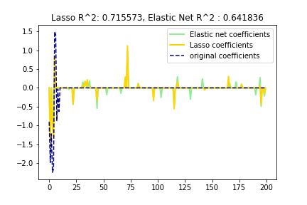

# Elastic Netを自分なりにまとめてみた(Python, sklearn)
今回はRidge回帰とLasso回帰のハイブリッドのような形を取っているElasticNetについてまとめる。  
以前の記事ではRidgeとLassoについてまとめた。  
[ラッソ(Lasso)回帰とリッジ(Ridge)回帰をscikit-learnで使ってみる | 創造日記](https://leck-tech.com/machine-learning/ridge-lasso-sklearn)    

ElasticNetについて書かれた論文はこちら。  
[Regularization and variable selection via the Elastic Net (2005)](http://citeseerx.ist.psu.edu/viewdoc/summary?doi=10.1.1.124.4696)   
Lassoについてはこちら。  
[Regression shrinkage and selection via the lasso: a retrospective](https://rss.onlinelibrary.wiley.com/doi/abs/10.1111/j.1467-9868.2011.00771.x)   
## 概要  
まず、前回の[記事](https://leck-tech.com/machine-learning/ridge-lasso-sklearn)で紹介したラッソ(Lasso)回帰とリッジ(Ridge)回帰の特徴についてまとめてみる。  
### ラッソ(Lasso)回帰  
ラッソ回帰はいわゆるL1正則化項を付け加えた値を損失として最適化する。  
この結果、いらない**特徴量を削る** ことができる(その特徴量に対する係数の値が0になる)利点がある。  
たくさんある特徴量から**必要なものだけで** 予測を行いたいときに有用なものとなる。  
しかしながら、過剰に特徴量が多く、訓練データの数が少ないと十分な数の特徴量が選択できない(原理的には選択できる特徴量の数の上限と訓練データの数は一致する)。  
また、特徴量同士の相関がとても高いときそのうちの片方しか特徴量として使われることがない(両方とも使えない)  
### リッジ(Ridge)回帰  
リッジ回帰は係数の値の大きさが発散してしまうのを防ぐ効果がある。  
L2正則化項(LassoはL1)を損失に付け加えてそれを最小にするようなモデルの最適化を行う。  
リッジ回帰は学習データを過剰に学習してしまい、未知のデータに対してうまく予測ができない過学習の問題を解決する手法として好まれる。  

### まとめ  
Ridge回帰は  
- 過学習を防ぐ  
- 特徴量の削減(係数を0にする)ことには向いてない  
Lasso回帰は   
- 不要な特徴量を削る(次元削減)  
- 相関の高い特徴量をどちらも残すことができない  
という特徴がある。  

この2つの特徴を程よく混ぜようぜってなったのがElasticNetだ。  
## 定式化  
まず特徴量が $p$ 個あるデータが $N$ 個あるとする。  
この学習データを $X \in \mathbb{R}^{N\times p}$ とする。  
これに対応する正解データを $y \in \mathbb{R}^N$ として、以下のようなモデルを作成する。  
$$
\hat{y} = X\omega + const  
$$  
係数となるベクトルが $\omega \in \mathbb{R}^p$ である。　　

この時の損失 $L$ が以下のようになる。  
$$
L = |X\omega - y|^2 + \lambda \{ (1-\alpha) |\omega|^2 + \alpha |\omega| \}  \\
$$
L2ノルムに当たるのが $\lambda|\omega|^2$ で、L1ノルムに当たるのが  $\lambda |\omega|$ である。  
この式をみると、答えとの差の二乗和に加えて、L1ノルムとL2ノルムを比率 $\alpha : (1-\alpha)$ で足し合わせたものがElasticNetにおける損失ということになる。  
ここの $\lambda \{ (1-\alpha) |\omega|^2 + \alpha |\omega| \}$ をElasticNetペナルティと呼ぶらしい。  
この辺りがハイブリッドって感じ。  
### 選択できる特徴の制限への解決  
この時、Lasso回帰で問題となっていた、訓練データが少ないと選択できる特徴量の数が限られるという問題があったが、以下のような恣意的なデータセット $y', X'$ を作成する。  
$$
X' = (1 + (1 - \alpha )\lambda)
      \begin{pmatrix}
            X \\
            \sqrt{(1 - \alpha) \lambda} \vec{1}_p \\
        \end{pmatrix}, \ \ \ \
y' = \begin{pmatrix}
                     y \\
                     O_p \\
                    \end{pmatrix}, \\
\ \gamma = \frac{\alpha \lambda}{\sqrt{1 + (1 - \alpha) \lambda}} , \ \ \ \omega' =  \sqrt{1 + (1 - \alpha) \lambda} \omega
$$   
$E_p$ は $p\times p$ の単位行列で、$O_p$ は 長さ $p$ の0を要素にもつベクトル。  
こんな恣意的な値を設定すると、新しい損失 $L' $ は  
$$
L' = |y' - X' \omega' |^2 + \gamma |\omega' | \\
$$
と書くことができ、 $X' \in \mathbb{R}^{(N+p)\times p}$ であるので  $X'$ のランクは $p$ となる。  
となると、ElasticNetは $p$ 個の特徴量を常に選択することが可能ということになるらしい。  
この時の最適化されたモデルの係数 $\hat{\omega}'$ は    
$$
\hat{\omega}' = arg \underset{\omega' }{argmin} \ L'  \\
$$
で求めることができ、先ほどの式から、  
$$
\hat{\omega} = \frac{1}{\sqrt{1+(1-\alpha)\lambda}}\hat{\omega}' \\  
$$
で求めることができるということになる。  
### 相関のある特徴量同士を選ぶことができる  
最適化された係数 $\hat{\omega}$ の $i$ 番目と $j$ 番目の値をそれぞれ $\hat{\omega}_i, \hat{\omega}_j$ とする。   
この2つの係数について、 $\hat{\omega}_i \hat{\omega}_j > 0$ という関係が成り立つ時、  

$$
D(i,j) = \frac{1}{|y|}|\hat{\omega}_i - \hat{\omega}_j| \\
$$
という $D(i,j)$ を定義する。  
$D$ は、係数間の距離を表していると捉えられる。  
この時、 $i$ 番目と $j$ 番目の特徴量の相関係数 $\rho = x_i^T x_j$ を定義すると、以下の関係式が成り立つ。  
$$
D(i,j) \le \frac{1}{\lambda(1-\alpha)} \sqrt{2(1-\rho)}  \\
$$
となる。  
よって、相関係数 $\rho$ の値が1に近づくほど、距離 $D$ の値は0に近づいていくということになる。  
ということは、相関が高い特徴量同士でもどちらかの係数が0になるのではなく、**係数はどちらも同じ値を取る** ことになる。  

## 実装  
ではPythonのscikit-leaernを使って実際に使ってみる。  
[scikit-learnの公式ページ](https://scikit-learn.org/stable/auto_examples/linear_model/plot_lasso_and_elasticnet.html#example-linear-model-plot-lasso-and-elasticnet-py)のコードに解釈を加える形で使う。  
少しだけ分かりやすくなるように改変した。  
### インポート
まずは必要モジュールのインポート  

```python
# 必要モジュールのインポート
import numpy as np
import matplotlib.pyplot as plt

from sklearn.metrics import r2_score
```

ここで言う `r2_score` は回帰モデルの評価値として使われる決定係数(coefficient of determination)である。  
以下の値 $R^2$ がそれに該当する。  

$$
R^2 \equiv 1- \frac{\sum_{i}(y_i - f_i)^2}{\sum_{i}(y_i - \bar{y})^2}  \\
$$  

$y_i$ はラベルデータ(正解データ)で、 $f_i$ はモデルの予測値、 $\bar{y}$ はラベルデータの平均値を示している。  
予測値とラベルデータとの偏差の2乗をラベルデータの分散で割った値（誤差の2乗和を分散で正規化した値)を1から差し引くことでできている。  
1に近づくほど良い値になる。  
### データの準備  
まずは正規分布に従った乱数を使ってデータを生成していく。    
特徴量の数は50個でそのうち、今回予測の対象となるモデルでは係数が0のものが40個含まれている。  
言い換えるなら、50個あるうちの特徴量の中で使われているものはたったの10個しかないスパースなモデルとなっている。  
```python
# データを準備する
np.random.seed(20190414) # シードの設定(再現性の確保)  

n_samples, n_features = 50, 200 # データ数:50, 特徴量数 : 200
X = np.random.randn(n_samples, n_features) # 正規分布に従った乱数生成
# 正解のモデルとなる係数(これも乱数で生成)
coef = 3 * np.random.randn(n_features)
inds = np.arange(n_features)  
#  スパース性を作るために一部の係数を0に
coef[inds[10:]] = 0
np.random.shuffle(inds) # indsの中身をシャッフル
y = np.dot(X, coef) # 教師データの作成
# 正規分布の乱数でノイズを加える
y += 0.01 * np.random.normal(size=n_samples)
```
次に訓練データとテストデータに分ける。  
```python
n_samples = X.shape[0]
# 半々のデータに分ける
X_train, y_train = X[:n_samples //2], y[:n_samples//2]
X_test, y_test = X[n_samples//2:], y[n_samples//2:]
```

### Lassoで予測  
比較用として、Lassoを使ってまずは予測してみる。  
```python
# Lassoを使って予測
from sklearn.linear_model import Lasso
# モデルの生成
alpha = 0.1
lasso =Lasso(alpha=alpha)
# フィッティングと予測
lasso.fit(X_train, y_train)
y_pred_lasso = lasso.predict(X_test)
r2_score_lasso = r2_score(y_test, y_pred_lasso)

print(lasso)
print("---------------------------")
print("r^2 on test data: %f" % r2_score_lasso)
```
この実行結果は以下の通り。  
```python
Lasso(alpha=0.1, copy_X=True, fit_intercept=True, max_iter=1000,
   normalize=False, positive=False, precompute=False, random_state=None,
   selection='cyclic', tol=0.0001, warm_start=False)
---------------------------
r^2 on test data: 0.715573
```
$R^2$ の値は 0.1858 となった。  


### ElasticNetでの予測  
本命ElasticNetで予測する。  
コードの手順はLassoの時と全く一緒。この辺りsklearnすごい。  
`l1_ratio`で罰則項で足し合わせるL1ノルムの割合を定めている。  
以下のコードではL1ノルムとL2ノルムの比は7:3となっている。  
`alpha`でL1ノルムとL2ノルムの和をどれほどの割合で罰則項で考慮するかを指定している。  
```python
# 次はElasticNet  
from sklearn.linear_model import ElasticNet  
# モデルの生成
enet = ElasticNet(alpha=alpha, l1_ratio=0.7)

# フィッティングと予測
enet.fit(X_train, y_train)
y_pred_enet = enet.predict(X_test)  
r2_score_enet = r2_score(y_test, y_pred_enet)  
print(enet)
print("---------------------------")
print("r^2 on test data : %f" % r2_score_enet)
```
結果は以下の感じ。  
```python
ElasticNet(alpha=0.1, copy_X=True, fit_intercept=True, l1_ratio=0.7,
      max_iter=1000, normalize=False, positive=False, precompute=False,
      random_state=None, selection='cyclic', tol=0.0001, warm_start=False)
---------------------------
r^2 on test data : 0.641836
```

明らかに $R^2$ の値が公式ドキュメントと違う。。。  
試しにシードの値を変えてみたがやるごとにスコアがめちゃくちゃ変動するので、この程度のデータ数だと性能差はあまり比較できない気がする。  
### 結果のプロット
何はともあれ、結果のプロットをする。  
以下のコードでは各モデルで予測された係数の値を計算している。  

```python
# ElasticNetで予測された係数の値
plt.plot(enet.coef_, color='lightgreen', linewidth=2,
         label='Elastic net coefficients')
# Lassoで予測された係数の値
plt.plot(lasso.coef_, color='gold', linewidth=2,
        label='Lasso coefficients')
# 正解データ  
plt.plot(coef, '--', color='navy', label='original coefficients')  
# 凡例の表示  
plt.legend(loc='best')
plt.title("Lasso R^2: %f, Elastic Net R^2 : %f"
          % (r2_score_lasso, r2_score_enet))
plt.show()
```

結果は以下のグラフ。  


  


今回のモデルではLassoの方が良く学習できた結果になったが、特徴として、  
係数の値が絶対値が大きくなっている箇所でLassoが予測した値は同様に大きくなっているがElasticNetではどの係数の値も抑えられている様子がわかる。  

## まとめ  
今回はLassoとRidgeとのハイブリッドのようなElasticNetについてまとめてみた。  
定式化から実装まで一通りやった。  
スパースなデータにもある程度対応しつつも、過学習も同時に抑えられることがわかった。  
良いとこどりをしたようであって、どっちつかず感もあるモデルでもあるという印象を抱いたのでLassoとRidge使ってうまくいかなかったらElasticNetを使ってみるくらいがちょうど良い気がしている。  
## 参考  
- [Rでスパースモデリング：Elastic Net回帰についてまとめてみる](http://tekenuko.hatenablog.com/entry/2017/11/18/214317)    
- [Regularization and variable selection via the Elastic Net (2005)](http://citeseerx.ist.psu.edu/viewdoc/summary?doi=10.1.1.124.4696)   
- [Lasso and Elastic Net for Sparse Signals](https://scikit-learn.org/stable/auto_examples/linear_model/plot_lasso_and_elasticnet.html#example-linear-model-plot-lasso-and-elasticnet-py)  
