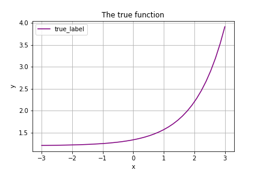
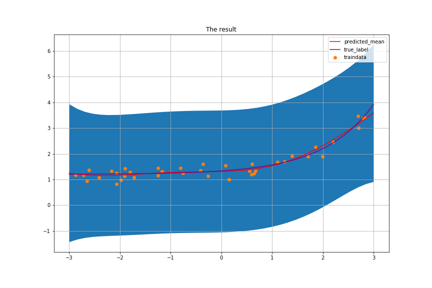

# ガウス過程回帰についてまとめてみる(Python, gaussian process regression)    

ガウス過程と機械学習という本を読み進めたので、そのメモ。  

丸写しする訳ではない上、全部載せる気力もないので重要そうなところだけをかいつまんで書いていく。  

詳しい導出部分や解説はぜひ、上の書籍を参考にしてみてほしい。  
下のリンクから飛ぶことができる。  

<a target="_blank"  href="https://www.amazon.co.jp/gp/product/4061529269/ref=as_li_tl?ie=UTF8&camp=247&creative=1211&creativeASIN=4061529269&linkCode=as2&tag=sunhellsing96-22&linkId=2ab3f7c3da48beb1e2ed8915eb5d39aa"></a>

毎度の事ながら、実装したコードは以下のレポジトリにアップロードしてある。  
https://github.com/wildgeece96/gaussian_process  

## 定式化
### そもそもガウス過程って  
ガウス過程って名前が正直ピンと来ないというか中身が想像しにくい内容であったが、それも書籍内で解説してくれていた。  

どうやらガウス過程というのは **無限次元のガウス分布** のことを指しており,  
確率過程は入力に対してそれに対応する確率変数 $y$ に同時分布 $p(y)$ を与える確率モデルのことをさすらしい。  

なので、確率モデルの一種ということであり、やりたいことは出力となる $y$ の期待値(平均)と分散を求めるということになりそうである。  

似たようなものとしてベイズ線形回帰があるが、こちらは重みとなる $\boldsymbol w$ の期待値と分散を求めることが目的なので若干モデルの構造が異なる。  

今回も推定していくモデルは基底関数 $\phi_i (\boldsymbol x)$ の線型結合で表現され、  

$$
\hat y = \boldsymbol w^T \boldsymbol \phi (\boldsymbol x) \\\\
= w_0 \phi_0(\boldsymbol x) + w_1 \phi_1(\boldsymbol x) + \cdots + w_H \phi_H(\boldsymbol x) \\\\
$$

この基底関数と重みを直接求めることなく、 $\hat y$ の期待値と分散をモデルかしてしまうのがガウス過程回帰だ。  

ベイズ線形回帰については以下のページでまとめたのできになる人は見てみてほしい。  
[ベイズ線形回帰をまとめてみる(Python, bayesian regression)](https://leck-tech.com/machine-learning/bayesian-regression)  

### カーネルトリック  

先ほども言及したように、ガウス過程回帰は基底関数と重みを直接求めることなく $\hat y$ をモデル化する確率モデルとなっている。  

まずは $\boldsymbol{\hat y} = (\hat y_1, \hat y_2, \cdots, \hat y_N)^T$ の共分散行列 $K$ は重み $\boldsymbol w$ を以下のようにモデル化することでこのように表せる。  

$$
\boldsymbol w \backsim \mathcal N (\boldsymbol 0, \lambda^2 \boldsymbol I) \tag 1\\\\
$$
$$
\boldsymbol K = \lambda^2 \Phi \Phi^T \tag 2 \\\\
$$
$$
(\Phi = (\boldsymbol \phi(\boldsymbol x_1), \boldsymbol \phi(\boldsymbol x_2), \cdots, \boldsymbol \phi(\boldsymbol x_N))^T) \tag 3 \\\\
$$

このように、重み $\boldsymbol w$ を使わずに表現することが可能。  

この時、 $\boldsymbol K$ の $(n, n')$ における要素 $K_{nn'}$ の値は  

$$
K_{nn'} = \boldsymbol \phi (\boldsymbol x_n)^T \boldsymbol \phi (\boldsymbol x_{n'}) \tag 4 \\\\
$$  

と表せ、基底関数ベクトル $\boldsymbol \phi$ を求める必要はなく、 $K_{nn'}$ を直接求めるようなカーネル関数  

$$
k(\boldsymbol x_n, \boldsymbol x_{n'}) \\\\
$$

で表現すれば良いということになる。  
$K_{nn'}$ は $\boldsymbol \phi(\boldsymbol x_n)$ と $\boldsymbol \phi(\boldsymbol x_{n'})$ との近似度を表している（値の傾向が近ければ近いほど共分散の値は大きくなる）ので、カーネル関数も $\boldsymbol x_n$ と $\boldsymbol x_{n'}$ との類似度（距離）を表すような関数を設定すれば良い。  

このように、カーネル関数を用いて共分散行列を表現することを **カーネルトリック** と呼ぶ。  
### カーネル関数の種類  

最もよく使われるのは **RBFカーネル(動径基底関数; Radial Basis Function)** と呼ばれるもので、以下のように表される。  

$$
k(\boldsymbol x_n, \boldsymbol x_{n'}) = \theta_1 exp(- \frac{|\boldsymbol x_n - \boldsymbol x_{n'}|^2}{\theta_2}) \tag 5 \\\\
$$

他にも **線形カーネル(linear kernel)**  

$$
k(\boldsymbol x_n, \boldsymbol x_{n'}) = \boldsymbol x_n^T \boldsymbol x_{n'} \tag 6 \\\\
$$

や **指数カーネル(exponential kernel)**  

$$
k(\boldsymbol x_n, \boldsymbol x_{n'}) = exp(- \frac{|\boldsymbol x_n - \boldsymbol x_{n'}|}{\theta}) \tag 7 \\\\
$$

などを使う。  

ガウス過程回帰では、これらの線型結合でカーネル関数を表現することもできる。  

$$
k(\boldsymbol x_n, \boldsymbol x_{n'}) = \theta_0  exp(- \frac{|\boldsymbol x_n - \boldsymbol x_{n'}|^2}{\theta_1}) + \theta_2 \boldsymbol x_n^T \boldsymbol x_{n'} + \theta_3 \delta (n, n') \tag 8 \\\\
$$

$\delta(n,n')$ は $n=n'$ の時のみ1を返す関数で、これは観測値 $y$ に期待値 $0$　、分散 $\sigma^2$ をもつノイズが乗っていると過程した際の追加分の分散。  

そのほかにも様々なタイプのカーネル関数が存在するらしい。  

### ガウス過程回帰モデル  
今までのを一旦まとめると、N個のデータの組 $\mathcal D = \{ (\boldsymbol x_1, y_1), (\boldsymbol x_2, y_2), \cdots, (\boldsymbol x_N, y_N) \}$ があるとすると  

$$
\boldsymbol y \backsim \mathcal N (\boldsymbol 0, \boldsymbol K) \tag 9 \\\\
$$

と $\boldsymbol y$ を確率モデル化することができる。  

#### 未知の値への予測  
では、得られたこの分布から、新たな値 $\boldsymbol x^*$ の新たな予測値 $y^*$ の期待値と分散を求めていく。  

この時、  
$$
\boldsymbol k_* = (k(\boldsymbol x^*, \boldsymbol x_1), k(\boldsymbol x^*, \boldsymbol x_2), \cdots, k(\boldsymbol x^*, \boldsymbol x_N))^T \\\\
k_{**} = k(\boldsymbol x^*, \boldsymbol x^*) \\\\
$$

とすると、

$$
p(y^* | \boldsymbol x^*, \mathcal D) = \mathcal N( \boldsymbol k_*^T \boldsymbol K^{-1} \boldsymbol y, k_{**} - \boldsymbol k_*^T \boldsymbol K^{-1} \boldsymbol k_*) \tag{10} \\\\
$$

これを複数の未知の入力 $\boldsymbol X^*$ が与えられた時の期待値と分散は以下のようになる。  
$\boldsymbol k_*$ と $\boldsymbol k_{**}$ を以下のようにすると、  
$$
\boldsymbol k_* =
\left(
    \begin{array}{ccc}
      k(\boldsymbol x_1, \boldsymbol x^*_1) & \cdots & k(\boldsymbol x_1, \boldsymbol x^*_m) \\
      \vdots & \ddots & \vdots \\
      k(\boldsymbol x_n, \boldsymbol x^*_1) & \cdots & k(\boldsymbol x_n, \boldsymbol x^*_m)
    \end{array}
  \right)
\\\\

\boldsymbol k_{**} =
\left(
    \begin{array}{ccc}
      k(\boldsymbol x^*_1, \boldsymbol x^*_1) & \cdots & k(\boldsymbol x^*_1, \boldsymbol x^*_m) \\
      \vdots & \ddots & \vdots \\
      k(\boldsymbol x^*_m, \boldsymbol x^*_1) & \cdots & k(\boldsymbol x^*_m, \boldsymbol x^*_m)
    \end{array}
  \right)
\
$$
未知の観測値の分布は以下のように表される  
$$
p(\boldsymbol y^* | \boldsymbol X^*, \mathcal D) = \mathcal N (\boldsymbol k_*^T \boldsymbol K^{-1} \boldsymbol y, k_{**} - \boldsymbol k_*^T \boldsymbol K^{-1} \boldsymbol k_*) \tag{11} \\\\
$$

### ハイパーパラメータ推定  
今までみてきたように、カーネル関数を定めてしまえばあとは手順に沿って計算するだけで未知の値の期待値と分散をそれぞれ求めることができてしまう。  

そのため、学習するのはカーネル関数に含まれるパラメータとなる $\theta$ となる。  

よって式 $(8)$ のようなカーネル関数を考える。  
これらの $\theta$ を持ったカーネル行列 $\boldsymbol K_{\theta}$ を使うと、  

$$
p(\boldsymbol y | \boldsymbol X, \theta) = \mathcal N (\boldsymbol y | \boldsymbol 0, \boldsymbol K_{\theta}) \\\\
= (定数) \times \frac{1}{|\boldsymbol K_{\theta}|^{\frac{1}{2}}}exp(- \frac{1}{2} \boldsymbol y^T \boldsymbol K_{\theta}^{-1} \boldsymbol y) \tag{12} \\\\
$$

そのため、これらの対数をとると  

$$
log\ p(\boldsymbol y | \boldsymbol X, \theta) = - \frac{1}{2}log|\boldsymbol K_{\theta}| - \frac{1}{2} \boldsymbol y^T \boldsymbol K_{\theta}^{-1}\boldsymbol y + const. \tag{13} \\\\
= L + const. \\\\
$$

このように $L$ をおくと、 $L$ を最大化するような $\theta$ を求めれば良いということになる。  

したがって $L$ をハイパーパラメータ $\theta$　で微分すると  

$$
\frac{\partial L}{\partial \theta} = - tr(\boldsymbol K_{\theta}^{-1} \frac{\partial \boldsymbol K_{\theta}}{\partial \theta}) + (\boldsymbol K_{\theta}^{-1}\boldsymbol y)^T \frac{\partial \boldsymbol K_{\theta}}{\partial \theta}(\boldsymbol K_{\theta}^{-1} \boldsymbol y) \tag{14} \\\\
$$

$\frac{\boldsymbol K_{\theta}}{\boldsymbol \partial \theta}$ は $\boldsymbol K_{\theta}$ の各要素に対してそれぞれ $\theta$ で偏微分した値を要素にもつ行列となる。  

あとは、確率的勾配降下法(SGD; Stochastic Gradient Descent)を用いてパラメータを何回か更新する。  

ここのパラメータ最適化の方法はいくつかあるらしいが自分の馴染みのあるものを使用することにする。  
パラメータ更新率 $\eta$ を使って、

$$
\theta_{new} = \theta + \eta \frac{\partial L}{\partial \theta} \tag{15} \\\\
$$

と各々の $\theta$ を更新していく。  

## 実装  

### カーネルクラス  
まずはカーネルを作成するクラスを設定する。  

カーネルは以下のものを使用する。  

$$
k(\boldsymbol x_n, \boldsymbol x_{n'}) = \theta_0  exp(- \frac{|\boldsymbol x_n - \boldsymbol x_{n'}|^2}{\theta_1}) + \theta_2 \boldsymbol x_n^T \boldsymbol x_{n'} + \theta_3 \delta (n, n')
$$

今後を考えて、カーネルマトリックスの微分系( $\frac{\partial K_{\theta}}{\partial \theta}$ や $\boldsymbol k_{**}$ )を求めるものも用意した。  

```python
class Kernel(object):
    def __init__(self, theta=[], seed=42):
        np.random.seed(seed)
        if len(theta) != 4:
            self.theta = np.random.randn(4)  
        else:
            self.theta = np.array(theta)  

    def make_kernel(self, X):
        """
        inputs :
            X : 2d-array. shape=[N, d].
        returns :
            K : 2d-array. shape=[N,N].
                The matrix that represents covariance.
        """
        N = X.shape[0]

        # make kernel matrix
        K = np.zeros(shape=[N,N],dtype=float)
        for i in range(N):
            for j in range(N):
                K[i,j] = self._kernel(X[i], X[j], i, j)  
        return K

    def _kernel(self, x, x_, n=0, n_=1):
        """
        inputs :
            x : 1d-array. shape=[d]
            x_ : 1d-array. shape=[d]
            n, n_ : the index of data.
        returns:
            k : scaler.
        """
        k_1 = self.theta[0] * np.exp(- np.sum((x - x_)**2) / self.theta[1])
        k_2 = self.theta[2] * np.sum((x - x_)**2)  
        k_3 = self.theta[3] * (n==n_) # delta function
        return k_1 + k_2 + k_3

    def part_k(self, x, x_, n, n_):
        """
        inputs:
           x, x_ : 1d-array. shape=[d]
           n, n_ : the index of data
        returns:
            dk : 1d-array. shape=[4].
                the result of dk/dθ
        """
        dk = np.zeros(4)
        dk[0] =  np.exp(- np.sum((x - x_)**2) / self.theta[1])   
        dk[1] = self.theta[0] * np.sum((x-x_)**2) / self.theta[1]**2 * np.exp(- np.sum((x - x_)**2) / self.theta[1])  
        dk[2] = np.sum((x - x_)**2)
        dk[3] = 1.0 * (n==n_)  # delta function
        return dk

    def part_K(self, X):
        """
        inputs:
           X : 2d-array. shape=[N, d].
        returns:
           dK :3d-array. shape=[4, N, N,].
               the result of dK/dθ
        """
        N = X.shape[0]
        dK = np.zeros(shape=[N, N, 4])
        for i in range(N):
            for j in range(N):
                dK[i, j] =self. part_k(X[i], X[j], i, j)
        dK = dK.transpose(2, 0, 1)
        return dK

    def make_k_star(self, X, X_star):
        """
        inputs:
            X : 2d-array.  The known values
            X_star: 2d-array. shape=[M,d]. The unkonwn values.
        returns:
            k_star: 2d-array. shape=[N, M]
        """
        N = X.shape[0]
        M = X_star.shape[0]
        k_star = np.zeros((N, M))
        for i in range(N):
            for j in range(M):
                k_star[i,j] = self._kernel(X[i], X_star[j])
        return k_star

```

### ガウス過程回帰クラス  

今度は本体部分のクラス。  
part_l関数が $\frac{\partial L}{\partial \boldsymbol \theta}$ を求める関数。  
```python  
class GPRegression(object):

    def __init__(self,kernel, thetas=[]):
        """
        inputs:
            kernel : the class for kernel.
        """
        self.kernel = kernel(thetas)

    def fit(self, X, y, num_iter=10, eta=0.1):
        """
        In this process, optimize the hyper parameters.
        inputs:
            X : 2d-array. shape=[N, d]
                The explanatory variables.
            y : 1d-array. shape=[N]
                The objective variables.
        returns:
            None
        """
        self.X = X  
        self.y = y

        # optimize thetas
        for i in range(num_iter):
            dl = self.part_l()
            self.kernel.theta += eta * dl  
        self.K = self.kernel.make_kernel(X) # kernel_matrix for predict to use for predicting value.

    def part_l(self):
        N = self.X.shape[0]
        k_theta = self.kernel.make_kernel(self.X)
        k_theta_inv = np.linalg.inv(k_theta)
        dk_dtheta = self.kernel.part_K(self.X)
        dl_1 = - np.trace(np.dot(dk_dtheta, k_theta_inv), axis1=1, axis2=2)
        dl_2_1 = (np.dot(k_theta_inv,y.reshape(-1,1)))
        dl_2 = np.dot(np.dot(dl_2_1.T, dk_dtheta).reshape(4,N), dl_2_1) # -> [4,1]
        dl_2 = dl_2.flatten()
        return dl_1 + dl_2

    def predict(self, X_star):
        k_star = self.kernel.make_k_star(self.X, X_star)
        k_dstar = self.kernel.make_kernel(X_star)  
        K_inv = np.linalg.inv(self.K)
        m = np.dot(np.dot(k_star.T, K_inv), self.y.reshape(-1,1))
        v = k_dstar - np.dot(np.dot(k_star.T, K_inv), k_star)
        return m, v
```

### 回帰してみる  
今回は以下の関数  

$$
f(x) = exp(x-2.0) + 1.2 \\\\
$$

を予測させることにした。  

  

```python
gpr = GPRegression(Kernel, [1.0, 1.0, 1.0, 1.0])  

def truef(X):
    return np.exp(X-2.0) + 1.2

X = np.random.uniform(-3, 3, size=[40, 1])
y = truef(X)  + 0.2*np.random.randn(40,1)

gpr.fit(X,y,num_iter=20, eta=0.05)

X_star = np.linspace(-3, 3, 40).reshape(-1,1)
m, v = gpr.predict(X_star)
m = m.flatten()
v = np.diag(np.abs(v))


plt.figure(figsize=(12,8))
plt.title('The result')
plt.fill_between(X_star.flatten(), m-np.sqrt(v), m +np.sqrt(v))
plt.plot(X_star.flatten(), m , color='red', label='predicted_mean')
plt.scatter(X.flatten(), y.flatten(), label='traindata')
plt.plot(X_star.flatten(), truef(X_star.flatten()), label='true_label', color='purple')
plt.legend()
plt.xlabel('x')
plt.ylabel('y')
plt.grid()
plt.show()
```

この結果がこれ。  

  

分散に当たる vが場合によっては負の値になってしまっているので数式的にまずいミスを犯している気がしてならないが、一旦保留。  
