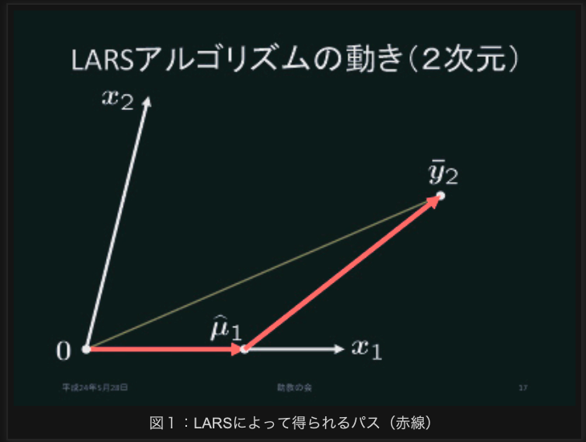
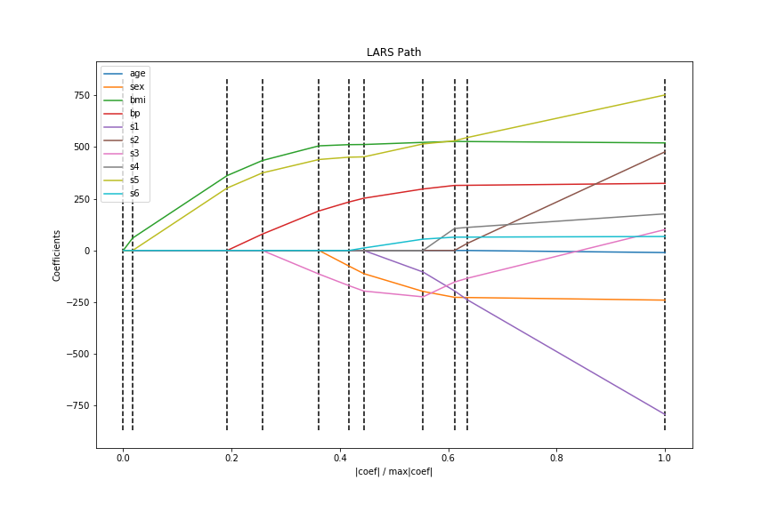
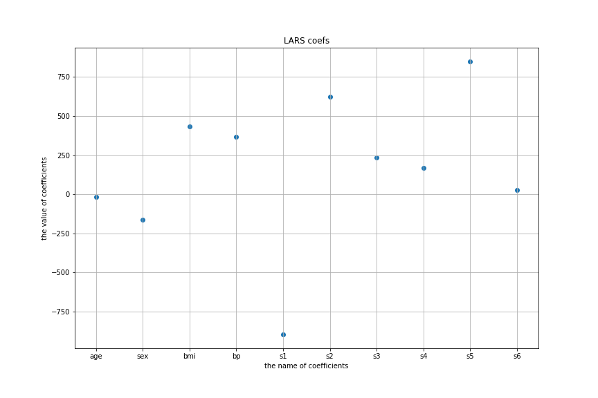
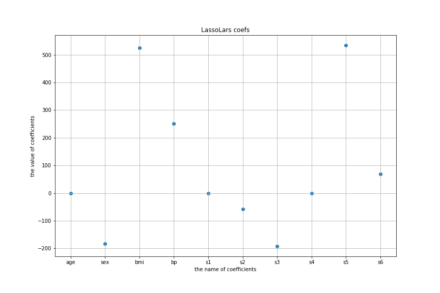

# LARS(Least Angle Regression)アルゴリズムまとめ(Python, sklearn)  
今回はLassoの内部でも使われることのあるLARS(Least Angle Regression)についてまとめてみた。  
このアルゴリズム自体は変数を選択するのによく使われる。  
Lasso回帰については以下の記事で扱っているので気になる人は参照してほしい。  
[ラッソ(Lasso)回帰とリッジ(Ridge)回帰をscikit-learnで使ってみる | 創造日記](https://leck-tech.com/machine-learning/ridge-lasso-sklearn)  

アルゴリズムについては  
以下の論文と、  

[LEAST ANGLE REGRESSION](http://statweb.stanford.edu/~tibs/ftp/lars.pdf)   

以下のサイトを参考にした。

[数理助教の会: 第14回助教の会](http://jokyos.blogspot.com/2012/06/14.html)     

## 定式化  
### 概要  
LARS(Least Angle Regression)は予測値と教師データとの偏差ベクトルとそれぞれの特徴量が基底となるベクトルとの角度が大きい(偏差との相関が大きい)ものとなるような特徴量を1つずつ追加していくというもの。  

相関の大きい基底(特徴量)を加えていく際に、角度が小さくなるような(内積の値が大きくなるような)特徴量を選ぶというところからLeast Angle Regressionという名前がついているそう。  
以下のサイト  
[数理助教の会: 第14回助教の会](http://jokyos.blogspot.com/2012/06/14.html)    
によれば、このアルゴリズムの流れというのは  

> 1. 全ての特徴量に対する重みが0の状態からスタート
> 2. まだ使っていない特徴量のうち、相関が一番大きい特徴量を基底に加える  
> 3. 基底に入っている特徴量と、モデルの予測値と教師データとの偏差をとる。
> 4. それぞれの特徴量と、偏差ベクトルとのなす角が等しい(内積の値が等しい)ような係数を新しく加えた基底に対する係数とする。  
> 5. 2~4を指定の回数分繰り返す  

という感じになるそう。(若干書き換えた)  
  
###### [数理助教の会: 第14回助教の会](http://jokyos.blogspot.com/2012/06/14.html)より  

$\bar{y}_2$ が新たな予測値で、 $x_1,x_2$ というのが新しい特徴量。  
$x_1$ を基底に加えたのち、$\bar{y}_2$ が $x_1,x_2$ を基底とするベクトルとのなす角がちょうど等しくなるように基底の重みを決定する。  

### Lassoモデル  
本題に入る前に、簡単に今回前提となる条件とモデルをざっとまとめていきたい。  

特徴行列 $X$ 、 教師ベクトル $y$ は以下のように定義する。  
$$
X = (x_1, x_2, \cdots, x_N) \ \in \mathbb{R}^{(N \times m)}   \\\\
(x_i =(x_{i1}, x_{i2}, \cdots , x_{im})^T \in \mathbb{R}^m) \\\\
y = (y_1, y_2, \cdots, y_N)^T \\\\
$$

これに対する回帰モデルが係数 $\hat{\beta}$ を持ち、  

$$
\hat{\beta} = (\hat{\beta}_1, \hat{\beta}_2, \cdots, \hat{\beta}_m) \\\\
$$

モデルの予測値は  

$$
\hat{\mu} = (\hat{\mu}_1, \hat{\mu}_2, \cdots, \hat{\mu}_N)^T \\\\  
$$

このモデルを損失 $L$

$$
L = ||y - \hat{\mu} ||^2 + \alpha \sum_{j=1}^m | \hat{\beta}_j | \\\\
$$  
の値が最小になるような係数を求めるものとする。  
( $\alpha$ はハイパーパラメータ)   

この変数 $X$ と教師データ $y$ は以下の正規化が施されていることが前提。  

$$
\sum_{i=1}^{N} y_i = 0 \\\\
\sum_{i=1}^{N} x_{ij} = 0 \\\\
\sum_{i=1}^{N} x_{ij}^2 = 1 \\\\
(j = 1, 2, \cdots, m)  \\\\
$$  

#### 2変数モデルの場合  

では、まずは簡単な例から見ていく。  
$m=2$ に制限されている場合だ。  
この時、予測値との相関が大きい特徴量を $x_{j_1}$ とし、次に相関が大きい特徴量 $x_{j_2}$ とする。  
$X = (x_{j_1}, x_{j_2}) \in \mathbb{R}^{(N \times 2)}$ を使って、予測値は  

$$
\hat{\mu} = X\hat{\beta} \\\\
$$  

で表すことが可能。  
この時、相関の大きさ $c(\hat{\mu})$ は、  

$$
c(\hat{\mu}) = X^T(y-\hat{\mu}) \\\\
= X^T(\bar{y}_2 - \hat{\mu}) \\\\
= (c_1, c_2)^T \\\\
$$  

$\hat{y}_2$ は $y$ の線型空間 $L(x)$ への写像。  

この時、 $\hat{\mu}_0 = 0$ の状態(初期状態の予測値を0にする)からスタートする。  
この時、 $x_1,x_2$ の間で以下のような関係が成り立っている時、  

$$
c_1(\hat{\mu}_0) > c_2(\hat{\mu}_0)  \\\\
$$

下図の様な関係を満たしていることになる。  
    
つまり、原点( $\hat{\mu}_0$ )から伸びている $\bar{y}_2-\hat{\mu}_0$ のベクトルが $x_1$ との角度がより小さくなる様になっている。  

この時、新たな予測値 $\hat{\mu}_1$ は  

$$
\hat{\mu}_1 = \hat{\mu}_0 + \hat{\gamma}_1 x_1 \\\\
$$  

となり、  
$\hat{\gamma}_1$ の値は  

$$
c_1(\hat{\mu}_1) = c_2(\hat{\mu}_2) \\\\
$$  
を満たすものとする。  
ちょうど2等分線を引ける様な形になる。  

上の図でいうと、右側の赤いベクトルが $x_1$ と $x_2$ とのなす角を二等分する様なベクトルになっていることがわかる。  

そして、次に  

$$
\hat{\mu}_2 = \hat{\mu}_1 + \hat{\gamma}_2 x_2  \\\\
$$

$\bar{y}_2 = \hat{\mu}_2$ となる様な $\hat{\gamma}_2$ の値を選ぶ。  

#### 一般化  
今度は2変数以外の場合にも成り立つ様な定式化を行う。  
(が、理由までは論文内で追いきれなかったのでご容赦を)  

今度は $A$ を $\{ 1,2,3,\cdots, m \}$ の部分集合として、  
$$
X_A = (\cdots, s_jx_j, \cdots) \\\\
j \in A \\\\

s_j \in \{ -1, +1 \} \\\\

$$

となるような $X_A$ を考える。  
この集合は予測値と教師データとの偏差との相関値が高いものが選ばれている集合とする。  

この時、新たに追加する変数を選ぶ作業をする。  
新たに以下の2つを定義する。  

$$
g_A = X_A^T X_A \\\\
A_A = (1_A^T g_A^{-1} 1_A)^{\frac{1}{2}} \\\\
$$

$1_A$　は長さ $|A|$ で成分が全て1のベクトル。  

この時、二等分線となるベクトルは  

$$
u_A = X_A w_A \\\\
(w_A = A_A g_A^{-1} 1_A) \\\\
$$

これを変形すると  
$$
X_A^T u_A = A_A 1_A \\\\
||u_A||^2 = 1 \\\\
$$
と表すことができる。  
この時、 $\hat{\mu}_A$ を暫定の予測値とすると、相関ベクトルは  

$$
\hat{c} = X^T (y - \hat{\mu}_A) \\\\
$$

であり、その中での最大値を取り出す。  

$$
\hat{C} = \max_{j} \{|\hat{c}_j| \} \\\\
A = \{j : |\hat{c}_j = \hat{C} \} \\\\
$$

$s_j = sgn(\hat{c}_j) (j \in A)$ となる。  
この様な集合 $A$ を作った後、先ほどの式にしたがって  
$X_A, A_A, u_A$ を計算する。  
内積ベクトルは  
$$
a \equiv X^T u_A \\\\
$$

こうして新たな予測値は  

$$
\hat{\mu}_{A+} = \hat{\mu}_A + \hat{\gamma}u_A \\\\
$$

となる。  
この辺りを見る限りだと、同じ変数が足される場合は排除していない(恐らく1回基底に加えると相関がほとんどなくなるからだと思うが)。  

係数 $\hat{\gamma}$ の値は  

$$
\hat{\gamma} = \min_{j\in A^c}^+ \{ \frac{\hat{C} - \hat{c}_j}{A_A - a_j} , \frac{\hat{C} + \hat{c}_j}{A_A + a_j} \} \\\\
$$
この時の最小値は正の値を取るものの中から選ばれる。  

やってること自体は予測値と相関があるものを1つずつ基底に加えていくだけというもの。  
シンプルではあるが、なかなか協力。  
## 実装  
とりあえず式はざっくりと追えたので、sklearnで使ってみる。  
#### LARSでの係数変化      
[Lasso path using LARS - scikit-learn](https://scikit-learn.org/stable/auto_examples/linear_model/plot_lasso_lars.html#sphx-glr-auto-examples-linear-model-plot-lasso-lars-py)  
ここのコードをアレンジしていく。  
どの様に学習が進んでいったかが分かる`lars_path`を使ってみる。  
まずは必要モジュールのインポート。  
```python  
# 必要モジュールのインポート  
import numpy as np
import matplotlib.pyplot as plt

from sklearn import linear_model
from sklearn import datasets # データセットダウンロード用
```
データセットのロード。  
```python
diabetes = datasets.load_diabetes() # 糖尿病のデータセット
X = diabetes.data
y = diabetes.target
```
項目は以下の通り。  
```python
diabetes['feature_names']
# ['age', 'sex', 'bmi', 'bp', 's1', 's2', 's3', 's4', 's5', 's6']  
```
|説明変数|説明|
|:---:|-------|
|age|年齢|
|sex|性別|
|bmi|BMI（体重kg ÷ (身長m)^2|
|bp|平均血圧|
|s1|血清測定値1|
|s2|血清測定値2|
|s3|血清測定値3|
|s4|血清測定値4|
|s5|血清測定値5|
|s6|血清測定値6|  

これらの変数が全て正規化された状態で入っている

でLARSを使った正則化を施してみる。  
```python
alphas, active, coefs = linear_model.lars_path(X, y,
            method='lars', verbose=True)  
```
LARSを使った最適化の結果が出力される。
coefsに出力されるのは更新回数ごとの係数の値の変化で、1つ1つの行がそれぞれの特徴量に対応する係数となっている。  
```python
coefs
```
```python
array([[   0.        ,    0.        ,    0.        ,    0.        ,
           0.        ,    0.        ,    0.        ,    0.        ,
           0.        ,    0.        ,  -10.01219782],
       [   0.        ,    0.        ,    0.        ,    0.        ,
           0.        ,  -74.91651394, -111.97855446, -197.75650114,
        -226.13366183, -227.17579824, -239.81908937],
       [   0.        ,   60.11926965,  361.89461246,  434.75795962,
         505.65955847,  511.3480707 ,  512.04408899,  522.26484702,
         526.88546671,  526.39059435,  519.83978679],
       [   0.        ,    0.        ,    0.        ,   79.23644688,
         191.26988358,  234.15461616,  252.5270165 ,  297.15973689,
         314.38927158,  314.95046722,  324.39042769],
       [   0.        ,    0.        ,    0.        ,    0.        ,
           0.        ,    0.        ,    0.        , -103.94624877,
        -195.10582951, -237.34097312, -792.18416163],
       [   0.        ,    0.        ,    0.        ,    0.        ,
           0.        ,    0.        ,    0.        ,    0.        ,
           0.        ,   33.62827441,  476.74583782],
       [   0.        ,    0.        ,    0.        ,    0.        ,
        -114.10097989, -169.71139351, -196.04544329, -223.92603334,
        -152.47725949, -134.59935205,  101.04457032],
       [   0.        ,    0.        ,    0.        ,    0.        ,
           0.        ,    0.        ,    0.        ,    0.        ,
         106.34280588,  111.38412869,  177.06417623],
       [   0.        ,    0.        ,  301.77534281,  374.91583685,
         439.66494176,  450.66744821,  452.39272771,  514.74948085,
         529.91603066,  545.48259721,  751.27932109],
       [   0.        ,    0.        ,    0.        ,    0.        ,
           0.        ,    0.        ,   12.07815226,   54.76768063,
          64.4874179 ,   64.60667013,   67.62538639]])
```
```python
alphas  
```
alphasの中身はこんな感じで、それぞれのイテレーション時に計算された相関係数( $\hat{C}$ )が記録されている。  
```python
 array([2.14804358, 2.01202713, 1.02466283, 0.71509967, 0.29441369,
      0.20086523, 0.15602991, 0.04520646, 0.01239247, 0.01151398,
       0.        ])
```
activeの中身は以下の通りで、それぞれのイテレーションで相関係数の値が最大となった係数のインデックスを表示している。  
```python
active  
```
```python  
[2, 8, 3, 6, 1, 9, 4, 7, 5, 0]   
```

次に、プロットのための前準備に入る。    
それぞれのイテレーションにおいて、係数の絶対値の足し合わせを求める。
そして、最後のイテレーションにおける係数の足し合わせとの比率をとる。  
```python
xx = np.sum(np.abs(coefs.T), axis=1)  
xx /= xx[-1]
```
```python
coefs.shape, xx.shape
```
これらの形状は  
```python
((10, 11), (11,))  
```  
結果をプロットする。それぞれの係数がどの様に変化していったかが示される。  
```python
# それぞれのイテレーションにおける係数の大きさとそれぞれの係数の大きさのプロット
plt.figure(figsize=(12,8))
labels = ['age', 'sex', 'bmi', 'bp', 's1', 's2',
                             's3', 's4', 's5', 's6']
for i, label in enumerate(labels):
    plt.plot(xx, coefs[i], label=label)  
ymin, ymax = plt.ylim()  
plt.vlines(xx, ymin, ymax, linestyle='dashed')  
plt.xlabel('|coef| / max|coef|')  
plt.ylabel('Coefficients')
plt.title('LARS Path')
plt.axis('tight')
plt.legend()
plt.show()  
```

実行結果  
  
縦軸が係数の値であり、横軸が各イテレーションにおける合計値の比率。  

### LARS  
LARSも使ってみるが、他のscikit-learnのモデルと同じ様に使える。    
```python
from sklearn.model_selection import train_test_split  
# テストデータと訓練データの作成
train_X, test_X, train_y, test_y = train_test_split(X, y, test_size=0.3)
# モデルの呼び出し
lars = linear_model.Lars()
# フィッティング
lars.fit(train_X, train_y)  
# 予測
y_hat = lars.predict(test_X)
```
スコアはあまりよくなかった。  
```python
print(lars.score(test_X, test_y))
```
```python
0.4997148667454298  
```

係数の値のプロットをする。  
```python
labels = ['age', 'sex', 'bmi', 'bp', 's1', 's2',
                             's3', 's4', 's5', 's6']
plt.figure(figsize=(12,8))
plt.scatter(np.arange(10), lars.coef_)  
plt.xticks(np.arange(10), labels)  
plt.grid()
plt.ylabel('the value of coefficients')
plt.xlabel('the name of coefficients')
plt.title('LARS coefs')
plt.show()
```

実行結果  
  

### LassoLars  
この際なので、
Larsを使ったLasso回帰も試してみる。  

```python
from sklearn.model_selection import train_test_split  
train_X, test_X, train_y, test_y = train_test_split(X, y, test_size=0.3)
lasso = linear_model.LassoLars(alpha=0.1) # alphaの値は0.1くらい  
lasso.fit(train_X, train_y)  
print(lasso.score(test_X, test_y))
```
```python
0.4691944386582325
```
係数の値をプロットする  
```python
labels = ['age', 'sex', 'bmi', 'bp', 's1', 's2',
                             's3', 's4', 's5', 's6']
plt.figure(figsize=(12,8))
plt.scatter(np.arange(10), lasso.coef_)  
plt.xticks(np.arange(10), labels)  
plt.grid()
plt.ylabel('the value of coefficients')
plt.xlabel('the name of coefficients')
plt.title('LassoLars coefs')
plt.show()
```

実行結果  
  

## まとめ  
今回は最適化の際に変数選択を行う1つのアルゴリズムとしてLeast Angle Regressionの中身についてまとめた。  
やってること自体は、特徴量の値と暫定での誤差との相関が最も大きい特徴量を1つずつ加えていくというシンプルなものだが、定式化すると意外と長くなってしまった。  
こういったものも数行で使えてしまうscikit-klearnは本当に恐ろしい子。  


## 参考  
- [LEAST ANGLE REGRESSION](http://statweb.stanford.edu/~tibs/ftp/lars.pdf)   
- [数理助教の会: 第14回助教の会](http://jokyos.blogspot.com/2012/06/14.html)       
- [sklearn.linear_model.lars_path](https://scikit-learn.org/stable/modules/generated/sklearn.linear_model.lars_path.html#sklearn.linear_model.lars_path)  
- [Lasso path using LARS - scikit-learn](https://scikit-learn.org/stable/auto_examples/linear_model/plot_lasso_lars.html#sphx-glr-auto-examples-linear-model-plot-lasso-lars-py)  
- [Toy datasets - sklearn](https://scikit-learn.org/stable/datasets/index.html#toy-datasets)  
