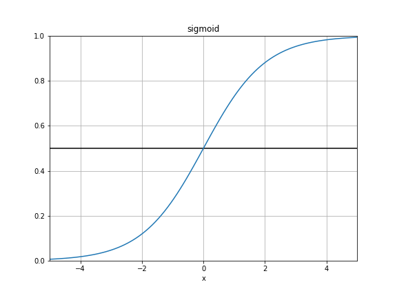
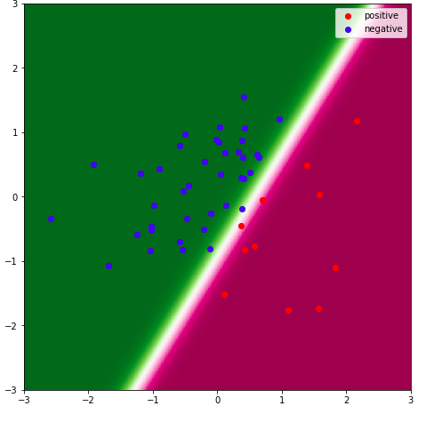

# ロジスティック回帰まとめ(Python, logistic regression)    
今回は回帰モデルの中でも特に確率的な値を出力するのに使われるロジスティック回帰についてまとめる。  
今まで扱ってきた線形回帰モデルの計算結果に対して、ちょっと一手間を加えただけのもの。  
線形回帰モデルについては以下の2つの記事を参考にしてほしい。  
- [最小2乗法(OLS)をscikit-learnで使ってみる](https://leck-tech.com/machine-learning/ols-sklearn)  
- [ラッソ(Lasso)回帰とリッジ(Ridge)回帰をscikit-learnで使ってみる](https://leck-tech.com/machine-learning/ridge-lasso-sklearn)    

嬉しいのは、出力される値が0~1に制限されるので確率として解釈ができるということ。  
ではまとめていく。  
今回書いたコードは以下のレポジトリにまとめてある。  
https://github.com/wildgeece96/logistic_regression  

## 定式化  
### シンプルな線形回帰モデル  
まず、シンプルな線形回帰のモデルは以下の特徴量同士を係数ベクトル $\boldsymbol \omega$ をかけて足し合わせる(つまり、内積をとる)ことで値をだす。  

$$
\hat y = \boldsymbol \omega^T \boldsymbol x \tag 1 \\\\
$$

この時、 $\hat y$ の値は特に制限されない。  

### シグモイド関数の導入  
ここで、シグモイド関数というのを導入する。  
これは以下のような式で表される。  

$$
\sigma (x) = \frac{1}{1+exp(-x)} \tag 2 \\\\
$$

グラフの形状は以下の感じ。  
  
この値は0から1に制限されていることがわかる。  
また、特徴として、閾値として定められることの多い0.5付近で **傾きが急** になっていることがわかる。  
これにより、クラス分類問題において閾値をここに設定しておくと、値の変化がシビアになる。  


### ロジスティック回帰  
このシグモイド関数の値を先ほどの $(1)$ に適用してみる。  

$$
\hat y = \sigma(\boldsymbol \omega^T \boldsymbol x) \tag 3 \\\\
$$

これでモデルの完成。  
ここでの目的はモデルの示す値が出来るだけ真の値 $y$ に近づくようにすること。  
### 損失の導入  

この時、説明変数 $\boldsymbol x = (x_1, x_2, \cdots, x_d)$ が与えられた時の目的変数 $t$ を予測したいので、  
これらが $N$ 個セットああるとすると、  
モデルの予想した値と実際の値との誤差の二乗和を損失として、  

$$
L = || \boldsymbol{\hat y} - \boldsymbol t||^2 \tag 4 \\\\
(\boldsymbol{\hat y} = (\hat y_1, \hat y_2, \cdots, \hat y_N) ) \\\\
(\hat y_i = \sigma(\boldsymbol \omega^T \boldsymbol x_i)) \\\\
$$

今回は二乗誤差を損失としたが、おそらく一般的な損失の値は  

$$
L = - (1-\boldsymbol t)log(1-\boldsymbol{\hat y}) - \boldsymbol t log \boldsymbol{\hat y} \\\\
$$

クロスエントロピーと呼ばれるものを使うが他のサイトでこれについては扱っているのでこちらでは二乗誤差を使ってみる。  
以下のサイトが参考になる。  
[第18回　ロジスティック回帰 | 機械学習はじめよう](http://gihyo.jp/dev/serial/01/machine-learning/0018)  
[第19回　ロジスティック回帰の学習 | 機械学習はじめよう](http://gihyo.jp/dev/serial/01/machine-learning/0019)  
### 最適化  
損失を導入したので、この値を重みベクトル $\boldsymbol \omega$ について微分して0となるような $\boldsymbol \omega$ が最適化された重みとなる。  

個人的にはここの微分して0だったら損失が最小値というのは若干論理の飛躍が有るように思えてしまうが、確かめ方を知らないので、直感的な理解に止めるしかない。  
直感的には、真の値 $t$ より遠くなるような値を取ることはいくらでも可能なので永遠に離れることができる。つまり、損失の値をいつまでも大きくさせることができるということ。そのため、微分の値が0になるような点は最大値では存在せず、有るとするなら最小値しかない。と言うことになる。  

では、微分をしてみる。  

$$
\frac{\partial L}{\partial \boldsymbol \omega} = 2(\boldsymbol{\hat y} - \boldsymbol t) \frac{\partial \boldsymbol{\hat y}}{\partial \boldsymbol \omega} \\\\
$$

ではここで、  
$X = (\boldsymbol x_1, \boldsymbol x_2, \cdots, \boldsymbol x_N)^T$ とすると、

$$
\frac{\partial \sigma(\boldsymbol x)}{\partial \boldsymbol x} = (1-\sigma(\boldsymbol x))\cdot \sigma(\boldsymbol x) \\\\
\frac{\partial}{\partial \boldsymbol \omega} \boldsymbol X \boldsymbol \omega^T = \boldsymbol X \\\\
$$

を踏まえると、連鎖律より  

$$
\frac{\partial \boldsymbol{\hat y}}{\partial \boldsymbol \omega} = \frac{\partial \sigma(\boldsymbol X \omega)}{\partial \boldsymbol X \omega} \frac{\partial \boldsymbol X \omega}{\partial \boldsymbol \omega} \\\\
= ((1-\sigma(\boldsymbol X \omega ))\sigma( \boldsymbol X\omega))^T\boldsymbol X \\\\
= ((1 - \boldsymbol{\hat y})\boldsymbol{\hat y})^T\boldsymbol X \\\\
\frac{\partial L}{\partial \boldsymbol \omega} = (2(\boldsymbol{\hat y} - \boldsymbol t)(1 - \boldsymbol{\hat y})\boldsymbol{\hat y})^T\boldsymbol X
$$

となる。  
あとはこれにしたがって重みを徐々に更新していけば良い。  
更新率を $\eta$ とおくと  

新しい重み $\boldsymbol \omega_{new}$ は  

$$
\boldsymbol \omega_{new} = \boldsymbol \omega - \eta \frac{\partial L}{\partial \boldsymbol \omega}
$$

これを何回か繰り返していけば良い。  
このように少しずつ重みを更新していく手法を確率的勾配降下法と呼ぶらしい。  

## 実装  
ロジスティック回帰を行ってくれるクラスをまずは実装する。  

```python
def sigmoid(x):
    return 1./(1.+np.exp(-x))

class LogisticRegression():

    def __init__(self, eta=0.1, num_iter=50):
        self.eta = eta
        self.num_iter = num_iter

    def fit(self, X, t):
        """
        inputs:
            X : 2-d array. shape: [N, d].
                N : the number of data.  
                d:  the number of features.
            t : 1-d array. shape: [N].
                the desired values
        """
        n_features = X.shape[1]+1
        X = np.append(X, np.ones(shape=[X.shape[0],1]),axis=1)
        self.w = np.random.randn(1,n_features)
        # predict the value
        for i in range(self.num_iter):
            y_hat = sigmoid(np.dot(X, self.w.reshape(-1,1)))  # --> [N, 1]
            grad = self.calculate_grad(X, y_hat, t)
            self.w -= self.eta * grad

    def calculate_grad(self, X, y_hat, t):
        d_y_hat = 2*(y_hat - t.reshape(-1,1)) # -> [N, 1]
        d_xomega = (1 - y_hat)* y_hat  # -> [N, 1]
        d_omega = X # -> [N, d]
        return np.dot((d_y_hat*d_xomega).T, d_omega)

    def pred(self, X):
        X = np.append(X, np.ones(shape=[X.shape[0],1]),axis=1)
        return sigmoid(np.dot(X, self.w.reshape(-1,1))).flatten()

```

では次に、目標となる関数を定義する。  

```python
def truef(X):
    return 1.5* X[:, 0] -  X[:, 1] -1.0
```

今回は、ここの値が0以上であれば1, 0以下であれば0 となるような教師データを作成した。  

```python
X = np.random.randn(50, 2)
t = np.where(truef(X)>0.0, 1.0, 0.0)
```

では、これを先ほど作成したクラスに入れ込んで見る。  

```python
logit = LogisticRegression(eta=1.0, num_iter=100)
logit.fit(X, t)
```
学習させたパラメータは以下のように更新されているはず。  

```python
print(logit.w)
### array([[ 9.59791622, -5.9564076 , -5.47246126]])
```

では、学習結果をプロットしてみる。  

```python
import matplotlib.pyplot as plt
# 図を描くための準備
seq = np.arange(-3, 3, 0.01)
X_1, X_2 = np.meshgrid(seq, seq)
X_1, X_2 = X_1.reshape(-1,1), X_2.reshape(-1,1)
X_all = np.concatenate([X_1,X_2],axis=1)
X_all = X_all.reshape(600,600, 2)
zlist = np.zeros([600,600])
for i in range(600):
    zlist[i,:] = logit.pred(X_all[i, :, :])

# 散布図と予測分布を描画
plt.figure(figsize=(12,8))
plt.imshow(zlist, extent=[-3,3,-3,3], origin='lower', cmap=plt.cm.PiYG_r)
plt.scatter(X[np.where(t==1)][:, 0],X[np.where(t==1)][:, 1], color='red', label='positive')
plt.scatter(X[np.where(t==0)][:, 0],X[np.where(t==0)][:, 1], color='blue', label='negative')
plt.legend()  
plt.show()
```
プロット結果は以下のようになる。  

  

コードをまとめたものを以下のレポジトリにアップロードしてある。  
https://github.com/wildgeece96/logistic_regression  
