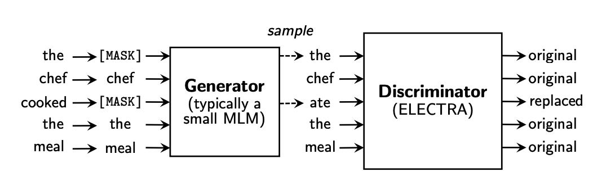
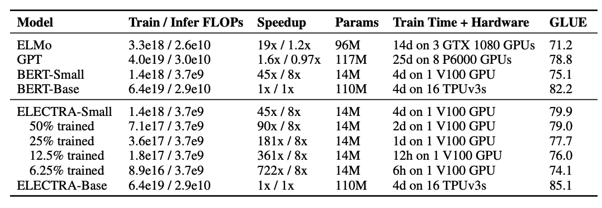

# (論文まとめ)ELECTRA : Pre-training Text Encoders As Discriminators Rather than Generators

簡易的に読んだ論文についてのメモを垂れ流していく。  
掲載する図や表は特筆がない限り、元の論文から引っ張ってきたものになる。  

[論文リンク](https://openreview.net/pdf?id=r1xMH1BtvB)  

## 概要

- Transformerベースのモデルにおいて使われる事前学習において新しい手法の提案。  
- これまで事前学習で使われていたタスクであるMasked Language Modelingを類似のもので置き換えられたトークンを検知するタスクに置き換えた。  
- マスクされた単語を **生成する** のではなく、置き換えられた単語を **検知する** という面が新しい  
- 手法による効果は小さいモデルほどよく現れた  
- RoBERTaやXLNetと言った大規模モデルでも計算量は1/4ほどに  

事前学習のイメージ  
  

## 手法  

主に2つのネットワークを学習させる様子。  

- Generator : 入力された文章のトークン(単語)を似たようなものに置き換える
- Discriminator : 本体。置き換えられたトークンがどれかを検知する  

どちらもTransformerベースのモデルを使用していそう。  

### Generator  

$$
p_G(x_t | \boldsymbol{x}) = exp(e(x_t)^T h_G(\boldsymbol{x})_t) / \sum_{x'}^T exp(e(x')h_G(\boldsymbol{x}_t))
$$

- $x_t$ : 各トークン  
- $\boldsymbol{x} = [x_0, \cdots, x_n]$ : 入力文章  
- $h_G(\boldsymbol{x})_t$ : 文章を入力として受け取った時にトークン$t$の、Generatorから得られた表現
- $e(x_t)$ : トークン$t$の埋め込み表現

Generatorで設定されている損失はMasked Language Modelingにしたがっている。  
一定確率(15%ほど)でマスキングされた単語が何かを予測する。  

損失は、マスキングされた単語を正しい単語だと予測した確率の負の対数。 

### Discriminator  

Discriminatorは各トークンについて、そのトークンが入れ替えられたものかどうかを予測する。  
そのため、最後の活性化関数はSigmoidになっている。  

$$
D(\boldsymbol{x}, t) = sigmoid(w^T h_D(\boldsymbol{x})_t)
$$

- $w$ : 重みパラメータ  
- $h_D(\boldsymbol{x})_t$ : トークン $t$ に対して得られたDiscriminatorからの内部表現  

損失は置き換えられたトークンにおけるBinary-cross entropyの平均。  

### 学習の流れ  

1. 入力文章について単語を一定確率でマスクする  
2. Generatorでマスクされた単語が何かを予測する  
3. そのトークンに対してGeneratorから得られた確率分布から新しいトークン $\hat{x}$を生成  
4. Discriminatorによって置き換えられたトークン$\hat{x}$　をオリジナルの文章のものと一致しているかどうか予測する 
5. 各々の損失の計算、およびパラメータの更新
6. 1~5の繰り返し

## Experiments

基本的にモデル構造は DiscriminatorについてはBERT-Baseのものと一致させている。  
GeneratorについてはDiscriminatorよりも小規模のものを使用したほうが精度が出るらしい。  

使ったベンチマークは以下の通り  

- GLUEベンチマーク  
- SQuAD 1.1と2.0

事前学習に使ったデータセット(BERT-Baseと一致
させている)  

- Wikipedia 
- BooksCorpus

合計33億トークン  

### パラメータの共有  

DiscriminatorとGeneratorのパラメータは単語のEmbedding層とPositional Embedding層(場所ごとに与えられる埋め込み層)は共通のものにしている。 

### 事前学習の学習時間について 

Smallがついているものは

- シーケンス長 : 128
- バッチサイズ : 128
- 隠れ層の次元 : 256
- 埋め込みの次元 : 128

の設定で行ったものの様子。  

ELECTRA-SmallについてはGPUでも十分行える設定にはなっている。  

FLOPについては後述。  

ALBERTの計算量の多さに少々驚いた。A Lite BERTとは何のことだったんだ・・？と思いたくなる結果だったが、どうやら設定としてxxlargeのものを使っている様子。

## Appendix  

### 計算量の評価(FLOP)について  

計算量の評価でTensorFlowでも使えるFLOPという指標を使っているらしい。  

- 基本的には1回の演算(数式で一発で表せる範囲)は1回としてカウントし、これが何回行われたかをざっくりカウントする。  
- 順方向の計算量のみを考え、逆方向は同じ値をとるものとしている。  
- Embeddingの際はスパースではなく、密(Dense)なものを想定している  

この辺りの原則を使っているようだ。自分の解釈にミスはあるかもしれない。  

## 感想

BERT系列のモデルをGANチックに学習させましたよという内容の論文だった。  
  
Discriminatorは事前学習済みのもの使えばこの辺り結構良い感じに転移学習が楽かもしれないなあとかぼんやり考えたり。  

ただ、やはり計算量で殴ってきますなあ、Googleさん。  
