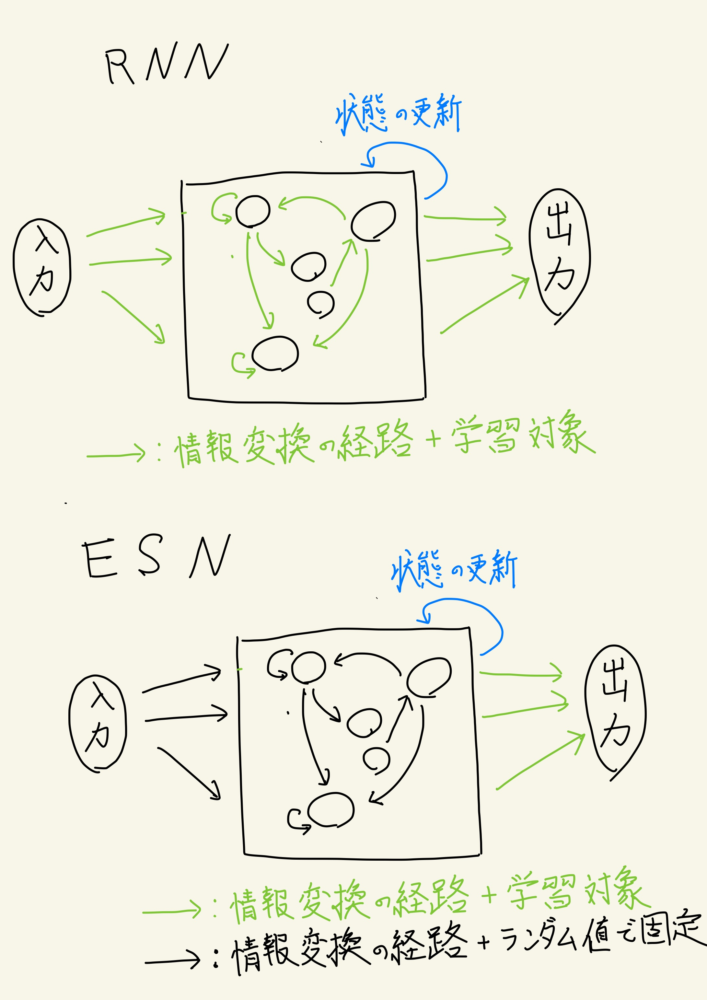
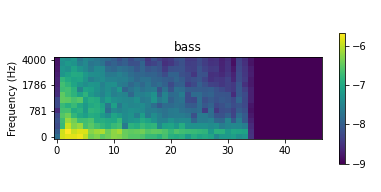
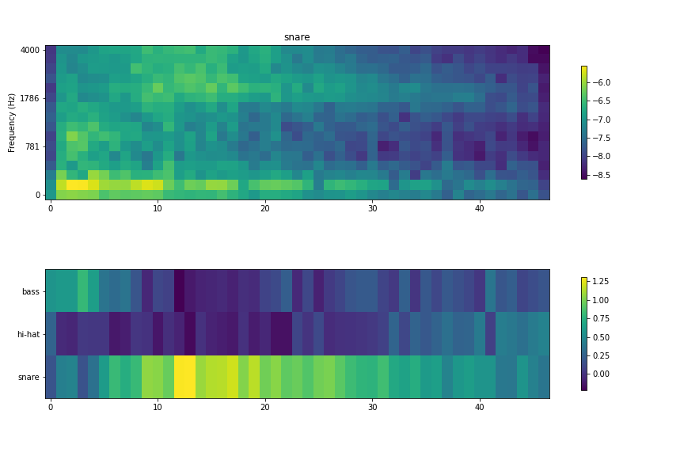
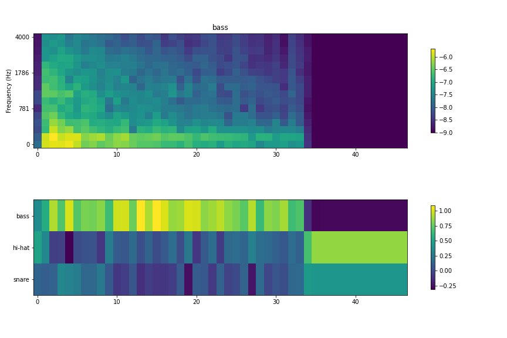
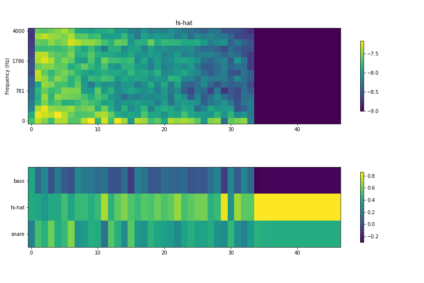

# Echo State Network を使ってボイパの音をリアルタイムで分類してみる (Python, Reservoir Computing)

この記事は[前回の記事](https://leck-tech.com/python/mac_python_mic)で実装したマイクからの入力をリアルタイムで処理する部分を流用した取組となっている。

ディープラーニングについて概念を把握している方なら読めるようになっていると思う。

自分の発した音をリアルタイムで分類したくなったので、そのアプローチとしてリザバーコンピューティングの中で有名な Echo State Network を使ってリアルタイム分析を行うことにした。短中期的な入力情報をネットワークの中で記憶しておき、それによって推論などを行うネットワークである。

自分が音を発したら、それにしたがってネットワークのダイナミクスがグネグネと変化して、いい感じのフィードバックを出せるようになったら楽しそうだなと思いこれはその第一歩。

実装は以下のレポジトリで公開している。

- [wildgeece96/reservoir-mic-input: Reservoir network for analysis of real time mic input.](https://github.com/wildgeece96/reservoir-mic-input)

## 1. 導入 - Echo State Network (ESN) とは？

ESN の概要について簡単に書いておく。

おそらく別途で理論的に解説をした記事を書くのでここでは軽めに触れて終わりにしたい。

Qiita の記事で詳しく書いていたものがあったのでここに貼っておく。

- [Echo State Network の詳細を解説してみる - Qiita](https://qiita.com/donaldchi/items/c65b978de384821f2942)

### 1.1. ざっくり説明すると

シンプルな再帰型ネットワーク (RNN; Recurrent Neural Network) を使うときに再帰的に情報を処理する層の重みを固定し、 **最後の線型結合層だけ学習させる** というアプローチをとって学習させたネットワークのこと。  
リザバーコンピューティング (Reservoir Computing) と呼ばれる分野では代表的なネットワークの 1 つとなっている。

重みを更新すべき箇所が線型結合層だけなので学習コストが低く、時系列データの解析を行う際などに主に使われる。

何故これでうまく学習できるかピンと来ない方も多いと思うが、ある程度のお膳立ては必要になってくる。基本的にランダムに初期化させた重みを用いて再帰的に情報を処理するが、その初期化のさせ方などに気を使う必要がある。

これを言い換えると、入力時系列をある内部状態 $\bm{u}$ に変換する非線形関数 $\bm{f}(\bm{x}_t, \bm{x}_{t-1}, \cdots) = \bm{u}$ が存在すれば良いので CPU 上で演算を行う必然性がなくなり **物理現象をこの関数 $\bm{f}$ と見立てて推論に使うことが可能となる** 。もちろん、この $\bm{f}$ になりうる条件が存在するため全ての物理系が使えるわけではない。

### 1.2. RNN との違い

簡単に図として表してみた。



基本的にネットワークの構造そのものは変わらないが、どこを学習対象にするかに違いが発生するものだと理解してもらえれば幸いである。

入力を内部状態へ変換する箇所と内部状態の更新を行う箇所で使われる重み（パラメータ）を基本的には RNN では学習させるが ESN （というより Reservoir Computing のアプローチ）では初期値のまま使う。そのまま手付かずに使ってしまうわけだ。

## 2. 手順

ESN の概要について軽く掴んだところで今回の実装について触れていく。

コードが思いのほか長くなったので、フルのコードは以下のレポジトリで参照して欲しい。

- [wildgeece96/reservoir-mic-input: Reservoir network for analysis of real time mic input.](https://github.com/wildgeece96/reservoir-mic-input)

データを収集するところからデコーダの学習、そして結果のデモまでをやっていく。

### 2.1. 環境

以下の環境で行った

- MacBook Pro (13-inch, 2019, Four Thunderbolt 3 ports)
- Python 3.7.4

### 2.2. データの収集

今回はお試しの意味もあるので、ボイパの音の中でも基本的な 3 種類の音である ”バスドラム(bass)"、"スネアドラム(snare)"、"ハイハット(hi-hat)" の 3 種類を単音ずつ収録した。  
Mac にデフォルトで入っているボイスメモを使って収録を行なった。収録環境は一種類のみ。

そして、音声の形式を`ffmpeg` を使って wav 形式に変換したあと、不要な部分を Audacity を使って切り取りした。

これで、学習に使う音声ファイルが 17 個完成した。
音声ファイルはサンプリングレートが 8000 Hz でチャネル数 1 となっている。

1 つ 1 つの音声ファイルは 0.5 秒ほど。

例えば、バスドラムの音声のうち 1 つを可視化すると以下のようになる。



立ち上がり部分で低音が強く鳴っているのがみて取れる。

### 2.3. 学習コードの実装

#### 2.3.1 Echo State Network の定義

Echo State Network は以下のように定義した。ネットワークを保存したりする関数も一緒に実装したが、ここでは割愛している。  
ただ、EchoStateNetwork のノードを格子状に配置しており、そこの結合の強さを他の方法で定義している。

また、`decoder` は scikit learn で学習させたモデルを想定している。基本的には `Ridge` か `LinearRegression` あたりが多くなる。

```python
import os
import json
from typing import Dict
import numpy as np
import sklearn


class ESN_2D(object):
    """Echo State Network which has 2 dimensional structure.
    """
    def __init__(
            self,
            height=10,
            width=10,
            input_dim=80,
            output_dim=4,
            alpha=0.8,  # 自己状態の保存の度合い
            dtype='float32',
            decoder=None):
        """ネットワークの初期か

        Parameters
        ----------
        height : int, optional
            ネットワークの高さ(2次元構造にノードを配置する想定), by default 10
        width : int, optional
            ネットワークの幅（2次元構造にノードを配置する想定), by default 10
        input_dim : int, optional
            入力の次元数, by default 80
        output_dim : int, optional
            ネットワークの出力次元数, by default 4
        alpha : float, optional
            直前の state を持つ割合, input の scale は 1 - slpha となる, by default 0.8
        dtype : str, optional
            network 内部で持つ数値データの型 by default 'float32'
        decoder : sklearn.model, optional
            内部状態をデコードするクラス。sklearn 上で取得できるモデルを想定
        """
        self.dtype = dtype
        self.scale = np.sqrt(width * height)
        self.alpha = alpha
        self.height = height
        self.width = width
        self.input_dim = input_dim
        self.output_dim = output_dim
        self._x = np.random.randn(width * height).astype(dtype)

        self.w_inter = np.random.randn(width * height,
                                       width * height) / self.scale
        self.w_inter.astype(dtype)
        self._adjust_w_inter_params(height, width)
        # echo state property を持たせるための重み調整
        self.w_inter /= np.linalg.norm(self.w_inter)
        self.w_inter *= 0.99

        self.w_in = np.random.randn(input_dim,
                                    width * height) / self.scale * 2.0
        # mask the input weight
        self.w_in *= np.where(
            np.random.rand(input_dim, height * width) < 0.8, 0, 1.0)
        self.w_in.astype(dtype)

        # 活性化関数
        self.g = np.tanh

        # デコーダー
        self.decoder = decoder

    def __call__(self, u, return_preds=False):
        """Update state."""
        return self.step(u, return_preds)

    def step(self, u, return_preds=False):
        """Update state and return output.

        Parameters:
        =========
        u: ndarray. (input_dim,).
        """
        u = u.astype(self.dtype)
        updated_value = self.alpha * np.dot(
            self.w_inter, self._x) + (1. - self.alpha) * np.dot(u, self.w_in)
        self._x = self.g(updated_value)
        if return_preds:
            return self.decoder.predict(self._x)

    @property
    def x(self):
        return self._x.reshape(self.height, self.width)

    @property
    def x_flatten(self):
        return self._x

    def set_decoder(self, decoder: sklearn.linear_model):
        self.decoder = decoder

    def _adjust_w_inter_params(self, height, width):
        # 格子状に並べたニューロンの結合をニューロン同士の距離にしたがって結合の強さを調節する
        for i in range(height):
            for j in range(width):
                distance = self._calc_distance(i, j, height, width)
                self.w_inter[i * height + j] /= distance

    def _calc_distance(self, i, j, height, width):
        # ニューロン同士の距離を計算する
        distance = np.zeros(height * width, dtype=self.dtype) + 1e-3
        for _i in range(height):
            for _j in range(width):
                if _i == i and _j == j:
                    distance[_i * height + _j] = 1.
                else:
                    distance[_i * height + _j] = np.sqrt((_i - i)**2 +
                                                         (_j - j)**2)
        return distance
```

#### 2.3.3 学習部分

- 入力：
  - 音声波形データをメルスペクトログラムと呼ばれるスペクトログラムの一種に変換
  - スペクトログラムの各タイムステップに切り取ったスペクトラムを入力
- 出力：
  - 音声が"ハイハット(hi-hat)"、"バスドラム(bass)"、"スネアドラム(snare)" のいずれかである度合い
- 学習データ : 評価データ
  - 8 : 2 。
  - 17 個しか音声がないためあまり意味あるものとは思えなかったが一応。
- 評価指標
  - 各フレームごとの分類精度 (accuracy)
- デコーダー
  - リッジ (Ridge) 回帰を使用

### 2.4. ハイパーパラメータの最適化

ネットワークのサイズや、デコーダー（今回はリッジ回帰を使用）で使う正則化の度合い、入力の強さなどをハイパーパラメータとして設定し、それらをグリッドサーチで探索した。

## 3. 結果

評価データでの分類性能が 85 % となった。  
思ったよりも悪くない。

各種音声を入力した時の各フレームごとの予測は以下のようになった。
評価データのものを抜粋しようと思ったが、ぱっとみ傾向が変わらなかったので特に区別せずにみていく。

### 3.1. スネア



上段が音声をメルスペクトログラムで可視化したもの、下段が ESN が各フレームごとの予測値の分布を示している。最後の紫一面になっている箇所は無音に近い状態の -9 でパディングしたところなのでひとまず無視してみる。

スネアは最初のアタック音（音の立ち上がり）部分だとバスドラムかスネアドラムか見分けがつきにくいという形になっているが、リリース音が入り始めるとスネアの確度が一気に高くなる。

悪くない。

### 3.2. バスドラム



バスドラムは比較的音の立ち上がり部分からバスドラムへの推測の確度が高い状態になっていることがわかる。

### 3.3. ハイハット



こちらはスネアやバスドラムほど判定がはっきりしていない。スネアかハイハットか判別が難しい状態になっている。  
とはいえ、全体で見るとハイハット優位の判定になっているので、ある程度の学習は成功したと考えられる。

### 3.4. 結果まとめ

同じ環境下で同一人物の発した音声のみを用いて学習、評価したものではあったものの、ひとまず単音の分類は学習できていることが確認できた。
次のステップに進めそうである。

## 4. いざ、リアルタイムで可視化！！

ここまで来て、可視化をしようとしたが 1 フレームあたり 128 サンプルで 8000 Hz のサンプリングレートのため、 `0.008` 秒ごとにフレーム処理をする必要がでてきてしまった。この短い時間内に処理を完遂することが難しくなってしまった。

そのため、試行錯誤の結果フレームの幅を 1024 ほどに上げてプロットすることにした。

## 5. まとめと今後の展望

本記事では、自前で用意したボイパの音声をリアルタイムで分類できるかを検証した。分類器としては、リザバーコンピューティングの分野で主流のネットワークの 1 つである Echo State Network (ESN) を活用した。

結果として。。。。。。。。

次のステップとして、やはり時系列データなので 1 つ 1 つの音の分類だけでなく 8 beat or 16 beat のようなビートの分類や、前ノリ後ノリ、テンポといった情報が分析できたらいいなと思っている。

その前に ESN の理論的背景をまとめる記事を出したい。多分。

## 6. 参考

- [Echo State Network の詳細を解説してみる - Qiita](https://qiita.com/donaldchi/items/c65b978de384821f2942)
