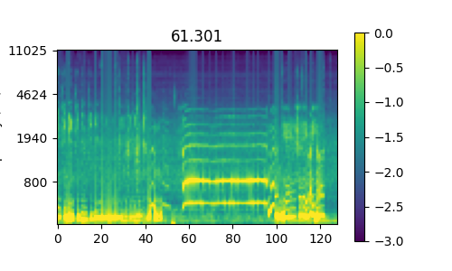

# マイク入力をリアルタイムで可視化する(Python, MacOS)

今回は、MacBook付属のマイクで色々遊ぶための前準備の手順を備忘録として残すことにした。  

## PyAudioのインストール  

どうやらマイクのアクセスにはPyAudioを使うことが多そうなので、手元にこれをインストールする。   

以下のQiita記事を参照した。  
[macOSにpyaudioをインストールする](https://qiita.com/mayfair/items/abb59ebf503cc294a581)  

まずはbrewを使ってPortAudioのインストール  

```bash
brew install portaudio
pip install pyaudio
```

pip installでうまく行かなかった人は以下コマンドで試してみると良いらしい。 

```bash
sudo env LDFLAGS="-L/usr/local/lib" CFLAGS="-I/usr/local/include" pip install pyaudio
```

## マイクからの音声取得と可視化  

こちらのサイトを参考にしつつやってみる。
[Python3でマイクから録音して音声をスペクトル表示する](https://toshusai.hatenablog.com/entry/2017/11/11/210000)  

マイクアクセス部分での調整がうまくできなかったので、以下サイトを参考にしながら調整をした。  
[PythonからPyAudioで録音/再生してみる](https://www.ipride.co.jp/blog/2525)  

```python
import pyaudio

p = pyaudio.PyAudio()

apiCnt = p.get_host_api_count()
print("Host API Count: %d" % apiCnt)

for cnt in range(apiCnt):
    print(p.get_host_api_info_by_index(cnt))
```

上のコードを実行すると、以下のような出力が返される。  

```bash
Host API Count: 1
{'index': 0, 'structVersion': 1, 'type': 5, 'name': 'Core Audio', 'deviceCount': 4, 'defaultInputDevice': 2, 'defaultOutputDevice': 3}
```

今回、マイクの入力だけ受け取りたいので、 `defaultInputDevice` の値 `2` を使用する。  
これが、PyAudioで設定するパラメータ `input_device_index` に相当するのでここを `2`に設定する。  

可視化については、`plt.pause` をうまく使ってリアルタイムで表示できるようにした。  
[matplotlibでリアルタイム描画 Qiita](https://qiita.com/hausen6/items/b1b54f7325745ae43e47)

また、周波数をlogスケールちっくにするために、メルフィルタをかけることで周波数のならびを10, 20, 30..とするのではなく、10, 20, 40, 80,..と対数的に並べるようにした。  
このあたりは`librosa`で実装されている関数を取得している。  

```python
import pyaudio
import numpy as np
import matplotlib.pyplot as plt

FORMAT = pyaudio.paInt16
CHANNELS = 1
CHUNK = 2**11
RATE = 22050  # サンプリングレート
FRAME_NUM = 218

p = pyaudio.PyAudio()

audio = pyaudio.PyAudio()
print(audio.get_device_count())
stream = audio.open(
    format=FORMAT, channels=CHANNELS,
    rate=RATE, input=True,
    input_device_index=2,  # デバイスのインデックス番号
    frames_per_buffer=CHUNK
)
# Get mel frequency basis.
mel_basis = librosa.filters.mel(RATE, n_fft=CHUNK, n_mels=N_MELS)
mel_freqs = librosa.mel_frequencies(n_mels=N_MELS, fmax=RATE//2)
datas_mel = []
cnt = 0

# プロットするために前準備
fig, ax = plt.subplots(1, 1, figsize=(5, 3))
zero_picture = np.zeros([N_MELS, FRAME_NUM])
# 初期値の範囲を-2.0~3.0にしておく
zero_picture[:, 0] = 1.0
zero_picture[:, 1] = -3.0
picture = ax.imshow(zero_picture)
fig.colorbar(picture, ax=ax)
ax.set_yticks(np.arange(0, N_MELS, 20))
ax.set_yticklabels([f"{int(f)}" for f in mel_freqs[::-20]])
ax.set_ylabel("Frequency (Hz)")
ax.set_aspect(1.0)

# ここでループを回してマイクから取得される値を処理していく
while True:
    data = np.frombuffer(stream.read(CHUNK), dtype=np.int16)
    data_fft = np.abs(np.fft.fft(data) / 2**16)
    data_fft = data_fft[:CHUNK//2+1]
    data_mel = np.log10(np.dot(mel_basis, data_fft.reshape(-1, 1)))
    datas_mel.append(data_mel.reshape(1, -1))
    if cnt > FRAME_NUM and cnt % 10 == 0:
        datas_mel = datas_mel[-FRAME_NUM:]
        plt.title(f"{cnt/RATE*CHUNK:.3f}")
        picture.set_data(np.concatenate(datas_mel, axis=0).T[::-1])
        plt.pause(0.001)

    cnt += 1
    print("cnt = ", cnt, end='\r')
```

これで簡単なスペクトログラムをいい感じに取得することができた。  
縦軸が周波数で、横軸が時間軸。上に行くほど周波数が高い。  

  
