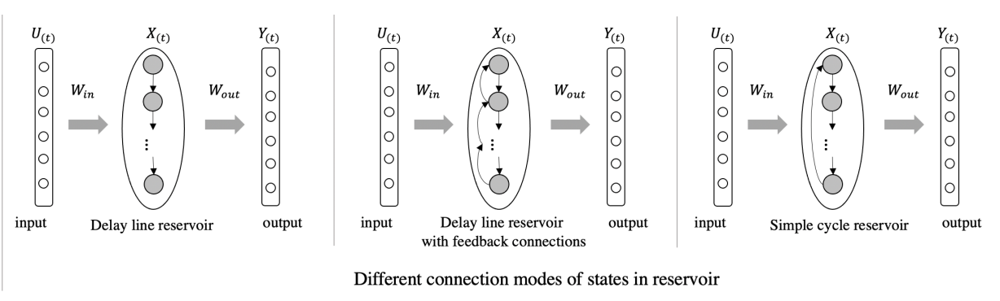
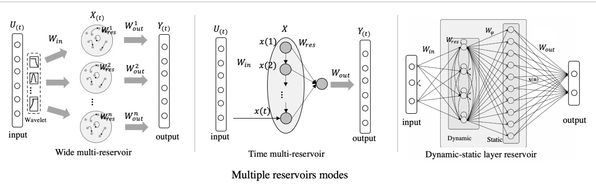
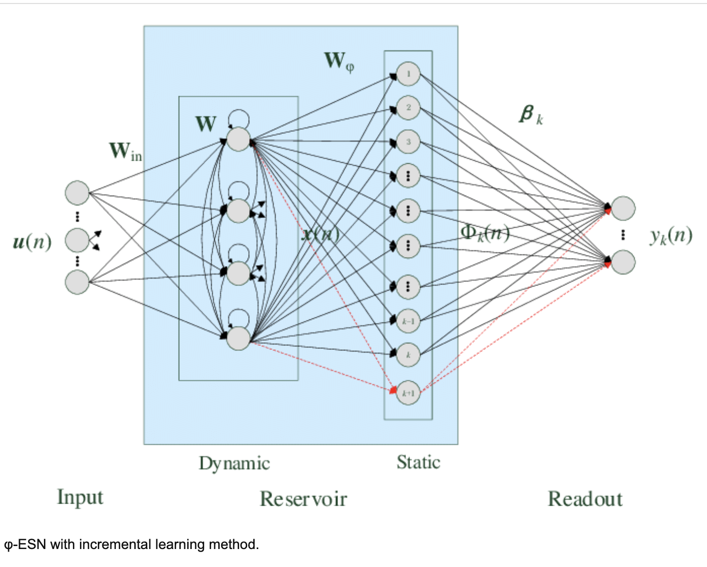
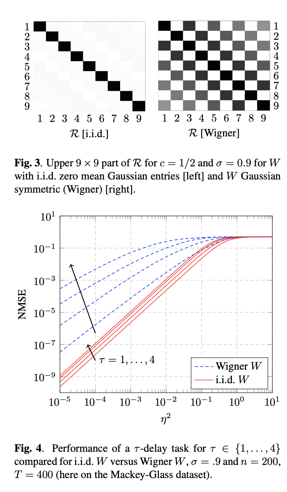
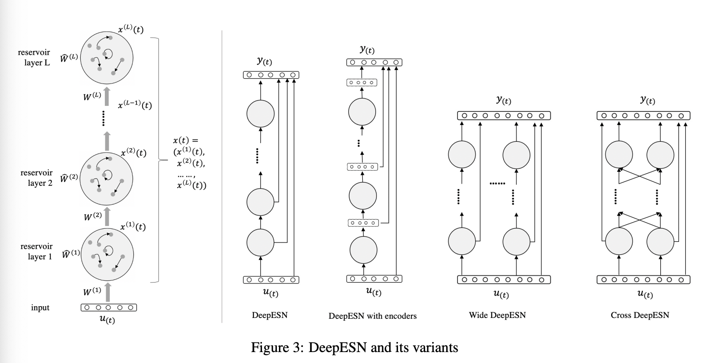

# (論文メモ) A Review of Designs and Applications of Echo State Networks

前回の記事で、Echo State Network にリアルタイムで音声を入力して遊ぶということをやった。

- [Echo State Network を使ってボイパの音をリアルタイムで分類してみる (Python, Reservoir Computing) | 創造日記](https://leck-tech.com/python/realtime-audio-classification-with-esn)

詳細は上記記事を参照してほしいが、現状までうまくいっているとは言い難い。この状況を打破するために、少しインプットを行おうということで昨年の 12 月に出ている論文である [A Review of Designs and Applications of Echo State Networks](https://arxiv.org/abs/2012.02974) を読もうと思う。

37 ページぐらいあるので、全部読むというよりかは気になるところを主に抜粋する。

出てくる画像は特に注釈がない限り、上記論文からの引用。

## 1. Abstract

- Recurrent Neural Networks (RNNs) は系列データを扱うタスクで有用なことが示されている。
- Echo State Network (ESN) は RNN のよりシンプルなタイプのもので、勾配降下法を使う RNN の代替案として提案された。
  - 実用的
  - コンセプトがシンプル
  - 実装が容易
  - 勾配降下法で問題になっている学習の非収束や膨大な計算量を解決できる
- 一方で、運用するには知見や経験を重ねることが不可欠
- 他の機械学習の技術と組み合わせたアプローチが ESN 単体よりも性能が良い
- この論文では、 "basic ESN" と "DeepESN" そして他の機械学習の技術を組み合わせた "combination" の 3 種類に分けて理論的背景やネットワーク設計そして具体的な応用先について論ずる

## 1. Introduction

### 1.1 RNN ベースモデルの学習における課題

- 誤差逆伝播で学習を行うが、 分岐（bifurcation） と呼ばれるダイナミクスが劇的に変化する現象が生じることで収束がしずらく計算コストが高い、そして性能の良くない局所最適解に陥ってしまう
- 勾配爆発といった現象も生じうるため、安定した推測パフォーマンスを確保することが困難である
- LSTM や GRU といった改善モデルも出されたが、入力長が限度を超えると勾配が消失してしまう
  - LSTM のモデルサイズを大きくすることもできるが、計算が非常に重く時間がかかるものとなってしまう

### 1.2 Reservir Computing (RC) の登場

- 勾配降下法の代替となる学習法として提案が行われた
- ESN は RC の 1 つの鍵
  - さまざまなバリエーションのある状態への高次元写像を行い、強力な非線形マッピングの力を使って入力のダイナミクスの情報処理を行う。
- echo state property は初期状態の影響が無限の遷移のあとには消え去る性質のことを指す
  - 似たような短期の変遷を持つ入力があると、似たような内部状態（echo state）が観測される

### 1.3 Deep Echo State Network (DeepESN) の登場

- RNN 部分の層を重ねることにより、複数のタイムスケールのダイナミクスを扱えるように
- 興味深いポイントは 2 つ
  - 層を重ねた RNN が持つ state のダイナミクスに注目が集まった
  - ディープなネットワークを時系列データに対して非常に効率的に学習ができる
- ディープラーニングのモデルの種類もたくさん増えてきたよね

## 2. Basic echo state Networks

### 2.1 前提知識

#### Echo State Networks (ESNs)

##### 定義

以下の性質をもつものを指す

- 高速で効率的な RNN
- 入力層、再帰層（リザバー）、出力層から成り立つ
- 入力層と再帰層の重みは初期化以外は固定で、出力層の重みのみ学習が可能（線形回帰）
- 再帰層は多くのニューロンがスパースに結合している

時刻 $t$ での内部状態 $\bold{x}(t) \in \mathbb{R}^{N\times 1}$ は入力 $\bold{u}(t)\in \mathbb{R}^{D\times 1}$ を受けて、以下のように更新される。

$$
\bold{x}(t) = f(\bold{W}_{in} \bold{u}(t_ + \bold{W}_{res} \bold{x}(t-1))) \\
\bold{y}(t) = \bold{W}_{out} \bold{x}(t) \\
$$

- $\bold{f}$: 活性化関数。 $tanh$ とか。
- $\bold{y}(t) \in \mathbb{R}^{M\times 1}$: 出力
- $\bold{W}_{in} \in \mathbb{R}^{N\times D}$: 入力層と再帰層との結合重み（重みは固定）
- $\bold{W}_{res} \in \mathbb{R}^{N\times N}$: 再帰層内の結合重み（重みは固定）
- $\bold{W}_{out} \in \mathbb{R}^{M\times N}$: 出力層（リードアウト）の重み（重みは学習対象）

$\bold{W}_{out}$ は閉じた形で学習させることができる。$||\bold{W}_{out}\bold{X} - \bold{Y}||^2_2$ を $\bold{W}_{out}$ について最小化すれば良いので、

$$
\bold{W}_{out} = \bold{Y} \cdot \bold{X}^{-1}
$$

で求めることができる。（$\bold{X}$ と $\bold{Y}$ はそれぞれ複数の内部状態とそれに対応する欲しい出力をまとめたもの）

ハイパーパラメータは以下の 3 つ。

- $w^{in}$: 入力をスケールするパラメータで、 $\bold{W}_{in}$ は $[-w^{in}, w^{in}]$ の一様分布で初期化される
- $\alpha$: $\bold{W}_{res}$ のスパース性を定義する。行列の中で非ゼロの値がどれくらいの割合で入っているのかを決める
- $\rho(\bold{W}_{res})$: $\bold{W}_{res}$ のスペクトル半径。固有値の絶対値の中でもっとも大きい値のことを指す

$\rho(\bold{W}_{res})$ を使って、一様分布で初期化された重み行列 $\bold{W}$ は以下のようにスケーリングが施される。

$$
\bold{W}_{res} = \rho(\bold{W}_{res}) \frac{\bold{W}}{\lambda_{max}(\bold{W})}
$$

$\lambda_{max}(\bold{W})$ は $\bold{W}$ の固有値の中で最大の値を示す。

リザバーのサイズは $N$ で決められ、入力データは長さ $T$ で $D$ 次元持つものなので、ESN の複雑性は以下のように計算ができる。

$$
C_{typical} = \mathcal{O}(\alpha TN^2 + TND)
$$

#### Echo State Property (ESP)

ESN の中で特に重要な性質が Echo State Property (ESP) となる。ESP はリザバーが漸近的に入力のみに依存することを数値的に表したものとなっている。定義としては、以下のようになる。

##### 定義

遷移等式 $F$ を持つネットワークが、各の入力系列 $U=[u(1), u(2), \cdots, u(N)]$ と入力状態のペア $\bold{x}, \bold{x}'$ があったとき、 $F$ が echo state property を持っている時、以下の式が成り立つ。

$$
||F(U, x) - F(U, x')|| \to 0 \\
(N\to \infin)
$$

ブログ著者コメント：入力が十分に長ければ、内部の状態は初期値にかかわらず入力に依存するということ。

ESP の存在は、 $\rho(\bold{W}_{res})$ と 特異値の最大値である $\bar{\sigma}(\bold{W}_{res})=||\bold{W}||_2$ を使って以下のように表現ができる。

$$
echo\ state \ property\ \Rightarrow \rho(\bold{W}_{res}) < 1 \\
\bar{\sigma}(\bold{W}_{res}) < 1 \Rightarrow echo \ state\ property \\
$$

上記の条件は ESN 文脈でリザバーの初期化によく使われている。
一方で、 ESN の初期条件については研究が進んでいる。
例えば、L2 ノルムである $||\bold{W}_{res}||_2$ を拡張した D ノルム $||\bold{W}_{res}||_D = \bar{\sigma}(\bold{D}\bold{W}_{res}\bold{D}^{-1})$ を用いて、十分条件を以下のように拡張した、

$$
\bar{\sigma}(\bold{D}\bold{W}_{res}\bold{D}^{-1}) < 1 \Rightarrow echo\ state\ property
$$

次に、 Memory capacity (MC) はネットワークの短期記憶（Short-Term Memory) を数値化したものである。MC は $\bold{W}^k_{out}$ の決定係数 $d[\bold{W}^k_{out}](u(n-k), y_k(n)) = \frac{cov^2(u(n-k),y_k(n))}{\sigma^2(u(n))\sigma^2(y_k(n))}$ から算出される。このとき、出力層は $k$ ステップ前の入力 $u(n-k)$ を出力するよう学習している。

これを踏まえた Memory Capacity は、以下のように記述できる。

$$
MC = \sum_{k=1}^{\infin}MC_k \\
MC_k = \max_{\bold{W}^k_{out}}d[\bold{W}^k_{out}](u(n-k), y_k(n))
$$

ブログ著者コメント：Memory Capacity は以下のレポジトリで書籍を参考にしながら実装したことがある。
[reservoir_demo/memory_capacity.py at main · wildgeece96/reservoir_demo](https://github.com/wildgeece96/reservoir_demo/blob/main/reservoir_network/memory_capacity.py)

### 2.2 設計

#### 2.2.1 Basic Models

Echo State Networks (ESNs) を初めて提唱したのは 2002 年の Jeager の[論文](https://proceedings.neurips.cc/paper/2002/file/426f990b332ef8193a61cc90516c1245-Paper.pdf).

2007 年には Jeager らは[論文](https://www.sciencedirect.com/science/article/abs/pii/S089360800700041X)で Leaky-ESN を提案した。  
Leaky-ESN は以下の発展式で表記される。

$$
\bold{x}(t) = (1 - \alpha\gamma)\bold{x}(t-1) + \gamma f(\bold{W}_{in}\bold{u}(t) + \bold{W}_{res}\bold{x}(t-1))
$$

- $\alpha \in [0, 1]$: リザバーのニューロンでのリーク率. 値が高いほど直前の state の影響が小さくなる
- $\gamma$: 外部入力と他のニューロンからの値の更新を行う強さ（ゲイン）

Leaky-ESN は時定数を組み込むことでローパスフィルタとなりダイナミクスがゆったりとするようになった。

また、出力をフィードバックとして戻す構造も提案されている。

$$
\bold{x}(t) = (1 - \alpha\gamma)\bold{x}(t-1) + \gamma f(\bold{W}_{in}\bold{u}(t) + \bold{W}_{res}\bold{x}(t-1) + \bold{W}^{back}_{out}\bold{y}(t-1))
$$

これらの原型から、さまざまな形式が提案されている。

#### 2.2.2 リザバーの設計

##### 動的に変化するリザバーの重み

ESN は基本的にリザバー部分の重みは初期化のあとは固定される。しかしながら、重みを固定したリザバーは必ずしも良いパフォーマンスを出すとは限らない。そのため、データ処理の時に動的に変化するリザバーもリザバーを設計するときの 1 つの主な焦点となる。

Mayer らが発表した[論文](https://www.researchgate.net/publication/221323436_Echo_State_Networks_and_Self-Prediction)だと、出力を推定するように調整された重み $\bold{W}^1_{out}:\bold{W}^1_{out}\bold{x}_t=\bold{y}(t)$ と 自己の状態を推定するように調整された出力重み $\bold{W}^2_{out}: \bold{W}^2_{out}\bold{x}_t = \bold{x}_{t+1}$ を使って、後者の重みを使って内部の重み $\bold{W}_{res}$ を $\hat{\bold{W}}_{res}$ を更新する

$$
\hat{\bold{W}}_{res} = (1 - \alpha)\bold{W}_{res} + \alpha \bold{W}^2_{out}
$$

$\alpha$ は固定の値。

自己推定の値を入れることで、ノイズへの敏感さをある程度抑えることが可能となる。

Hajnal らが発表した[論文](https://www.researchgate.net/publication/225728358_Critical_Echo_State_Networks)では Critical Echo State Networks (CESN) が提案された。ここでは、$\bold{W}_{in}$ と $\bold{W}_{out}$ を使うことで非周期的なダイナミクスの近似を行うことができている。

$$
\hat{\bold{W}}_{res} = \bold{W}_{res} + \bold{W}_{in} \bold{W}_{out}
$$

Fan らが発表した[論文](https://ieeexplore.ieee.org/document/7966058)では、principle neuron reinforcement (PNR) アルゴリズムを提案している。このアルゴリズムを用いて、強化学習的に内部結合の重みを調整するというもの。事前学習段階の出力の重みの値をもとに内部結合の重みを更新する。

$$
\bold{W}_{res}(t) = (1 + \rho(\bold{W}_{res})) \bold{W}_{res}(t-1), if\ \bold{W}_{out} > \xi
$$

Babinec らが発表した[論文](https://link.springer.com/chapter/10.1007/978-3-540-74690-4_3)では、Anti-Oja (AO) 学習を使って $\bold{W}_{res}$ を更新している。$\eta$ は小さな正の定数。

$$
\bold{W}_{res}(n+1) = \bold{W}_{res}(n) - \Delta \bold{W}_{res}(n) \\
\Delta \bold{W}_{res}(n) = \eta \bold{y}(\bold{x}(n) - \bold{y}(n)\bold{W}_{res}(n))
$$

この更新によって、隠れ層のニューロン間の多様性が増加し、内部の状態ダイナミクスがよりリッチなものとなる。

Boedecker らが発表した[論文](https://www.researchgate.net/publication/221166101_Studies_on_Reservoir_Initialization_and_Dynamics_Shaping_in_Echo_State_Networks)では、内在的な可塑性(intrinsic plasticity; IP) をもとに教師なし学習をオンラインで行った。ネットワークの出力は以下のようになる。

$$
\bold{y}(t) = f(diag(\bold{a})\bold{W}_{res} \bold{x}(t-1) + diag(\bold{a})\bold{W}_{in}\bold{u}(t) + c)
$$

- $\bold{a}$: ゲインベクトル
- $\bold{c}$: バイアスベクトル

また、$\bold{a}$ と $\bold{c}$ の学習は、 Kullback-Leibler ダイバージェンスをもとに学習が行われる。

$$
D_{KL} = \sum p(y)log\frac{p(y)}{\bar{p}(y)}
$$

- $p(y)$: リザバーのニューロンの出力値の分布
- $\bar{p}(y)$: 目指す出力分布 $\bar{p}(y) = \frac{1}{2\sigma}e^{(-\frac{|\bold{x}-\bold{\mu}}{\sigma})}$

各ニューロンの出力値がラプラス分布に沿うように $\bold{a}$ と $\bold{c}$ の学習を行う。

これら以外にもいくつか重みの設計方法は存在する。

##### リザバー内部での複数の結合様式

主なものとして 3 種類存在し、こちらの[論文](https://ieeexplore.ieee.org/document/5629375)でそれぞれのネットワーク構造の複雑さ（complexity）と記憶容量（MC）の比較を行っている。

1. delay line reservoir (DLR)
2. フィードバックつき delay line reservoir (DLPB)
3. simple cycle reservoir (SCR)

比較の結果 SCR は、標準的な ESN の手法と同等であるという結論になっている。

そのほかにもいくつか提案されている。

ALR(adjacent-feedback loop reservoir) Xiao-chuan らの[論文](https://www.semanticscholar.org/paper/Modeling-deterministic-echo-state-network-with-loop-Sun-Cui/fa237dcf5d9f13c1d0cfeb68242a7b603622b5ba) で提案されている。ALR は SCR をもととしており、他のニューロンの値を次のステップにフィードバックとしてとるようにした構造を持っている。これにより、ネットワークの複雑性（complexity）を下げることに成功したとうたっている。

複数のリザバーのサイズやトポロジーを自動的に設計する目的で Growing ESN (GESN) が提案されている。こちらは、複数のサブリザバーを内包しており、各リザバーごとに隠れユニット数を増加させることでネットワークサイズの増加を行っている。

#### 複数リザバーの様式

1 つのリザバーだけに限らず、複数のリザバーを組み合わせて精度の工場を図ることができる。

Chen らの[論文](https://ieeexplore.ieee.org/document/5580765)では、 shared reservoir modular ESN (SRMESN) を提案されている。 ESN が内部の中に複数のリザバーを保有するような形で情報処理をしていることになる。

もしくは、出力の $\bold{y}(t)$ が時刻 $1$ から $t$ までの複数状態(state)を使って計算される、というケースもある([論文リンク](https://ieeexplore.ieee.org/document/5634130))。
残念ながら、複数の時刻を考慮できても線形結合のみのリードアウトだと限界があった。そのため、非線形の出力層を付け加えることを提案した[論文](https://www.researchgate.net/publication/236117079_Augmented_Echo_State_Networks_with_a_Feature_Layer_and_a_Nonlinear_Readout)も存在した。

また、リザバーの状態 $\bold{x}(t)$ をより高次元な $\bold{\Phi}(t)$ にマッピングをしてから出力する手法も提案されている。これにより、記憶容量と非線形のマッピング性能が上がることが確かめられている。

###### Zhang らの[論文](https://www.researchgate.net/publication/338030746_Orthogonal_Least_Squares_Based_Incremental_Echo_State_Networks_for_Nonlinear_Time_Series_Data_Analysis) より引用

##### リザバーの短期記憶についての解析

リザバーの短期記憶を解析する手法はいくつか提案されている。

有名なものは、記憶容量(MC; memory capacity) で、さまざまな入力データをいくつかのステップをずらして再現できるかどうかを確かめていく。

ハイパーパラメータとして、 入力の重み分布の幅を決める $w^{in}$ と スペクトル半径 $\rho(\bold{W}_{res})$ 、リーク率 $\alpha$ が短期記憶に影響を与うることがわかった。MC の値を最大化する $w^{in}$ の値はリザバーのサイズ $N$ によって変化することと結論づけられている([論文](https://www.sciencedirect.com/science/article/abs/pii/S0893608016300946))。

#### 2.2.3 ハイパーパラメータの最適化

スペクトル半径 $\rho(\bold{W}_{res})$ は $0.8$ がもっとも適切だった。settling time (ST) はリザバーの中で入力が処理されてから出力されるまでのイテレーションの回数を示すが、これが長いほど ESN のパフォーマンスに悪影響を与えることが判明している。

最適化のアルゴリズムとして、遺伝的アルゴリズム（GA）やベイズ最適化などが使われている。

また、進化計算（double evolutionary computation）もハイパーパラメータ最適化のために検討されている。

#### 2.2.4 正規化と学習時の設計

- 変分ベイズのフレームワークを使った ESN の学習 ([論文](https://ieeexplore.ieee.org/document/6797572?arnumber=6797572))
- リードアウトの重みを入力はターゲットとなる関数の性質とシステム構造の関数として算出する方法([論文](https://arxiv.org/abs/1409.0280))
- データを 1 箇所に集められないケースを想定した分散学習（[論文](https://www.researchgate.net/publication/281548989_A_decentralized_training_algorithm_for_Echo_State_Networks_in_distributed_big_data_applications))
- リードアウトの訓練にリッジ回帰を使う方法([論文](https://www.tandfonline.com/doi/abs/10.1080/01691864.2015.1010576?journalCode=tadr20))
- 学習段階での巨大な線形 ESN の理論的なパフォーマンス解析を重みの初期化手法の観点から行った([論文](https://www.di.ens.fr/data/publications/papers/NN_SSP.pdf))
  
  画像は上記論文より引用
- 教師なし学習で進化的な学習方針を ESN に適用([論文](https://www.researchgate.net/publication/29617556_Unsupervised_Learning_of_Echo_State_Networks_A_Case_Study_in_Artificial_Embryogeny)).
- 進化的な連続パラメータ最適化で二重倒立振り子問題を解いた([論文](https://www.researchgate.net/publication/220742010_Unsupervised_Learning_of_Echo_State_Networks_Balancing_the_Double_Pole))

少ない学習データに対しては、以下のような取り組みがなされてきた。

- Laplacian eigenmap を用いてリザバー多様体を推定し出力の重みを計算([論文](https://ieeexplore.ieee.org/document/8233420))
- よりコンパクトな構造を持つネットワークに差し替えを行う([論文](https://www.researchgate.net/publication/323907596_Adaptive_lasso_echo_state_network_based_on_modified_Bayesian_information_criterion_for_nonlinear_system_modeling))
- Levenberg-marquardt 法を使って学習の収束と安定性を達成([論文](https://ieeexplore.ieee.org/document/8305450))
- 複数の正規化をハイブリッドを行うことで、大量の出力重みがあった場合で適切に正規化を行う. $L_{\frac{1}{2}}$ 正規化(スパース性とバイアスの除去)と $L_2$ 正規化(重みの大きさ増大の抑制) の 2 つを組み合わせたものとなっている。([論文](https://ieeexplore.ieee.org/document/8352737))

ほかにも、過学習に対する対策として提案されてきた手法は以下のものがある。

- leave-one-out 交差検証を使ってネットワークの構造を自動的に決定する。([論文](https://www.researchgate.net/publication/329204812_Design_of_Incremental_Echo_State_Network_Using_Leave-One-Out_Cross-Validation))
- Bayesian Ridge ESN の提案.([論文](https://www.researchgate.net/publication/327877475_A_Novel_Echo_State_Network_Model_Using_Bayesian_Ridge_Regression_and_Independent_Component_Analysis_27th_International_Conference_on_Artificial_Neural_Networks_Rhodes_Greece_October_4-7_2018_Proceedin))
- Backtracking search optimization アルゴリズム（BSA）により ESN の出力重みを決定すると線形回帰により引き起こされる過学習を回避を([論文](https://www.semanticscholar.org/paper/Optimizing-echo-state-network-with-backtracking-for-Wang-Zeng/e4524e07342aae5d812efe06de142dfe638b0aa7))
- スパース回帰最小二乗（OSEAN-SRLS)アルゴリズムを使ったオンラインのシークエンス ESN が提案され、 2 つのノルムスパースペナルティが出力重みにたいしてかけられた。これによりネットワークサイズを制御した。([論文](https://www.researchgate.net/publication/333449826_Online_sequential_echo_state_network_with_sparse_RLS_algorithm_for_time_series_prediction))

また、学習段階においていくつか別の提案がなされている。

- k-fold の交差検証が提案された。この方式では、時間複雑性を支配する要素は一定であり、k によってスケールアップすることはない。([論文](https://arxiv.org/abs/1908.08450))
- モデリングしたシステムのダイナミクスを視覚化するために、 ESN の内部レイヤーの出力を低次元空間にマッピングし正規化の制約を加えたとこと、汎化性能が上昇した([論文](https://arxiv.org/abs/1608.04622))
- 線形に入力を変化させるモデルにより、 ESN に適した入力を学習させた（[論文](https://ieeexplore.ieee.org/document/8626772))
- ESN の入力となる特徴量を抽出するために、一連の線形パラメータ可変モデルを使用([論文](https://ieeexplore.ieee.org/document/8626772))
- Hodrick-Prescott (HP) フィルターを入力の前処理として使用。HP フィルターにより 1 つの時系列データから複数の要素を抽出ができる（[論文](https://ieeexplore.ieee.org/document/9206771))

## 3 Deep echo state Networks

複数のリザバー層を重ねることで DeepESN を構築する。

4, 5 は割愛。余裕あったら書き足すかも。

## 6 Discussion

### 6.1 Challenges and open questions

ESN は発展してきたけれどもいくつかオープンクエスチョンが残っている。

1. **リザバーネットワークの変数はどのようにタスクに影響を与えるのか？個別なのかそれとも集合的なのか？そして一般的なのか、個別なのか？**
2. **ネットワーク構造でもっとも良いものって何なのか？各々のタスク構造から最適なネットワーク構造を設計することはできないのか？異なるダイナミクスと異なるベストなリザバー構造とをどのようにして関連づけられるか？**
3. **ESN の制度をどのように担保するか？BP RNN に対して将来取って代わる存在となるのか？**

## 7. Conclusion

この論文では、ESN と 3 つに分類（ベーシックな ESN、DeepESN、他の ML 手法と組み合わせた combination）し、それらに対して理論的な研究、ネットワークデザイン、そして具体的な応用先について述べた。そして、最後にこの領域についてのチャレンジや展望について述べた。

## 感想

正直、ざっと文字列をおっただけになってしまった。そして、リンクされた論文が基本的に有料でないと見れないものが多く中身が正直ピンときてないものも大半となってしまった。ESN のデザインについては、色々な方法で試行錯誤されているということだとは思うが、やはりまだ DNN のようなブレイクスルーを起こすような発見は出てなさそうである。  
また、ネットワークの性能をはかるものも実運用というよりかはまだ理論に近いタスクをベンチマークとしているため、ネットワークの性能がいまひとつピンとこないのもあった。このあたりは、もっと腰を据えて数式を追わないとわからない分野なのだろうなと感じた。
