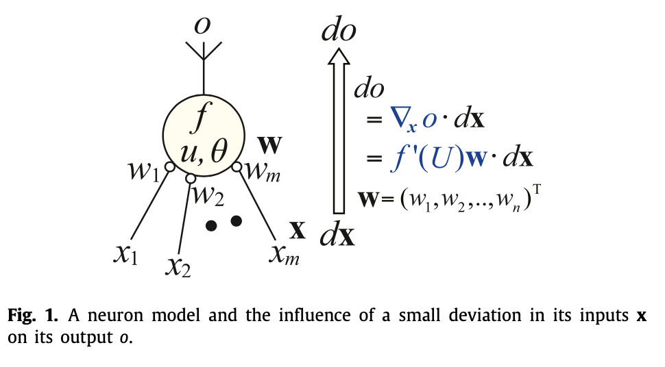
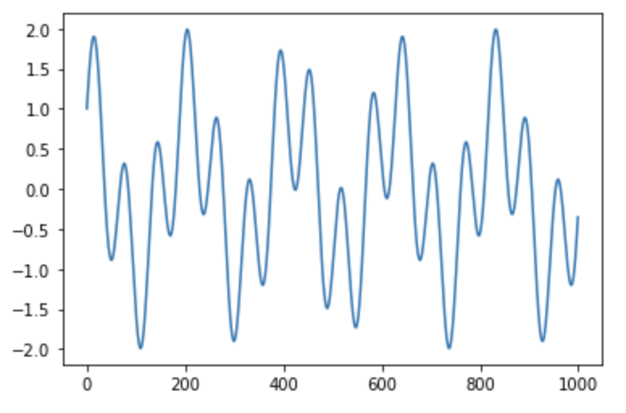
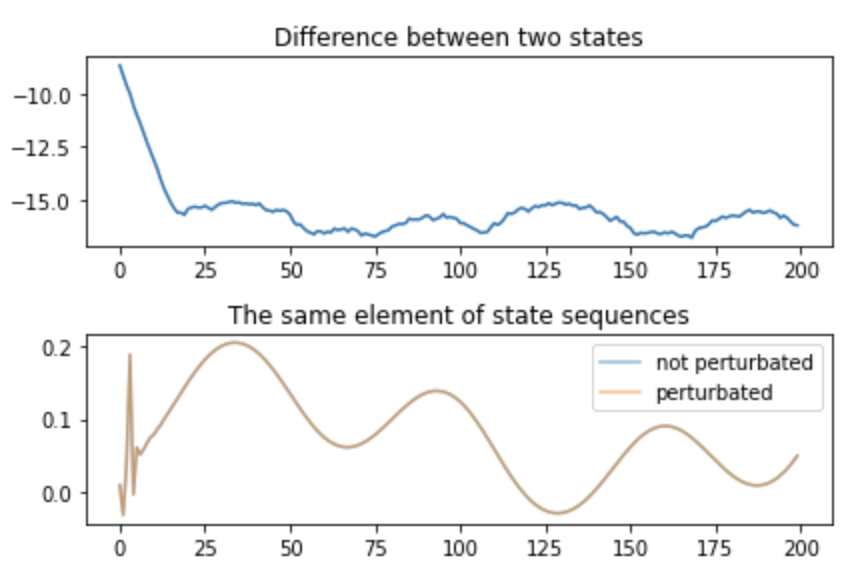
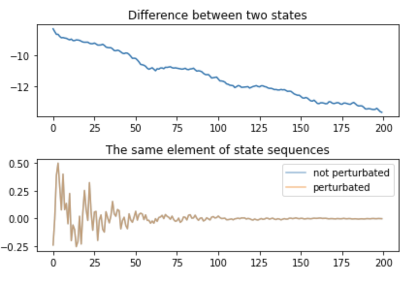
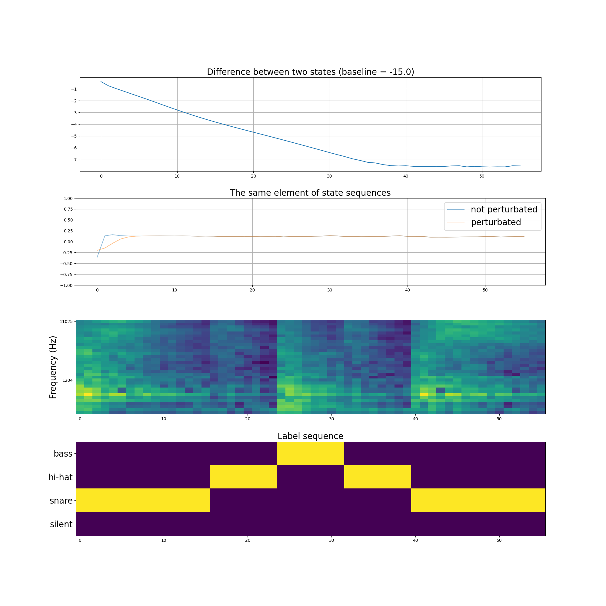
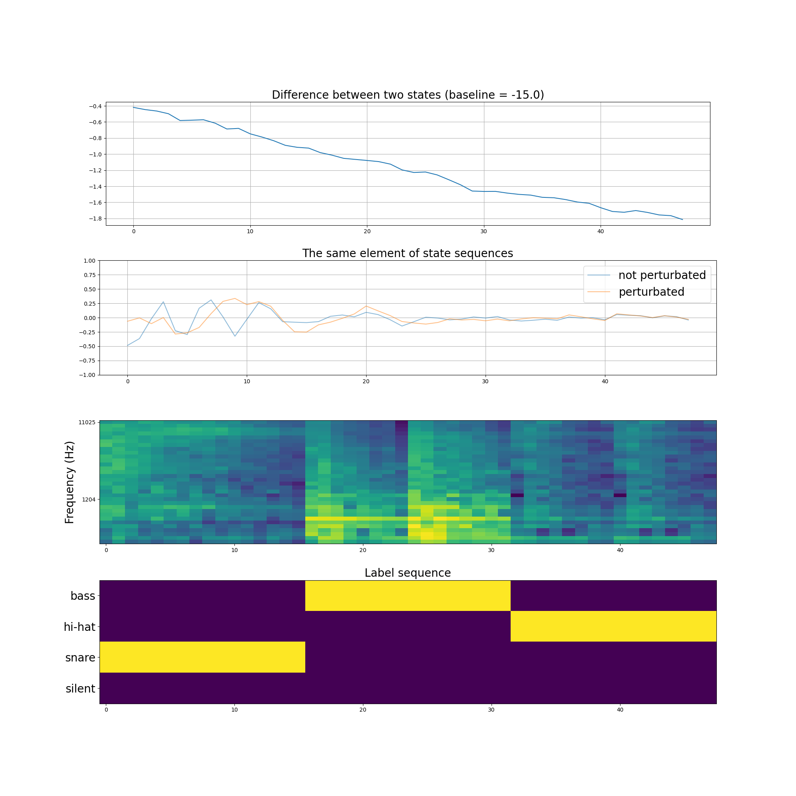

# リザバーネットワークにカオス性を意図的に持たせる

[Sensitivity – Local index to control chaoticity or gradient globally -](https://www.sciencedirect.com/science/article/abs/pii/S0893608021002471) という論文を発見した。

これによると、ディープニューラルネットワークで特に RNN に対してあらかじめカオス性を持たせてから時系列タスクを解かせるとモデルの性能が上がるらしい。

特に実装例も公開されているわけではなかったが、PyTorch か TensorFlow を使えば手軽に実装できそうだと思ったのでネットワークのカオス性だけ出してリザバーネットワークとして応用できないか試してみることにした。

細かい数式的な議論については元論文に詳しく記載されているので気になる方はぜひ参照して欲しい。

## 論文で紹介されている学習手法

論文で提案されているのは、"sensitivity adjustment learning (SAL)" という学習手法で、論文内部で定義している感度(sensitivity)の値を 1.0 に近づけることで RNN の学習がうまく進められるというもの。
これによって、 300 層の DNN の構造で学習させても勾配消失が起こらなかったとか。

### sensitivity の定義

下記のニューロンモデルで考えてみる。(画像は論文より抜粋)



内部状態 $u$ は入力ベクトル $x$ と結合重みベクトル $w$ によって、以下のように表記される。

$$
u = \bold{w} \cdot \bold{x}
$$

ここにバイアス $\theta$ を加えて、出力 $o$ は以下のように表される。

$$
o = f(U) = f(u + \theta)
$$

ここで、今扱っているニューロンについての sensitivity $s(U;w)$ は以下のように定義される。

$$
s(U; \bold{W}) = \|\|\nabla_{x}o\|\| = f'(U)\|\|\bold{w}\|\|
$$

$f(\cdot)$ が単調増加関数なら、以下のように書き換えられる。

$$
s(U;\bold{w}) = \sqrt{\sum_i^m(\frac{\partial o}{\partial x_i})^2} = f'(U)\sqrt{\sum_i^mw_i^2}
$$

### SAL の方法

上記で定義した Sensitivity adjustment learning (SAL) の重みの更新は、以下の式で行うことができる。

$$
\Delta \bold{w} = \eta_{SAL} \nabla_{\bold{w}} s(U; \bold{w})
$$

$$
= \eta_{SAL} f'(U) \frac{\bold{w}}{\|\|\bold{w}\|\|} + \eta_{SAL}\|\|\bold{w}\|\| \nabla_{\bold{w}}f'(U)
$$

基本的には、先ほど定義した sensitivity をパラメータ $w$ について偏微分した値を考えれば良いということになる。

また、バイアス項 $\theta$ の更新ルールは以下のようになる

$$
\Delta \theta = \eta_{SAL} \|\|\bold{w}\|\| \frac{\partial f'(U)}{\partial \theta}
$$

## 実装

PyTorch などでやる場合はそこまで難しくなく、 sensitivity を計測する関数を素直に実装してそれに対して逆伝播させれば良さそう。

とはいえ、今回はリザバー適用が前提のため RNN に対する適用が大前提となる。そうなると、各タイムステップごとの出力を覚えておくことが必要。

論文の中では、各ステップ $n$ ごとに得られた sensitivity の値 $s_{n}$ に対して移動平均をとることで $\bar{s}$ を算出していた。

$$
\bar{s}_n \leftarrow \beta \bar{s}_{n-1} + (1 - \beta) s_n
$$

ひとまず、多層パーセプトロンに対して適用させてみる。

```python
class SALReservoirLayer(nn.Module):
    """reservoir layer with SAL"""
    def __init__(self,
                 input_dim: int = 100,
                 output_dim: int = 100,
                 act_func: str = "tanh"):
        super(ReservoirLayer, self).__init__()
        self.linear = nn.Linear(input_dim, output_dim)
        if act_func == "tanh":
            self.act = torch.tanh
            self.inv_act = lambda u, o: 1 - o**2
        else:
            raise ValueError("Invalid function type '%s' only valid on '%s'" %
                             (act_func, "tanh"))

    def forward(self, x):
        u = self.linear(x)
        x = self.act(u)
        s_each_w = self.inv_act(u, x) * torch.sqrt(
            torch.sum(self.linear.weight**2, dim=1))
        sensitivity = torch.mean(s_each_w)
        return x, sensitivity


class SALReservoir(nn.Module):
    """reservoir with SAL"""
    def __init__(
        self,
        dims: List[int] = [100, 100],
        beta: float = 0.99,  # sensitivity を計算するときの移動平均の度合い
        leaky_rate: float = 0.8  # どれぐらいの比率で前ステップの状態を持っておくか
    ):
        super(SALReservoir, self).__init__()
        assert dims[0] == dims[-1], \
            "The first and end values of dims should be the same but different %f vs %f" % (
            dims[0], dims[-1])
        layers = []
        for i in range(len(dims) - 1):
            layers.append(
                SALReservoirLayer(dims[i], dims[i + 1], act_func="tanh"))
        self.layers = layers
        self.n_layers = len(layers)
        self.beta = beta
        self.leaky_rate = leaky_rate
        self.dims = dims

    def forward(self,
                x,
                prev_states: List[torch.Tensor],
                prev_s: torch.Tensor = 0.0):
        sensitivity_list = torch.empty(self.n_layers)
        states = []
        for i, layer in enumerate(self.layers):
            _x, _s = layer(x)
            x = _x
            # x = self.leaky_rate * prev_states[i] + (1 - self.leaky_rate) * _x
            states.append(x)
            sensitivity_list[i] = _s
        s = torch.mean(sensitivity_list)
        s_bar = self.beta * prev_s + (1 - self.beta) * s
        return x, s_bar, states

    def generate_init_state(self):
        return [
            Variable(torch.Tensor(np.random.randn(dim)))
            for dim in self.dims[1:]
        ]
```

ひとまず、これらをサイン波とコサイン波をミックスした波で sensitivity が増加するのか試してみた。

sensitivity は上記のここのコードで記述している。

```python
s_each_w = self.inv_act(u, x) * torch.sum(self.linear.weight**2, dim=1)
sensitivity = torch.mean(s_each_w)
```

入力の信号は以下のような感じ。


この入力信号は合計 1000 点あるわけだが、これらのうち前半の 800 点を使って SAL の値が 1.0 を越える手前まで学習させる。

学習前後に、初期状態 x の値に 1e-4 だけの摂動を与えなかったものと与えたものの 2 つを用意してそこの違いをみてみる。

学習前だと、以下のグラフになった。


学習後だと以下のグラフになった。



軌道としてはかなりカオスっぽくなってきているが、ちゃんと入力の時間が経過するにつれて初期値の差分が埋まっていく方向になっているのもわかるので echo state property も存在している。  
後半部分で軌道が消えてしまっているのがちょっと気になるが、いったんこのまま進めてみる。

### 音声入力での結果

ここの入力を音声のスペクトログラムに変えたところ、以下のような結果となった。
実装は以下のレポジトリに格納してある。

https://github.com/wildgeece96/reservoir-mic-input/blob/main/src/train/sal.py

まずは、学習前。


次に学習後



グラフとしては、

- 1 段目: 摂動を与えたものと、与えていないものとの L2 ノルム距離の遷移
- 2 段目: 摂動を与えたものと、与えていないものとでのネットワーク活動状態の遷移
- 3 段目: 入力した音声のメルスペクトログラム
- 4 段目: 入力した音声の系列ラベル（どんな音がなっているのか）

となっている。
このグラフを見てみると、摂動の開きが学習後に縮まりにくくなっていることがわかる。一方で、音声を入力していくとその差分が徐々に狭まっているものでもあるため Echo State Property を満たしていることも観測される。

学習としてはうまくいったと評価して良い。

これを使って、タスクの精度が上がることを願いたい。

