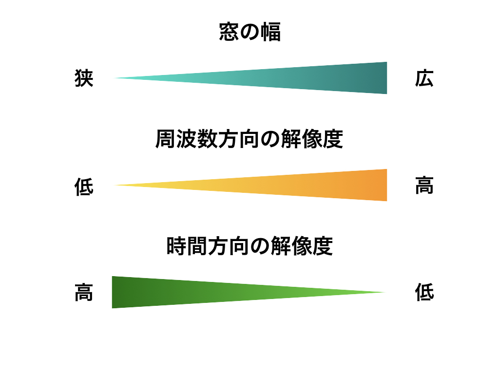
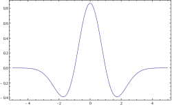
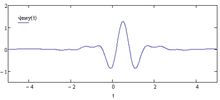
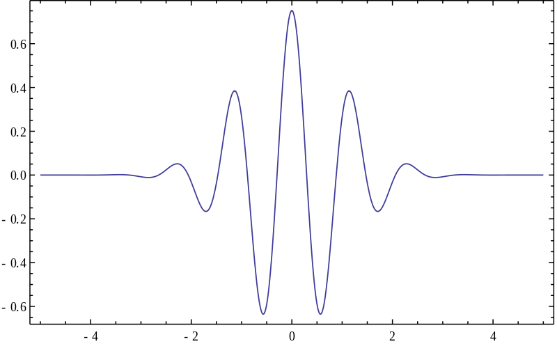
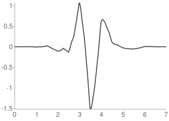

# ウェーブレット変換(Wavelet)について簡単に実装してみた  

音声信号処理系の本を少し読んでいるところでよくわからないまま放置していた概念があったのでここで簡単にまとめておく。  


## 概要  

### Wavelet変換とはそもそも何なのか

簡単に言うvと、波形データを短い時間ずつ切り出したフーリエ変換をかける短時間フーリエ変換が抱える問題点を解消する1つの手段。  

### (蛇足)ウェーブレット変換ができたきっかけ  
https://www.slideshare.net/h_okkah/ss-86158411 より  

Morletが石油探査において、探査機が地中に与えた衝撃を反射した振動の解析を行うために、編み出された方法。  
複数の層からの反射が返ってくるため、局所的な時間での周波数解析を行う必要がありFourier変換だとうまくいかなかったのが背景にあるらしい。  

#### フーリエ変換の弱点  

短時間フーリエ変換だと窓幅の長さによって時間軸方向の解像度と周波数方向の解像度が変わってくる。  

  

窓の幅を広げようとすれば細かい周波数単位でスペクトルを計算することができるが、一方で時間方向での解像度は落ち、鋭い間隔で出てくるような音とかをうまく拾いきることができない。  
逆に窓幅を狭くしてあげれば短い時間で発生するような音を捉えることができるがその分、詳細な周波数情報が落ちてしまう。  

こういったトレードオフの関係があるのが短時間フーリエ変換。  

#### Wavelet変換の克服点  

上記に挙げたトレードオフの関係をうまく解消するように考案されたのがWavelet変換となる。  

拾いたい周波数帯の音によって、窓の幅を変えてしまおうという発想。  
**高い音ほど短い窓幅** にし、 **低い音ほど長い窓幅** を適用する。  

ただ、窓関数を使うのではなく、 **マザーウェーブレット** と呼ばれる波形のテンプレートを使用する。  
これを短時間フーリエ変換で **窓関数の適用するところで代わりにマザーウェーブレットを使用する** というイメージ。  

このマザーウェーブレットの波形を時間軸方向に引き伸ばしたり縮めたりすることによって、様々な周波数帯の音声を拾うことができると言う寸法となる。  

### Wavelet変換がやっていること

Wavelet変換は、用意した波形テンプレートであるマザーウェーブレットにうまく合致するような波形を、マザーウェーブレットの **時間方向のスケールを変えながら** 抽出していく手法となる。  

そのため、フーリエ変換が得意とするような定常的な波よりかは、突発的に発生するような非定常な信号をうまく抽出することができる。  
また、Wavelet変換は変換と表現されているが、 **波の分解** と表現する方がイメージに近い(と言う理解)   

フーリエ変換は時間方向の波形データを周波数空間に投射する、と言うものであったがWaveletが出すのは **複数の波形** に近く、テンプレートに使用した波形にどれほどマッチするかの度合いを時間軸方向にプロットしたものとなっており、周波数空間に投射すると言うものではない。　　
（実際にWavelet変換で抽出された波形を聞くと、元の音声の一部に聞こえる)  

分解された波形それぞれでは周波数帯的に似たものが含まれるため、各波形を各周波数ごとに抽出した波形、といった見方もできる。  

##　定式化 

定式化に移る。  
Pythonの数値計算モジュール `scipy` にも実装されている、 **連続ウェーブレット変換** についてここでは言及する。  

信号 $g(t)$ のウェーブレット変換の結果得られる値 $W_g(a,b)$ は

$$
W_g(a,b) = \int_{- \infin}^{\infin} g(t) \psi^{ * }_{a,b}(t)dt \tag 1  
$$

- $\psi^{ * }_{a,b}(t)$ : $\psi_{a,b}(t)$ の複素共役  
- $\psi_{a,b}(t) = \frac{1}{\sqrt{a}}\psi(\frac{t-b}{a})$  
- $\psi(t)$ : マザーウェーブレットに相当する、ウェーブレット関数  
- $a$ : スケールファクタ。マザーウェーブレットの時間方向のスケールを調整する。  
- $b$ : シフトファクタ。マザーウエーブレットを適用する位置を指定する  
ある位置にあてがったマザーウェーブレットが波形と一致していると $W_g(a,b)$ の値は大きくなる。  

### マザーウェーブレット $\psi(t)$  

マザーウェーブレットには色々な種類が存在しており、有名なものだと

- メキシカンハット関数(Ricker 関数とも)    

$$
\psi(t) = \frac{2}{\sqrt{3\sigma}\pi^{\frac{1}{4}}}(1-(\frac{t}{\sigma})^2)exp(-\frac{t^2}{2\sigma^2}) 
$$

  

###### Wikipediaより

- メイエ関数(Mayer wavelet)  

  
- モルレー関数  

$$
\psi_{\sigma}(t) = c_{\sigma} \pi^{-\frac{1}{4}}e^{-\frac{1}{2}t^2}(e^{i\sigma t}- \kappa_{\sigma}) \\
c_{\sigma} = (1 + e^{-\sigma^2} - 2e^{-\frac{3}{4}\sigma^2})^{-\frac{1}{2}}  \\
\kappa_{\sigma} = e^{-\frac{1}{2}\sigma^2}  
$$

  


- シムレット関数(sym4と呼ばれるもの)  

  

###### http://wavelets.pybytes.com/wavelet/sym4/ より  

などが存在する  

それぞれのマザーウェーブレットによって得意とする波形などがあるらしい。  
例えば、モルレー関数は心電図での異常な箇所を特定するのによく使われるらしい。  


### スケールファクタ $a$ について 

スケールファクタ $a$ は時間方向にマザーウェーブレットを引き伸ばしたり縮めたりするパラメータ。  

これにより、マザーウェーブレットの形状が決定する。  

### シフトファクタ $b$ について  

シフトファクタ $b$ は時間方向にどれほどマザーウェーブレットをずらすかのパラメータとなる。  

## 実装  

とりあえず実装してみる。  

以下の音声ファイルを扱うことにする。  

### wavelet関数の実装  

まずはwavelet関数の実装から。  
時間方向での定式化が行われているものを使うことにする。  
そのため、モルレー(Morlet)とメキシカンハット(ricker)関数の2つを実装する。  

#### ricker関数  

$\sigma$ を全体のサイズの1/8に設定して定義。  

```python  
import numpy as np 
def ricker(N, s=1):
    """
    inputs : 
        N : length of wavelet.
        s : float. scale factor. 
    returns : 
        wavelet : ndarray. (N,). mother wavelet
    """
    sigma = 1
    t = np.linspace(-4*s, 4*s, N)  
    return 2/(np.sqrt(3*sigma)*np.pi**0.25)*(1 - (t/sigma)**2)*np.exp(- t**2 / (2*sigma**2))
```

#### モルレー関数(Morlet)  

簡便化のため、$c_{\sigma}$ は入れないことにした。  

```python
def morlet(N, sigma=5, s=1.0):
    """
    inputs : 
        N : length of wavelet.
        sigma : float.  Default is 5.0
        s : float. scaling factor. 
    outputs : 
        wavelet : ndarray. (N,). mother wavelet
    """
    t = np.linspace(-s*2*np.pi, s*2*np.pi, N)
    kappa = np.exp(-0.5*(sigma**2))
    output = np.pi ** -0.25 * np.exp(-0.5*(t**2)) * (np.exp(1j*sigma*t) - kappa)      
    return output 
``` 

これで2つのマザーウェーブレットが揃った。  

### 連続ウェーブレット変換  

あとはスケールファクタを適宜変えながら畳み込みを行なっていけば良い。  


## 参考  

- [Mexican hat wavelet - Wikipedia](https://en.wikipedia.org/wiki/Mexican_hat_wavelet)  
- [Morlet wavelet - Wikipedia](https://en.wikipedia.org/wiki/Morlet_wavelet)  