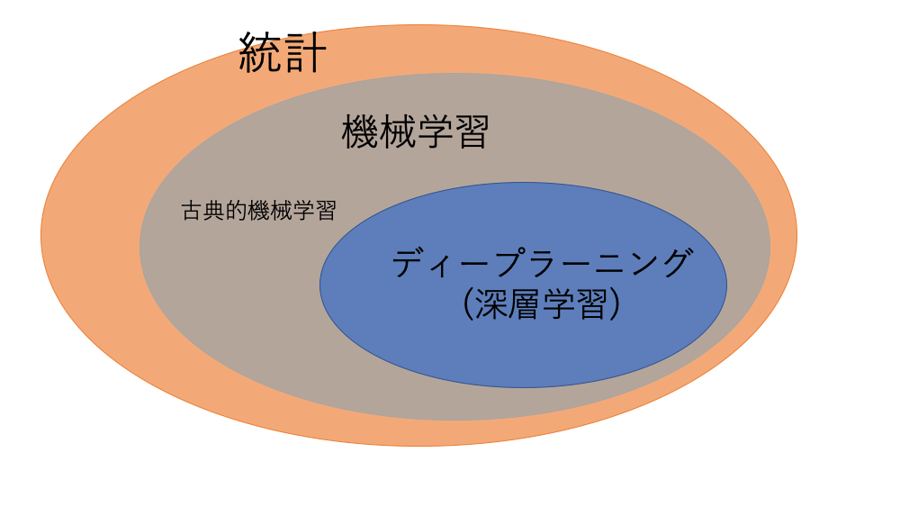
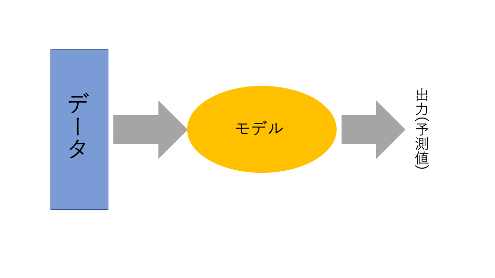
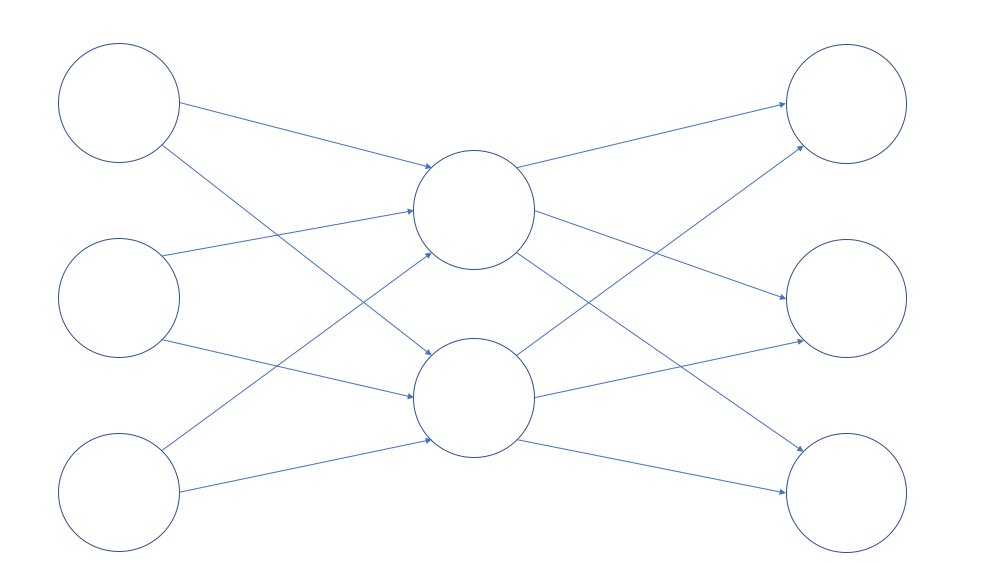

# AIとは何なのか  

今回は、AIと呼ばれる分野(特に機械学習)を勉強し始めて約1年ほど(多分)の著者が  
自分の勝手な解釈でAIについて解説することにします。  

今回の記事では多分に主観が含まれていますので内容についての責任は一切負いません。  

## AIの概観  
まずはAIについてざっくりとしたイメージを持ってもらうかなと思います。  
実態と世間一般に持たれているイメージと少しだけ乖離しているのかなぁというのが感覚としてはあります。  

### AIの定義は曖昧  

  

AIとはArtificial Intelligenceの略称で、日本語にすると人工知能と呼ばれることが多いです。  

この単語だけ聞くと、AIって我々人間が持っているような頭脳を人工的に作ってしまう技術のように聞こえると思いますが、残念ながらそうではありません。  

実態としてはAIがやれることって人間が行っていることのごく一部しかないのです。  
この辺りはあとで言及することにします。  

ここではAIとはそもそも何を指すのかについて説明していきます。  

見出しにもつけた通り、 **AIの定義は曖昧** です。何を以ってAIとするのかは特にはっきりとした決まりがあるわけではありません。  

### とりあえず定義してみる  
巷で使われているAIについては定義的には以下のような言い方ができると思います。  

    人間の知能が果たしている役割の一部をコンピュータの力を使って再現しようとしたもの

かなり抽象的な気もしますが、こんな感じかなと思います。  
ポイントは「 **知能の一部** 」という部分で、決して全部ではないということです(我々と全く同じように思考し、行動するようなプログラムではないということです)。  

ちょっと難しい言葉だと **弱いAI** という表現になります(次の項で説明します)。  

現在だと人の視覚のように画像を認識することなどはAIが比較的得意とすることです。  

例えば、以下の写真を見て、あなたは何が写っていると思いますか？  

そう、犬です。  
さらに詳しくならばゴールデンレトリバーですね。  
このように、写真に何が写っているかを判断することは私たちができることの1つですが、これを **AIで再現する** ことができてしまったというわけです。  
### 強いAIと弱いAI  

先ほど定義したAIは専門的に言うならば **弱いAI** に該当します。  
その逆で、強いAIという単語も存在します。  

#### 強いAI  
強いAIはまさに人間の知能を **そのまま** 再現することのできるAIのことを指します。  

人間と同じように考え、思考することができる・・・・・  

ドラえもんとか鉄腕アトムとかが強いAIに該当しますね。  

一昔前にもAIブームというのはあったのですがその時にはこのような強いAIを実現しようという動きもあったみたいです。  

残念ながら、強いAIというのはSFの世界を出ることができていないのが現状です。
これを実現するには現状の技術からさらに突き抜けた発明がなされないと無理だろうなという気がします。  

### 弱いAI  
一方、弱いAIは人間の知能の **一部** を機械で再現したもののことを指します。  

現在流行しているAIが行っていることは弱いAIの領域であり、一般の文脈で使われているAIというのは特にこの弱いAIを指すため、先ほどの定義の部分ではこちらのニュアンスを多分に含ませました。  

そのため、今のAIというのは少し言い方を変えると  

- 写真を識別すること **しかできない**  
- 音声を認識すること **しかできない**  

と表現することができます。  

弱いAIについては、やらせたいことを人間側が設定して、それに合わせてAIを設計します。  
そのため、AIがやれることは我々人間が指定したことのみとなりそれ以外のことは勝手にできるようにはなりません。  

与えられたデータに対して、欲しい答えを出してもらうように設計すると言うのが現在使われているAIを作る時に行われていることです。  

これらの背景から、人の知能をAIが超えてしまうというシンギュラリティーは恐らく100年以内に来るのは難しいでしょう。  

## AIを構成する技術  
では、こんなAIですがどんな技術が使われていることが多いのでしょうか。  

### ルールベースとは  
ここでちょっと1つの単語について触れておきます。  

**ルールベース** という単語です。  

ルールベースというのは、人が設計したルールにしたがって挙動を示すもの(プログラムとか)です。  
1つ1つ場合を想定して挙動を決めてあげる必要がありますし、全ての行動を論理にしてプログラム上で書き記す必要があります。  

ルールベースというのは普段みなさんが使っているアプリの裏で動いているプログラムとかはほぼ全てルールベースで動いています。  

### 機械学習    
AIの場合、基本的には **非ルールベース** で設計されていることがほとんどです。  
本来我々が書くべきルールの部分を機械自身に学ばせるという寸法です。  

今回の定義ですとルールベースで綿密に設計されたプログラムも立派なAIですがこれをAIと呼ぶ人は少ないと思われます。  

非ルールベースで設計されるAIは特に機械学習と呼ばれる技術から成り立っています。  
以下では、 **機械学習を用いたAI** について詳しく見ていきます。  

それぞれの技術の包含関係はこのようになっています。  

統計学と機械学習を対立させて説明する人もいるのですが、著者の理解だと全体のデータから傾向を見出すという点では統計と言うこともできるので機械学習は統計に内包されていると考えています。  

  
あとで解説しますが、ディープラーニングや深層学習(この2つの単語は同じ意味ですが)はこの機械学習に分類される技術です。  

現在のAIを構成する技術は機械学習によって成り立っていると言っても過言ではないでしょう。  

データサイエンティストと呼ばれる人たちは基本的にはこの機械学習の技術(とそれを運用するための技術)を有する人のことを指します。  

#### 機械学習とは  
機械学習とは、与えられたデータ群の中から一定の傾向を見出し、欲しい出力を得るために開発された数理モデルのことを指します。  

  

そうです、数理モデルなのです。  
機械学習って数式で表現することができてしまいす。  
このあたりについては  
新井紀子さんが「AI vs 教科書が読めない子どもたち」で言及していた通りで、これらの背景から  

AIはただの数理モデル

  

と表現することができてしまいます。  

機械学習は古典的機械学習とディープラーニングとに分類することができます。  

**学習** と呼ばれているのにもしっかりと理由があって、このモデル自身がデータから答えを出せるように学ぶ過程が存在しているからです。  

学習の際にはモデルが出した予測値と実際の値との誤差が小さくなるようにモデルを調整していきます。  

具体的には  

- ロジスティック回帰  
- サポートベクターマシン  
- 決定木解析  

あたりのことを指します。  

### ディープラーニング  
ディープラーニングは機械学習の技術の1種類にすぎませんが、ここ10年ほどで非常に目覚ましい進歩を遂げた分野となっており、AIが再度注目され始めたのもこの技術の発展によるものです。  

内容的には、脳の神経回路の構造を簡易的に模倣した人工ネットワーク、人工ニューラルネットワーク(neural network)を使用しています。  
機械学習の文脈では単にニューラルネットワークと呼ばれることがほとんどです。  

実際の神経回路を用いて計算をさせてみようと言う研究も進んでいますがここでは割愛します。  

  

各ニューロンが情報を受け取り、それを次のニューロンへ次次と情報を伝達していくのがこのニューラルネットワークの構造ですが、この構造をどんどん重ね合わせていって構造をより深く(ディープ)なものにしたものをディープニューラルネットワーク(deep neural network; DNN)と表現します。  

このディープニューラルネットワークを使って構成されているのがディープラーニングです。  

ディープラーニングが得意としているのは

1. 画像  
2. 音声  
3. 文章

の3つの分野です。  

文章については我々が普段用いている言語と言う意味で自然言語という表現をすることが多いです。  

また、文章は日本語はまだまだだなぁと言う印象です。英語やそれに似ている言語についてはGoogleが無双しているおかげでかなりの進歩が見られています。  

いまだにルールベースでの技術が主流という印象で機械学習ではない統計を使っているものが多い印象です。  

ディープラーニングの弱点として言われているのが、予測結果の根拠を明示的に探ることが難しいというところにあります。  
その辺りも含めて学習させているので仕方ないっちゃ仕方ないのですが、今まで開発されてきた技術と違うところはここにあります。  
得体の知れない技術と言うのは、AIを設計するエンジニア側にとっても同じなのです。  

なんか、よくわからないけどちゃんと動いてます。

と言うのが正直なところです。モデル内部でどのような判断をしているのか、といった研究はされてはいますがまだまだブラックボックスなんだなぁと言う気がします。  

## AIができてAIができないこと  

何回か言及したように、今使われているAIは **弱いAI** に分類されるものです。  

そのため、各々のAIは特定の機能を果たすことしかできません。  

狙い通りの機能以上のものをAIに持たせることは現段階では難しいです。  
(犬と猫の判別をさせていたら、犬の種類まで判別するようになったといったことはできないと言うこと)  

### AIができること
具体的に、AIができることを適当に列挙してみます。  
(ちゃんと調べた訳ではないので結構適当なこといってる可能性が高めです。ご了承を)  

#### テーブルデータ  
エクセルのようなものにまとめられたデータのことをテーブルデータと呼びます。  

これまでの在庫の状況や去年の売り上げのデータから明日の売り上げを予測するといったようなことです。  

このようなテーブルデータにはディープラーニングではなく、古典的機械学習に属する技術がよく使われます。  

#### 画像、動画  
まずは画像や動画の範囲  
ディープラーニングではもっとも成功した範囲と言えるかもしれません。  

- 物体検知(画像や動画の中に何があるのかみる)  
- セグメンテーション(画像の領域ごとに何があるのかを分ける)  
- 画像生成  

最近、画像生成の技術を使って女性の写真から裸の写真を合成するサービスが開始から5日間で閉鎖された話題がありますが、これもAIの画像生成の技術を用いたものです。  

セグメンテーションは自動運転の際にはコアとなる技術で、かなり研究が進んでいる印象です。  

<iframe width="560" height="315" src="https://www.youtube.com/embed/CxanE_W46ts" frameborder="0" allow="accelerometer; autoplay; encrypted-media; gyroscope; picture-in-picture" allowfullscreen></iframe>

セグメンテーションはこんな感じです。  
画像を色分けする感じです。こうすると機械が外の世界をより処理しやすい形にして情報を送ることが可能となり、正確な運転を行うことができるいう訳です。  

#### 音声  

- 音声認識  
- 異常音検知  
- 環境音認識  
- 音声合成  

音声認識はSiriやGoogleアシスタントに代表されるように、人の喋った内容を認識する技術です。  

異常音検知は例えば工場の機械が故障した時に、異常な音が発生したことを検知するといったような技術も開発されています。  

あとは人の音声から鬱の傾向を検知したいといった技術を開発しているようなところもあります。  

環境音認識は、そのマイクが置かれている状況(場所)を認識する技術のことです。何に使われるのかよくわかりませんが、ノイズとなって入ってくる外の音の分類に使われたりするのでしょうか。  

#### 文章(自然言語処理)  

- 文章分類  
- 要約  
- 読解  

この辺りでしょうか。  

文章を扱う時って、人間でもどのように理解しているのかをはっきり言語化するのって難しいです。  

また、いわゆる常識というのを機械に教えることはまだできていません。(これを解決できそうな手法は提案されつつありますが)  

## まとめ  
記事もいい感じの長さになったのでこの辺でまとめます。  
あまりAIに対して幻想を抱かない方が良いですが、活用できるところはどんどん活用した方が良いかなぁと思います。  

ただ、AIを使う時の注意点としてはAIが学習をするためにはちゃんと **答えのあるデータ** をいくら揃えられるかが勝負となります。  
しかもそのデータはきちっと整理されているものであればあるほど好ましいです。(エンジニア側の手間が省ける上、データを十全に活用ができるので)  

このあたりも機械学習に詳しい人がよく知らない人に対して周知させていく必要のあるものですが。  
なので、よくわからないなと思ったら周りの詳しい人に聞いた方が早いなとも思います。  

この記事を通してAIのイメージを簡単にでも掴めていただけたら幸いです。  
